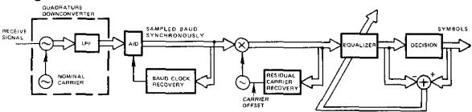
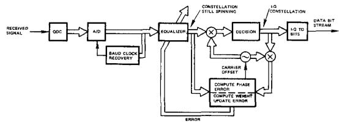
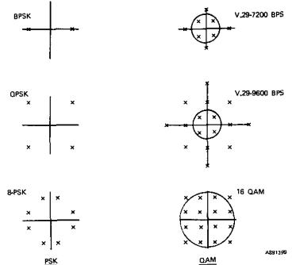
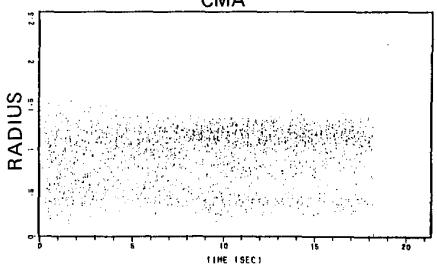
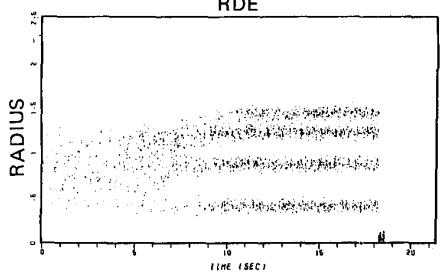
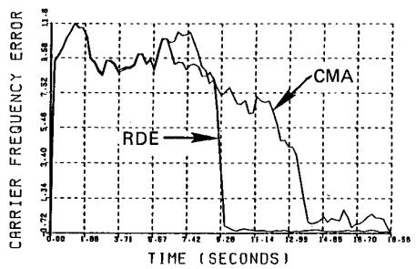
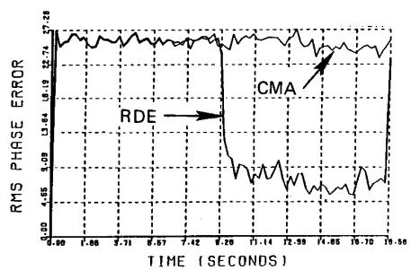
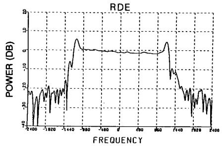
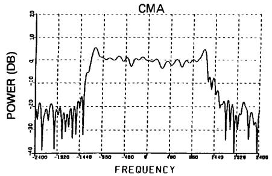

# BLIND EQUALIZATION BASED ON RADIUS DIRECTED ADAPTATION

Michael J. Ready and Richard P. Gooch

Applied Signal Technology， Inc. 160 Sobrante Way Sunnyvale, Ca. 94086

## ABSTRACT

Thispaper describes a blind\_equalization algorithm,termed radius directed equalization (RDE),for QAM signals based on theknown modulus of the constellation symbol radii.For example,16 QAMhas threeradii,32QAMhas5radii.The algorithm usesthe errorbetween the equalizeroutput modulus and the nearest symbol radius to update the equalizerweights.TheRDE algorithm providesfaster convergence than the CMA algorithm for QAM signals and is independent of the carer offset.The algorithm is described inthe context of blind carrier and baud clock recovery schemes.

## 1. INTRODUCTION

In point-to-point data communications systems,the receiving modem isadapted to the optimal equalizer duringthe transmissionof a predeterminedtrainingsignal.No information data is transmited during the training period.In multidrop systems where multiple receivers listen to the same transmitter，the data throughput would suffer if the system had to retrain every timea new receivercame on line.Blind equalization refers to the problem of adaptively mitigating the dispersive effects of a transmission channel on a digitally modulated communications signal without knowledge of the channel response or transmitted data signal.

Sato[1] reported one\_of the earliest blind equalization algorithms for multilevel PAM signals.The basic concept has beenfurther generalized to multilevel QAM signals\_[2,3]. In theseapproaches,the demodulator adaptively equalizes the signal using\_anerror criterion based on E{ly(n))P-K}，where p,qare usually restricted to (1,1),(1,2)，(2,1) and (2,2)；y(n)is theequalizer output and K is a known,fixed constant.This algorithm，commonlyknownastheConstant Modulus Algorithm (CMA)，has been\_successfully implemented for blind equalizationof QAMandPSK signals.While the CMAerror criterion isoptimal for PSK signals,it isnot optimal for QAM signals,such as16 QAM,in the sense that the error does not\_go to zero when the equalizer has fully converged.The RDEalgorithmpresentedinthispaperisageneralization of theCMA algorithmand isoptimal forQAMsignals.An important propertyof both CMAandRDEistheir independence of carier offset because the\_error signai is based only on the equalizer output modulus.This is important in most applications because the carier offset is generally unknown.Recently，another paper derivedtwoalgorithms basedon radius directedequalization (RDE) [5].The RDE algorithmdescribedinthispaperis identical to thedecisionadjusted-modulus-algorithm presented in [5]. The work in\_[5] was not evaluated in the context of channel distortion or blind carrier recovery schemes.The Stop-and-Go algorithm is another approach to blind equalization [4] but requires carrier lock.

This\_paperdescribesademodulationarchitecture and algorithms that perform both blind equalization and blind carrier recovery. Section 2 describes this architecture.The structure is applicable to both low data rate modems (<2400 baud)as well asmodems with data rates exceeding1 megabaud.Section3describestheradiusdirected equalization algorithm.Section 4 describes the blind carrier recovery\_algorithm.Section5 comparesthe performanceof theRDE algorithm withthe constantmodulusalgorithm (CMA) fora specific example.

## 2.EQUALIZER ARCHITECTURE

Blind acquisition of data from a digitally modulated signal requires that the demodulator have algorithms for blind carrier acquisition,baud clock recovery and equalization. In general, theblind recoverymodem mustbe adaptiveto acquireand compensate for different channel conditions and track slowly timevarying characteristics.Additionally，to be useful，it is important that the system acquire the signal quickly.

One possible architecture is shown in figure 1.The received signalis quadrature downconverted by the nominal carrier frequency.The quadraturesignal isthendigitizedbaud synchronouslyusingabaud ciock recoveryalgorithm.(This algorithmis the subjectofafuturepaper.）Next,anycarrier offsetisremovedbypassing thesignal throughanonlinearity (usually4thor8th power)andusinga PLLto lock ontoa tonegeneratedatthecarrieroffset frequency.Following this, thesignal is equalized.An error signal is generated from the equalized signal whichisused toupdate the equalizer weights.

  
Figure 1. One architecture for a blind demodulator.

Thissystemhas onemajor disadvantage:thesignal component generatedby thenonlinearity forcarrierrecovery mustbeheavilyfiltered to eliminatethenoisegeneratedby passing the signal through the nonlinearity.The noise consist of three components:a self-noise component due to the signal mixing with itself,a component due to additive noise mixing with itself，and a component due to cross products between the signal and the additive noise.Generally，for QAMsignals,the self-noise is the dominant component.The heavyfiltering leadsto sluggish carrieracquisitionand tracking.Rapid carrier tracking can be very important.For example，itmaybe necessary forthe carriertracking algorithm to compensate for periodic phase noise [6] in voice grademodems.For higherratemodems,it may be necessary to track an FM service channel modulating the carrier.

Analternative architecture that provides a faster carrier tracking loop is shown in figure 2. The signal is qaudrature downconvertedbythenominal carrierfrequency.The quadrature downconverter here does not acquire the exact carrier offset.Instead, the exact carrier is acquired from the equalized signal.

  
Figure 2.A better architecture fora blind demodulator.

This system operates as follows.Assume that the equalizer has converged,the carrier has been acquired and that the system is operatingin decision directed mode.(Blind carrier acquisition and equalization will be described later.）In the absence of any carrier offset,the equalizer output isan estimate of the constellation symbols.However,when there is offset,the symbolswillbe spinning at the carrier ofset rate. Themixer after the equalizer rotates the symbols to stop the spinning.The despun'symbois are then sliced to get the actual constellation point.To compute the error for updating thecarrier tracking loop and equalizer weights,theactual constellationsymbols are'respun'(note the conjugation operation in thesecondmixer)andcomparedto theequalizer output.Denoting theequalizer output as y(n) and therespun constellation symbols asy'(n)，the carrier is trackedby measuringthephaseerrorbetweeny(n)andy（n) andusing thiserrorto driveaPLL.Thephase erroriscomputed by calculating the phase of y(n)(y'(n))，where (indicates the complex conjugate.The carrier is lockedwhen the phase erroris zero.This type of carrier recovery/tracking loop is called decision-aided carier recovery.The decision directed error used for updating the equalizer coefficients is computed from ${ \sf e } ( { \sf n } ) = { \sf y } ( { \sf \dot { n } } ) - { \sf y } ^ { * } ( { \sf n } )$ If the carier is acquired and the signal is fully equalized,then the decision directed error will be zero (ignoring additive noise).

This decision-aided carrier recovery approach is faster acting thancarrier acquisition/tracking based on the nonlinearity approach because the noise is minimized by the equalizer and there is no self-noise generated.Consequently， the carriertracking loop filtering does not have to be so heavily filtered which allows fora wider tracking bandwidth.

## 3.RADIUS DIRECTED EQUALIZATION

The radius directed equalization (RDE) method is similar to LMSin that the equalizer can be viewed as a filter with adaptive weights.The weights are updated by computingan errorwhich is minimized using some criterion.For LMS，the weights are updated using the formula:

$$
{ \bf w } ( n + 1 ) = { \bf w } ( \dot { n } ) + 2 { \bf u } \dot { \bf u } ( \dot { n } ) { \bf e } ( \bar { \mathfrak { n } } )
$$

where w(n)are the filter weights,x(n) is the filter (or equalizer inthis case)input ande(n)istheerror between the filter output and desired resporse.For traditional equalizers，the weights are initialized by using a training sequence before data is transmitted.Once the equalizer has converged,the decision directed error is used to maintain the optimal equalizer response,even if the channel changes slowly.For blindequalization，thedesired responseisnot known. Consequently,other error criterion must be used.

The constant modulus algorithm (CMA） is a common blind equalization method that is very robust under many channel conditions [2]. The error criterion for CMA is given by:

$$
e ( \boldsymbol { \mathsf { n } } ) = \{ | \boldsymbol { \mathsf { y } } ( \boldsymbol { \mathsf { n } } ) | ^ { \boldsymbol { \mathsf { p } } } \cdot \mathsf { K } \} ^ { \boldsymbol { \mathsf { q } } }
$$

where K is a constant. This algorithm minimizes the error power between the equalizer output and a constant. Clearly forPSK signals,this criterion isoptimumin the sense that for perfect equalization (and no noise),the error e(n)= 0 because the symbolsall lieonaring.(Itisinteresting topoint out that PSK signalsare only constant modulus at the maximum eye opening.The signal at other times is\_not constant and even goes through zero.) Note that the CMA algorithm isindependent onthe carrier offset.For QAM constellations，the CMA error criterion is not optimal,in the sense that when the signal is perfectly equalized，the error does not go to zero.

For QAM signals,an alternative error criterion is based on the errorbetween the equalizer output and the nearest constellation radius:

$$
\mathsf { e } ( \mathsf { n } ) = [ | \mathsf { y } ( \mathsf { n } ) | ^ { \mathsf { P } } \cdot | \mathsf { K } _ { \mathsf { d } } ( \mathsf { n } ) ] | ^ { \mathsf { q } }
$$

where $\mathbb { K } _ { \mathtt { d } } \{ \mathsf { n } \}$ is theradii of the nearest constellation symbol for each equalizer output.We term this the radius directed error. Thisalgorithm，termed RDE，is independent of the carrier offset like CMA and is optimal for QAM signals in the sense that theeror iszero when the signal is perfectly equalized. Commonvaluesof (p,q) are (1,1)，(1,2)，(2,1) and (2,2).Note thatRDE reducesto CMA forPSK signals.

## 4.BLIND CARRIER ACQUISITION

Before illustrating the performance of RDE,a blind carrier acquisition algorithm for QAM and PSK signals is described. Figure 3 shows several common constellations.The table belowdescribesaphaseerror discriminator used foracquiring the carrier offset for each constellation.

  
Figure 3. Common symbol constellations for data modems.

<table><tr><td>BPSK</td><td>Method 1</td></tr><tr><td>QPSK</td><td>Method 1</td></tr><tr><td>8-PSK</td><td>Method 1</td></tr><tr><td>16-QAM</td><td>Method 2</td></tr><tr><td>V.29-7200</td><td>Method 2</td></tr><tr><td>V.29-9600</td><td>Method 3</td></tr></table>

Method 1: Phase error = phase error between despun equalizer output and nearest constellation point

$$
{ \begin{array} { r l r l } { { \mathsf { M e t h o d ~ 2 : } } \quad } & { { \mathsf { I f ~ \Gamma } } ( { \mathsf { n e a r e s t ~ c o n s t e l l a t i o n ~ p o i n t ~ i s ~ o u t s i d e } }  } \\ & { } & & { { \mathsf { c i r c l e } } ) { \mathsf { \Omega t h e n } } } \\ & { } & & { { \mathsf { p h a s e ~ e r r o r ~ = ~ m e t h o d ~ 1 } } } \\ & { } & & { { \mathsf { e l s e } } } \\ & { } & & { { \mathsf { p h a s e ~ e r r o r ~ = 0 } } } \end{array} }
$$

$$
{ \begin{array} { r l r l } { { \mathsf { M e t h o d ~ 3 : } } \quad } & { { \mathsf { I f } } } & { { \mathsf { ( n e a r e s t ~ c o n s t e l l a t i o n ~ p o i n t ~ i s ~ i n s i d e } } } \\ & { } & { { \mathsf { c i r c l e } } { \mathsf { ) ~ t h e n } } } \\ & { } & & { { \mathsf { p h a s e ~ e r r o r } } = { \mathsf { m e t h o d ~ 1 } } } \\ & { } & & { { \mathsf { e l s e } } } \\ & { } & & { { \mathsf { p h a s e ~ e r r o r } } = 0 } \end{array} }
$$

The circles are defined for each constellation as shown in figure 3. The exact value is not too crucial. The key here is that the phase error for the carrier recovery lock loop updates only\_when we are sure that the phase error is correct.Using 16QAM as an example,the PLL is updated only when the equalizer output is determined to be an outside constellation point.The inside samples are ignored because the equalizer, inblind mode，maynot have converged so that making decisions on the inside constellation points maynot be the correct thing to do.We have found that this algorithm works for both voice grade modems and digital radio modems.

## 5.PERFORMANCE EXAMPLE

The performance of the system is illustrated by an example. Forthisexample，a V.29 signal (240o baud)waspassed throughaworst case CClTT M.1o20 channel and distorted by additive noise so that the SNR= 26 dB.The M.1020 channel attenautesthebandedgesofthemodem signal. Consequently，the equalizer should compensate forthis attenuation by boosting its response near the band edges. Thecarrier offset was adjusted tobe 10 Hz off nominal (1710 Hz).The initial equalizerresponsewas set toa 50% square root raised cosine.

Figure 4 shows plots of the equalizer output radii asa functionoftime for RDE and CMAblindequalization algorithmsusing the same blind carrier recovery scheme. Notice that the four radii start to become more distinct after about 8 seconds when using RDE.When using CMA，the equalizer converges after about 9-10 seconds but the radii are not as distinct as they are for RDE.This is because CMA isnot an optimal criterion for 16 QAM. The blind carrier acquisition was also started at time = O. The system cannot be switched into decision directed mode until after the carrier has locked.Figure 5 shows the carrier offset frequency as a function of time.Before theequalizerconverges,the carrier hovers about its initial value.Once the equalizer has converged,the carier recovery acquires very quickly when usingRDE.The carrier isalso acquired when using CMA but not as quickly.Carier lock isdetermined bymeasuring the phaseerrorpower.Figure6shows thephase error power for carrierrecovery loopusingboth RDE and CMA.For RDE,the error power drops from about 22.5 degrees to about 9 degrees.For CMA,differentiation between unlock and lock is much less distinct,only about a degree.This\_is again due to the fact that the RDE is an optimal criterion for QAM signals and CMA,aithough it works,is not.Figure 7 shows\_the equalizer responses for both RDE and CMA. The RDE equalizer response did not change once the equalizer was switched into decisiondirectedmode.For CMA,howeverthe equalizer response converges to the same shape as the RDE equalizer once switched into decision directed mode.

Twopoints of caution\_are inorder.First,\_there are circumstances where RDE does not converge.The obvious example is when the initial equalizer gain is incorrect. Another case is when the equalizer was initialized to an alipass filter. CMA，however,doesconverge forboththese cases. Secondly，its not clear that RDE will extend easilyand converge for higher order constellations such as 64 and 256 QAM.More extensive investigations,and possibly different algorithms,arerequired for fast acquisition of these signals.

## 6.CONCLUSIONS

Blind demodulators\_ require both blind equalization and blind carrierrecoveryschemes.CMAisone popular method that hasworks for QAM constellations but is not optimal.RDE is angeneralizationofCMAthatis optimalforQAM constellation and,in simulations,converges toamore optimal responsethan\_CMA.Fortheblindcarrierrecoveryscheme presented，RDEallows faster carrier recovery thanCMA for QAMsignals.Computationally，RDEisnotverymuchmore expensive than CMA for blind equalization.

## REFERENCES

[1] Y.Sato,"Amethod of self recovering equalization for multi-levelamplitudemodulationsystems,"IEEETrans. Comm., Vol COM-23, pp 679-682, June 1975.

[2] J.R. Treichler and B. G> Agee,"A new\_approach to multipath correction of constantmodulus signals," IEEE Trans ASSP,Vol.ASSP-31,pp 349-472,Apr.1983.

[3] D.N. Godard,"Self recovering'equalization and carrier trackingintowdimensional data communication systems," IEEE Trans Comm.,Vol.COM-28,pp1867-1875,Nov.1980.

[4]G.Picchi and G.Prati, "Blindequalization and carrier recovery using a "Stop-and-GO"decision directed algorithm," IEEETrans.Comm,VolCOM-35,pp877-887,Sept.1987.

[5]W.A.Sethares,G.A.Rey and C.R.Johnson,"Approach toblind equalization of signals with multiple modulus,"IEEE ICASSP,pp 972-975,Apr.1989.

[6] R.P.'Gooch and M. J. Ready,"An adaptive\_phase\_lock loopfor phase jitter tracking,"Twenty Second Asilomar Conf. on Signals, Systems and Computers,Nov.1987.

CMA  

RDE  
  
Figure4.Equalizer\_output modulus\_versus\_time when using the RDEand CMA algorithms for blind equalization.

  
Figure 5. Carrier offset as\_a function of time when using RDE and CMA algorithms for blind equalization.

  
Figure 6.Phase error power as\_a function of time when using RDE and CMA algorithms for blind equalization.

  
Figure 7.Converged equalizer responses for RDE and CMA.