# Compensation for In-Phase/Quadrature Imbalance in Coherent-Receiver Front End for Optical Quadrature Amplitude Modulation

Volume 5, Number 2, April 2013

Md. Saifuddin Faruk Kazuro Kikuchi, Fellow, IEEE

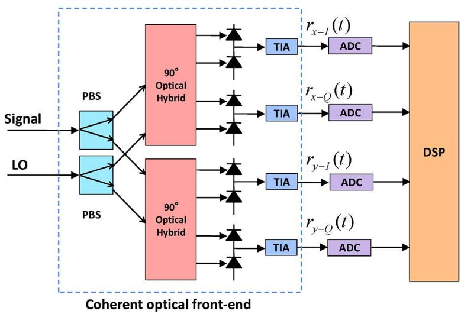

# Compensation for In-Phase/Quadrature Imbalance in Coherent-Receiver Front End for Optical Quadrature Amplitude Modulation

Md. Saifuddin Faruk1 and Kazuro Kikuchi，² Fellow, IEEE

1Department of Electrical and Electronic Engineering,Dhaka University of Engineering and Technology,Gazipur 170o,Bangladesh

2Department of Electrical Engineering and Information Systems,The University of Tokyo, Bunkyo-Ku,Tokyo 113-8656, Japan

DOI: 10.1109/JPHOT.2013.22518721943-0655/\$31.00 ?2013 IEEE

Manuscript received January11,2013;revised February 26,2013;accepted March 5,2013.Date of publication March 13,2013;date of current version March 22,2013.Corresponding author: K. Kikuchi (e-mail: kikuchi@ ginjo.t.u-tokyo.ac.jp).

Abstract: We propose a novel method of compensation for imbalance between in-phase (l) and quadrature (Q) channels in the front-end circuit of digital coherent optical receivers. Adaptive finite-impulse-response (FIR) filters in the butterfly configuration,which are commonly used for signal equalization and polarization demultiplexing,are modified so as to allow for adjustment of any imbalance between the IQ channels. IQ imbalances under consideration include the gain mismatch,the phase mismatch,and the timing-delay skew. Computer simulations for the dual-polarization quadrature-amplitude-modulation (QAM) format up to an order of 256 show that such IQ imbalances can severely degrade the system performance,especially for higher order QAM; however，using the proposed scheme，we can compensate for them without any significant penalty over a wide range of imbalances.

Index Terms: Coherent optical receivers, in-phase/quadrature imbalance， digital signal processing.

## 1. Introduction

The recent development of digital coherent optical receivers has brought the 100-Gbit/s dualpolarization quadrature phase-shift keying (QPSK) system into practical use [1]. For further increase in the bit rate of optical fiber transmission systems,quadrature amplitude modulation (QAM), where both of the in-phase (l) and quadrature (Q) components of an optical carrier are modulated in a multilevel manner, is the best candidate among various modulation formats [2]. However, when higher order QAM formats are employed, their performances are seriously impaired by imperfections of the systems,such as phase noise of the transmitter laser and the local oscillator [3],fiber nonlinearity [4],and imbalance between the IQ channels in the front end of coherent optical receivers [5]. In this paper, we focus on the impact of the imbalance between the IQ channels on QAM signals.We propose a novel lIQ-imbalance compensation scheme, where the conventional adaptive finite-impulse-response (FIR) filters in the butterfly configuration are modified so as to allow for adjustment of any imbalance between the IQ channels.

The front end of coherent receivers employing phase and polarization diversities converts com-plex amplitudes of the incoming dual-polarization optical signal into the electrical domain by means of homodyne detection with a free-running local oscillator. It provides four outputs,namely，IQ components of the complex amplitudes for horizontal and vertical polarizations [6].Fig.1 shows the configuration of the front end composed of polarization-beam spliters (PBSs), 90° optical hybrids, balanced photodiodes,and transimpedance amplifiers (TIAs).The four outputs from TIAs are sent to analog-to-digital converters (ADCs) folowed by a digital signal-processing (DSP) circuit.

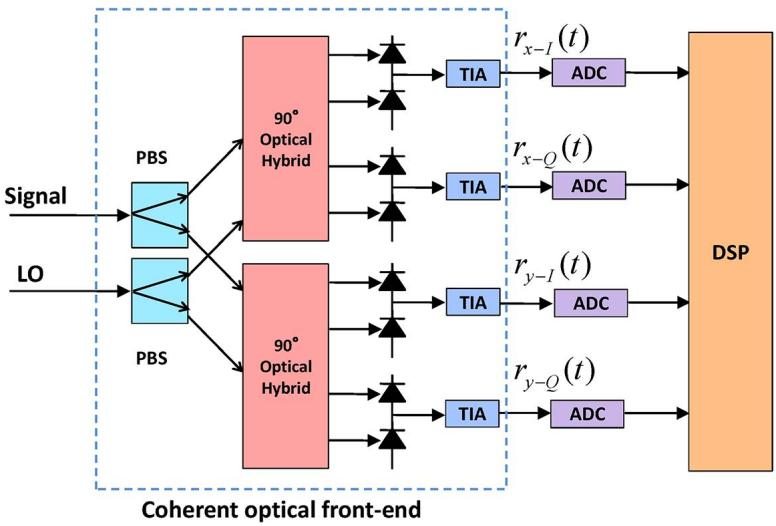  
Fig.1. Block diagram of the digital coherent receiver comprising phase and polarization diversities. LO: local oscilator,PBS:polarization-beam splitter,TIA: transimpedance amplifier,ADC:analog-to-digital converter,and DSP:digital signal-processing circuit.

Imperfection in any of the 90° optical hybrids,balanced photodiodes,and TIAs in the front end may introduce IQ imbalance stemming from the mismatch of the gain and/or the phase between the IQ ports [7]. In addition,timing mismatch between the IQ ports may also be induced by the difference in the physical path length of the circuit trace, which is known as the IQ delay skew [8]. These IQ imbalances degrade the system performance severely if they are left uncompensated in the DSP unit of the receiver.

Several methods of IQ-imbalance compensation in the digital domain have been reported so far [9]-[11]. In [9], the Gram-Schmidt orthogonalization procedure (GSOP) is investigated for the QPSK signal; however, when higher order QAM formats are employed, computational complexity is increased and very high ADC resolution is required. In [10], the compensation is done by the ellipse-correction method,which is neither applicable to higher order QAM signals nor efective when the optical signal-to-noise ratio (OSNR) is low. The IQ-imbalance equalizer based on the constant-modulus algorithm (CMA) is demonstrated for the QPSK signal in [11]; however, such an approach is again not applicable to higher order QAM signals.It should be also noted that none of the methods mentioned above can compensate for the IQ delay skew and that allof them need to use dedicated DSP circuits for IQ-imbalance compensation.

On the other hand, in this paper, we propose a novel scheme, which can overcome the difficulties of the previous schemes: First, our scheme can be applied to any modulation formats. Second, it can compensate for the IQ gain mismatch,IQ phase mismatch,and IQ delay skew all at once. Third,it can be implemented as a part of the conventional two-by-two buterfly-structured FIR filters, which have been commonly used for signal equalization and polarization demultiplexing.

In fact,our proposed scheme modifies the configuration of the conventional adaptive FIR filters in such a way that each of the complex-valued FIR filters is replaced with four real-valued FIR filters in an inner two-by-two buterfly structure.Then,our scheme has two input ports for each polarization, corresponding to the IQ outputs from the front end.Tap coeffcients of the sixteen real-valued FIR filters can be updated using any stochastic-gradient-decent-based adaptation algorithm such as the decision-directed least-mean-square (DD-LMS) algorithm [12] and the CMA [13].The initial convergence speed and the steady-state performance of the equalizer depend on the employed adaptation algorithm.In this paper，we use the DD-LMS algorithm with the training mode.The training mode ensures fast and reliable initial convergence and then switched to the decisiondirected mode. Such adaptation procedure provides the optimal steady-state performance for highorder QAM formats. By the proposed filter modifications,our scheme performs compensation for IQ gain/phase mismatch and iQ delay skew simultaneously，along with other conventional tasks of adaptive FIR filters such as sampling-phase adjustment [14], polarization demultiplexing [15],and compensation for polarization-mode dispersion (PMD) [16].

With intensive computer simulations using the 10-Gsymbol/s dual-polarization 4-,16-, 64-,and 256-QAM formats,we find that the system performance severely degrades if we use the conventional FIR-filter structure in the presence of IQimbalance; however,our scheme can fuly compensate for IQ imbalance generated in the receiver front end over a wide range.

The organization of our paper is as folows: Section 2 presents the formulation of front-end IQ imbalance based on the transfer-function matrix.In Section 3, we propose the novel scheme for IQimbalance compensation together with the tap-adaptation algorithm. Section 4 deals with intensive computer simulations on higher order QAM signals,and we conclude our paper in Section 5.

## 2. Formulation of the Problem

Let $r _ { x - I } ( t )$ and $r _ { x - Q } ( t )$ respectively be received signals from the l and Q ports of the front-end circuit for the x-polarization component, when IQ imbalances are not present. Similarly， let $r _ { y - I } ( t )$ and $r _ { y - Q } ( t )$ be those for the y-polarization component. Then, the complex amplitude of the optical signal is reconstructed as

$$
r _ { x , y } ( t ) = r _ { x - I , y - I } ( t ) + j r _ { x - Q , y - Q } ( t ) .\tag{1}
$$

First,we consider the case that the IQ phase mismatch is included in the front end.In such a case, the l and Q axes in the complex plane are rotated by angles of $\delta _ { x - I }$ and $\delta _ { x - Q }$ ,respectively, for the x-polarization component. Similarly, those angles for the y-polarization component are denoted as $\delta _ { y - I }$ and $\delta _ { y - Q }$ . IQ phase mismatches are given as $\delta _ { x - I } - \delta _ { x - Q }$ and $\delta _ { y - I } - \delta _ { y - Q }$ for x- and y-polarization components,respectively，which represent the ofset from the correct angle of $9 0 ^ { \circ }$ Using $\delta _ { x - I } , \delta _ { x - Q } , \delta _ { y - I }$ and $\delta _ { y - Q }$ ，the real and imaginary parts of the received complex amplitude $r _ { x , y } ^ { p } ( t )$ are expressed as

$$
r _ { x - I , y - I } ^ { p } ( t ) = \cos ( \delta _ { x - I , y - I } ) r _ { x - I , y - I } ( t ) + \sin ( \delta _ { x - I , y - I } ) r _ { x - Q , y - Q } ( t )\tag{2}
$$

$$
r _ { x - Q , y - Q } ^ { p } ( t ) = - \sin ( \delta _ { x - Q , y - Q } ) r _ { x - I , y - I } ( t ) + \cos ( \delta _ { x - Q , y - Q } ) r _ { x - Q , y - Q } ( t ) .\tag{3}
$$

When we define the transfer matrix $\mathsf { P } _ { x , y }$ stemming from the IQ phase mismatch as

$$
\begin{array} { r } { \pmb { \mathrm { P } } _ { x , y } = \left[ \begin{array} { c c } { \cos ( \delta _ { x - I , y - I } ) } & { \sin ( \delta _ { x - I , y - I } ) } \\ { - \sin ( \delta _ { x - Q , y - Q } ) } & { \cos ( \delta _ { x - Q , y - Q } ) } \end{array} \right] } \end{array}\tag{4}
$$

equations (2) and (3) yield

$$
\left[ r _ { x - I , y - I } ^ { p } ( t ) , r _ { x - Q , y - Q } ^ { p } ( t ) \right] ^ { T } = \mathbf { P } _ { x , y } \left[ r _ { x - I , y - I } ( t ) , r _ { x - Q , y - Q } ( t ) \right] ^ { T }\tag{5}
$$

which expresses the mutual coupling of real and imaginary parts of the complex amplitude.

Second, we consider the case that only the IQ gain mismatch is involved in the front end.In such a case, we can express the received complex amplitude as

$$
r _ { x , y } ^ { g } ( t ) = \alpha _ { x - I , y - I } r _ { x - I , y - I } ( t ) + j \alpha _ { x - I , y - I } r _ { x - Q , y - Q } ( t ) .\tag{6}
$$

In (6), $\alpha _ { X - I }$ and $\alpha _ { X - Q }$ are the gains of the l and Q ports,respectively, for the x-polarization com-ponent. Similarly, those values for the y-polarization component are $\alpha _ { y - I }$ and $\alpha _ { y - Q }$ In case that $\alpha _ { x - I } \neq \alpha _ { x - Q }$ , the lQ gain mismatch exists in the x-polarization port and it does in the y-polarization port when $\alpha _ { y - I } \neq \alpha _ { y - Q }$ .The gain mismatching factor is defined as $\alpha _ { X - I } / \alpha _ { X - Q }$ and $\alpha _ { X - I } / \alpha _ { X - Q }$ for the X- and y- polarization components, respectively. Equations (1)and (6) yield the transfer matrix for the IQ gain mismatch $\mathsf { G } _ { x , y }$ as

$$
{ \pmb { \mathsf { G } } } _ { x , y } = \left[ \begin{array} { c c } { \alpha _ { x - I , y - I } } & { 0 } \\ { 0 } & { \alpha _ { x - Q , y - Q } } \end{array} \right]\tag{7}
$$

which leads to

$$
\begin{array} { r } { \left[ r _ { x - I , y - I } ^ { g } ( t ) , r _ { x - Q , y - Q } ^ { g } ( t ) \right] ^ { T } = \mathbb { G } _ { x , y } \left[ r _ { x - I , y - I } ( t ) , r _ { x - Q , y - Q } ( t ) \right] ^ { T } . } \end{array}\tag{8}
$$

Third,we consider the case that only the IQ delay skew is involved between the land Q ports of the front end.When time delays in the four output ports of the front end are given as $\tau _ { x - I } , \tau _ { x - Q } , \tau _ { y - I } ,$ and $\tau _ { y - Q }$ ,the complex amplitude reconstructed from the front-end outputs can be expressed as

$$
r _ { x , y } ^ { d } ( t ) = r _ { x - I , y - I } ( t - \tau _ { x - I , y - I } ) + j r _ { x - Q , y - Q } ( t - \tau _ { x - Q , y - Q } ) .\tag{9}
$$

In case that $\tau _ { X - I } \neq \tau _ { X - Q }$ , the lQ delay skew exists in the X-polarization component, whereas in case that $\tau _ { y - I } \neq \tau _ { y - Q }$ ，it does in the y-polarization component.We transform (9) into the frequency domain as

$$
\left[ R _ { x - I , y - I } ^ { d } ( \omega ) , R _ { x - Q , y - Q } ^ { d } ( \omega ) \right] ^ { T } = \pmb { \mathsf { D } } _ { x , y } ( \omega ) \left[ R _ { x - I , y - I } ( \omega ) , R _ { x - Q , y - Q } ( \omega ) \right] ^ { T }\tag{10}
$$

where $\omega$ is the angular frequency of the optical signal measured from the carrier frequency; $R _ { x - I , y - I } ^ { d } ( \omega ) , \ R _ { x - Q , y - Q } ^ { d } ( \omega ) , \ R _ { x - I , y - I } ( \omega )$ ，and $R _ { x - Q , y - Q } ( \omega )$ are Fourier transforms of $r _ { x - I , y - I } ^ { d } ( t )$ ， $r _ { x - I , y - I } ^ { d } ( t ) , r _ { x - I , y - I } ( \dot { t } )$ ,and $r _ { x - I , y - I } ( t )$ ，respectively; and the transfer matrix $\mathsf { D } _ { x , y } ( \omega )$ is given as

$$
\pmb { \mathrm { D } } _ { x , y } ( \omega ) = \left[ \begin{array} { c c } { \pmb { \mathrm { e x p } } ( j \omega \tau _ { x - I , y - I } ) } & { 0 } \\ { 0 } & { \pmb { \mathrm { e x p } } ( j \omega \tau _ { x - Q , y - Q } ) } \end{array} \right] .\tag{11}
$$

On the other hand, frequency-domain expressions for $\mathsf { P } _ { x , y }$ and $\mathsf { G } _ { x , y }$ are the same as $\mathsf { P } _ { x , y }$ and $\mathsf { G } _ { x , y } ,$ since they are time independent. Therefore, the overalltransfer function expressing the three kinds of IQ imbalances can be written in the frequency domain as

$$
\begin{array} { r } { \pmb { \Omega } _ { x , y } ( \omega ) = \pmb { \mathsf { P } } _ { x , y } \pmb { \mathsf { G } } _ { x , y } \pmb { \mathsf { D } } _ { x , y } ( \omega ) . } \end{array}\tag{12}
$$

Using (12),we find that the complex amplitude including the front-end IQ imbalances is measured as

$$
\left[ R _ { x - I , y - I } ^ { e } ( \omega ) , R _ { x - Q , y - Q } ^ { e } ( \omega ) \right] ^ { T } = \pmb { \Omega } _ { x , y } ( \omega ) \left[ R _ { x - I , y - I } ( \omega ) , R _ { x - Q , y - Q } ( \omega ) \right] ^ { T }\tag{13}
$$

in the frequency domain. To compensate for the IQ imbalances，we need to find the inverse matrix $\pmb { \mathsf { Q } } _ { x , v } ^ { - 1 } ( \omega )$ ，which eliminates the IQ phase mismatch， the IQ gain imbalance，and the IQ delay skew, as shown by

$$
\begin{array} { r } { \big [ R _ { x - I , y - I } ( \omega ) , R _ { x - Q , y - Q } ( \omega ) \big ] ^ { T } = \mathbf { Q } _ { x , y } ^ { - 1 } ( \omega ) \Big [ R _ { x - I , y - I } ^ { e } ( \omega ) , R _ { x - Q , y - Q } ^ { e } ( \omega ) \Big ] ^ { T } . } \end{array}\tag{14}
$$

## 3. Proposed IQ Compensation Scheme

This section discusses how we can generate the inverse matrix $\pmb { \mathcal { Q } } _ { x , v } ^ { - 1 } ( \omega )$ using adaptive FIR filters. We assume that the linear transfer-function matrix of the link is given as $\boldsymbol { \mathsf { H } } _ { f } ( \omega )$ in the absence of IQ imbalances.It is a two-by-two matrix including polarization-mode coupling. Fig.2(a) shows the conventional adaptive FIR fiters in the two-by-two butterfly structure.The discrete Fourier transform (DFT) of tap-coefficient vectors in Fig. 2(a) is defined as

$$
\mathsf { \pmb { h } } _ { i j } ( n ) = \left[ h _ { i j , 0 } ( n ) , h _ { i j , 1 } ( n ) , \ldots , h _ { i j , N } ( n ) \right] ^ { T }\tag{15}
$$

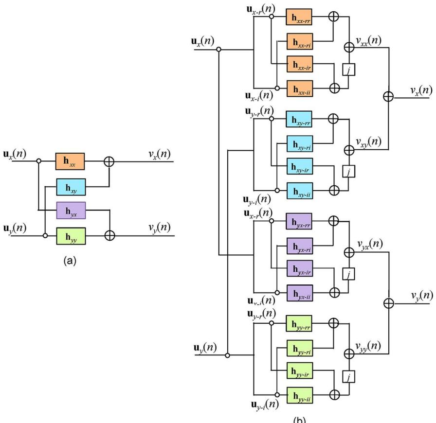  
(b)  
Fig.2.Adaptive FIR-filter configurations used in digital coherent receivers. (a) Conventional configuration with four complex-valued FIR filters. (b) Our proposed configuration with sixteen real-valued FIR filters to enable IQ-imbalance compensation.

where $( i , j ) = ( x , y )$ ，n denotes the index of the data sequence，and N is the tap length.As discussed in [17], it can generate the inverse transfer function $\mathsf { H } _ { f } ^ { - 1 } ( \omega )$ in an adaptive manner. Since $\mathsf { H } _ { f } ^ { - 1 } ( \omega )$ is a two-by-two matrix with four complex elements,four butterfly-structured complex-valued FiR filters shown in Fig. 2(a) are capable of generating such matrix.

However, in order to compensate for IQ imbalances, tap-coefficient vectors $\boldsymbol { \mathsf { h } } _ { x x } ( n )$ and ${ \sf h } _ { y x } ( n )$ should generate $\pmb { \mathsf { Q } } _ { x } ^ { - 1 } ( \omega )$ because the input vector ${ \bf u } _ { x } ( n )$ for them includes the IQ imbalances from the x-polarization channel. Similarly, $\boldsymbol { \mathsf { h } } _ { x y } ( n )$ and ${ \sf h } _ { y y } ( n )$ should generate $\pmb { \mathsf { Q } } _ { v } ^ { - 1 } ( \omega )$ to adjust the IQ imbalances of the y-polarization channel that is included in their common input vector ${ \bf u } _ { y } ( n )$ . Since $\pmb { \mathcal { Q } } _ { x , y } ^ { - 1 } ( \omega )$ is a two-by-two matrix that contains four independent elements, it is evident that the conventional FIR-filtering approach shown in Fig. 2(a) cannot generate $\pmb { \mathsf { Q } } _ { x , v } ^ { - 1 } ( \omega )$ ·

On the other hand,Fig. 2(b) shows the proposed configuration, where each complex-valued FIR filter is replaced by four real-valued FIR filters in an inner two-by-two butterfly structure.Our scheme works on two inputs corresponding to real and imaginary parts of the input complex amplitude. In the following，subscripts $( * )$ rand $^ { ( * ) }$ ：correspond to the real and imaginary parts of a variable, respectively.With an optimum tap-adaptation algorithm, such a configuration ensures that

$$
\mathsf { D F T } \left[ \begin{array} { l l } { \mathsf { n } _ { x x - r r } ( n ) } & { \mathsf { n } _ { x x - r i } ( n ) } \\ { \mathsf { n } _ { x x - i r } ( n ) } & { \mathsf { n } _ { x x - i i } ( n ) } \end{array} \right] \simeq \mathbf { 0 } _ { x } ^ { - 1 } ( \omega ) \mathsf { H } _ { 1 1 } ( \omega )\tag{16}
$$

$$
\mathsf { D F T } \left[ \begin{array} { l l } { \mathsf { n } _ { x y - r r } ( n ) } & { \mathsf { n } _ { x y - r i } ( n ) } \\ { \mathsf { n } _ { x y - i r } ( n ) } & { \mathsf { n } _ { x y - i i } ( n ) } \end{array} \right] \simeq \mathbf { 0 } _ { y } ^ { - 1 } ( \omega ) \mathsf { H } _ { 1 2 } ( \omega )\tag{17}
$$

$$
\mathsf { D F T } \left[ \begin{array} { l l } { \mathsf { n } _ { y x - r r } ( n ) } & { \mathsf { n } _ { y x - r i } ( n ) } \\ { \mathsf { n } _ { y x - i r } ( n ) } & { \mathsf { n } _ { y x - i i } ( n ) } \end{array} \right] \simeq \mathbf { 0 } _ { x } ^ { - 1 } ( \omega ) \mathsf { H } _ { 2 1 } ( \omega )\tag{18}
$$

$$
\mathsf { D F T } \left[ \begin{array} { l l } { \mathsf { n } _ { y y - r r } ( n ) } & { \mathsf { n } _ { y y - r i } ( n ) } \\ { \mathsf { n } _ { y y - i r } ( n ) } & { \mathsf { n } _ { y y - i i } ( n ) } \end{array} \right] \simeq \mathbf { 0 } _ { y } ^ { - 1 } ( \omega ) \mathsf { H } _ { 2 2 } ( \omega )\tag{19}
$$

where four matrix elements of ${ \mathsf { H } } _ { t } ^ { - 1 } ( \omega ) , \mathsf { i . e . , } { \mathsf { H } } _ { 1 1 } ( \omega ) , { \mathsf { H } } _ { 1 2 } ( \omega ) , { \mathsf { H } } _ { 2 1 } ( \omega )$ ,and ${ \sf H } _ { 2 2 } ( \omega )$ , are transformed into two-by-two matrices ${ \sf H } _ { m n } ( \omega ) \left( ( m , n ) = ( 1 , 2 ) \right)$ as

$$
H _ { m n } ( \omega )  \mathsf { H } _ { m n } ( \omega ) = [ \begin{array} { l l } { \mathsf { R e } ( H _ { m n } ( \omega ) ) } & { - \mathsf { I m } ( H _ { m n } ( \omega ) ) } \\ { \mathsf { I m } ( H _ { m n } ( \omega ) ) } & { \mathsf { R e } ( H _ { m n } ( \omega ) ) } \end{array} ] .\tag{20}
$$

Equation (2O) is the transfer matrix for implementing a complex multiplication with wel-nown procedure of using four real multiplications. With such a modification, the matrix can be multiplied with a column vector consisting of the real and imaginary parts of the complex amplitude.

For the proposed configuration, four input column vectors are given by

$$
\mathbf { u } _ { ( x , y ) - ( r , i ) } ( n ) = \left[ u _ { ( x , y ) - ( r , i ) } ( n ) , u _ { ( x , y ) - ( r , i ) } ( n - 1 ) , \ldots , u _ { ( x , y ) - ( r , i ) } ( n - N - 1 ) \right] ^ { T }\tag{21}
$$

and sixteen filter tap-coefficient vectors $\mathbf { h } _ { p q - a b } ( n )$ , where $p q = x x , x y , y x , \mathrm { o r } { } y$ y and $a b = r r , r i , i r ,$ or ii are written as

$$
{ \mathfrak { h } } _ { p q - a b } ( n ) = \left[ h _ { p q - a b } ( n ) , h _ { p q - a b } ( n - 1 ) , \ldots , h _ { p q - a b } ( n - N - 1 ) \right] ^ { T } .\tag{22}
$$

The output signal $v _ { p q } ( n )$ is expressed as

$$
v _ { x x } ( n ) = \mathsf { h } _ { x x - r } ( n ) \mathbf { u } _ { x - r } ( n ) + \mathsf { h } _ { x x - n } ( n ) \mathbf { u } _ { x - i } ( n ) + j \{ \mathsf { h } _ { x x - i r } ( n ) \mathbf { u } _ { x - r } ( n ) + \mathsf { h } _ { x x - i } ( n ) \mathbf { u } _ { x - i } ( n ) \}\tag{23}
$$

$$
v _ { x y } ( n ) = \mathsf { h } _ { x y - m } ( n ) \mathbf { u } _ { y - r } ( n ) + \mathsf { h } _ { x y - \bar { n } } ( n ) \mathbf { u } _ { y - \bar { i } } ( n ) + j \{ \mathsf { h } _ { x y - \bar { i } r } ( n ) \mathbf { u } _ { y - r } ( n ) + \mathsf { h } _ { x y - \bar { i } } ( n ) \mathbf { u } _ { y - \bar { i } } ( n ) \}\tag{24}
$$

$$
v _ { y x } ( n ) = \mathbf { h } _ { y x - r r } ( n ) \mathbf { u } _ { x - r } ( n ) + \mathbf { h } _ { y x - r } ( n ) \mathbf { u } _ { x - i } ( n ) + j \{ \mathbf { h } _ { y x - i r } ( n ) \mathbf { u } _ { x - r } ( n ) + \mathbf { h } _ { y x - i } ( n ) \mathbf { u } _ { x - i } ( n ) \}\tag{25}
$$

$$
v _ { y y } ( n ) =  { \mathbf { h } } _ { y y - t r } ( n )  { \mathbf { u } } _ { y - r } ( n ) +  { \mathbf { h } } _ { y y - t ( n ) }  { \mathbf { u } } _ { y - i } ( n ) + j \{  { \mathbf { h } } _ { y y - i r } ( n )  { \mathbf { u } } _ { y - r } ( n ) +  { \mathbf { h } } _ { y y - i } ( n )  { \mathbf { u } } _ { y - i } ( n ) \} .\tag{26}
$$

Then, the final outputs from the FIR-filter configuration, i.e., $v _ { x } ( n )$ and $v _ { y } ( n )$ ， are computed as

$$
v _ { x } ( n ) = v _ { x x } ( n ) + v _ { x y } ( n )\tag{27}
$$

$$
v _ { y } ( n ) = v _ { y x } ( n ) + v _ { y y } ( n ) .\tag{28}
$$

The error signal for updating the tap coeficients using the DD-LMS algorithm is calculated as

$$
{ \pmb e } _ { x , y } ( n ) = d _ { x , y } ( n ) - v _ { x , y } ( n )\tag{29}
$$

where $d _ { x , y } ( \boldsymbol { n } )$ is either the training symbol in the training mode or the symbol decoded from $v _ { x , y } ( \boldsymbol { n } )$ in the tracking mode.

Finally,based on the DD-LMS algorithm, the filter tap coefficients are updated as

$$
\boldsymbol { \mathsf { h } } _ { p q - r r } ( n + 1 ) = \boldsymbol { \mathsf { h } } _ { p q - r r } ( n ) + \mu \boldsymbol { \mathsf { e } } _ { p - r } ( n ) \boldsymbol { \mathsf { u } } _ { q - r } ( n )\tag{30}
$$

$$
\mathsf { h } _ { p q - n } ( n + 1 ) = \mathsf { h } _ { p q - n } ( n ) + \mu \pmb { e } _ { p - r } ( n ) \mathsf { u } _ { q - i } ( n )\tag{31}
$$

$$
\boldsymbol { \mathsf { h } } _ { p q - i r } ( n + 1 ) = \boldsymbol { \mathsf { h } } _ { p q - i r } ( n ) + \mu \boldsymbol { \mathsf { e } } _ { p - i } ( n ) \boldsymbol { \mathsf { u } } _ { q - r } ( n )\tag{32}
$$

$$
\mathsf { h } _ { p q - i i } ( n + 1 ) = \mathsf { h } _ { p q - i i } ( n ) + \mu \pmb { e } _ { p - i } ( n ) \mathsf { u } _ { q - i } ( n )\tag{33}
$$

where $\mu$ is the step-size parameter, and ${ \pmb { e } } _ { x - r , y - r } ( n )$ and ${ e _ { x - i , y - i } ( n ) }$ are the real and imaginary parts of $\theta _ { x , y } ( \boldsymbol { n } )$ ， respectively.

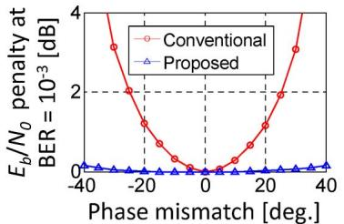  
(a)

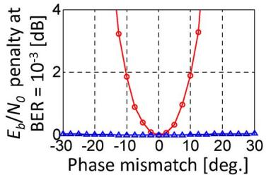  
(b)

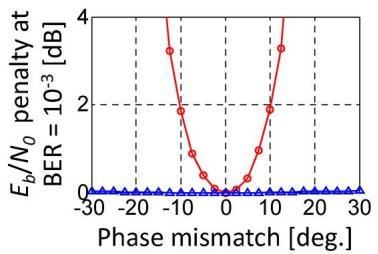  
(c）

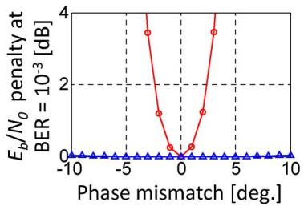  
(d)  
Fig. 3. ${ E _ { b } } / { N _ { 0 } }$ penalty at BER of $1 0 ^ { - 3 }$ as a function of the IQ phase mismatch when neither IQ gain mismatch nor iQ delay skew is included.(a)4-QAM.(b) 16-QAM. (c) 64-QAM. (d) 256-QAM.Red and blue curves represent the penalty when the conventional configuration and the proposed configuration are used, respectively.

## 4. Simulation Results and Discussions

To validate the proposed scheme, we conduct simulations on 10-Gsymbol/s dual-polarization $^ { 4 \cdot , }$ 16-,64-,and 256-QAM coherent systems.In the transmiter,the signal is band limited by a rootraised-cosine filter with a roll-off factor of O.5.The signal is then impaired by phase noise of the transmitter laser and passes through a 100-km-long standard single-mode fiber (SSMF),whose transfer function consists of a chromatic-dispersion value of 17Oo ps/nm and a Jones matrix for fiber birefringence. Additive white Gaussian noise (AWGN) from a preamplifier and phase noise from LO are then given to the signal. The 3-dB Iinewidths of lasers for the transmitter and LO are 500 kHz,100 kHz,10 kHz,and 1 kHz for 4-,16-,64-，and 256-QAM systems,respectively.To obtain the optimal performance,the signal is subsequently filtered by another root-raised-cosine filter to match the signal waveform shaped at the transmiter. After that, we intentionally introduce IQ imbalances.Identical amounts of IQ imbalances are added to both of the X- and y-polarization ports.The signal is then sampled at twice the symbol rate and fed into the adaptive FIR filters configured as either in the conventional manner [see Fig. 2(a)] or in the proposed way [see Fig. 2(b)]. The delay-tap spacing is $\tau / 2$ ，where T is the symbol duration. Such FIR filters simultaneously perform clock recovery，equalization of linear impairments,polarization demultiplexing, and IQ-imbalance compensation. The step-size parameter for the LMS algorithm is optimized so that bit-error rate (BER)is minimized. Next, carier phase estimation based on the decision-directed LMS algorithm [18]，symbol decoding，and BER calculations is done in this order. For the performance evaluation of different modulation formats, we calculate the penalty for the energy-perbit-to-noise spectral-power-density ratio, i.e., ${ E _ { b } } / { N _ { 0 } }$ ,at BER of $1 0 ^ { - 3 }$ . In the following,results for the X-polarization tributary are presented; however， similar results are found for the y-polarization tributary.

Fig.3 shows the ${ E _ { b } } / { N _ { 0 } }$ penalty for different IQ phase mismatches when neither IQ gain mismatch nor lQ delay skew is included. In the simulation，we assume that $\delta _ { x - I } = \delta _ { y - I } = 0 ^ { \circ }$ and vary the rotation angle of the Q axis $\delta _ { x - Q } = \delta _ { y - Q }$ to generate the IQ phase mismatch. In the conventional configuration, tolerances for the IQ phase mismatch are about 25°,10°,5°,and 2.5° for 4-,16-, 64-, and 256-QAM formats，respectively，when the ${ E _ { b } } / { N _ { 0 } }$ penalty is less than 2 dB. However，no notable penalty is found over a wide range when the proposed scheme is used.

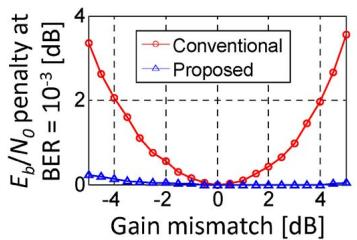  
(a)

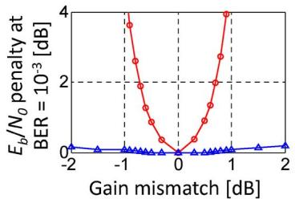  
(c）

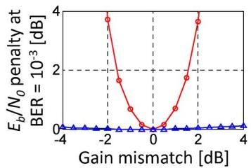  
(b)

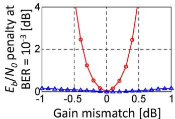  
(d)

Fig. 4. ${ E _ { b } } / { N _ { 0 } }$ penalty at BER of $1 0 ^ { - 3 }$ as a function of the IQ gain mismatch when neither IQ phase mismatch nor iQ delay skew is included.(a) 4-QAM.(b) 16-QAM.(c) 64-QAM.(d) 256-QAM.Red and blue curves represent the penalty when the conventional configuration and the proposed configuration are used, respectively.  
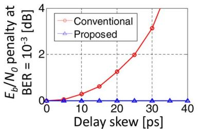  
(a)

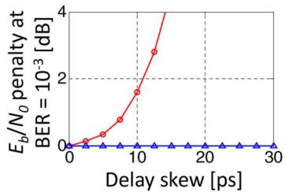

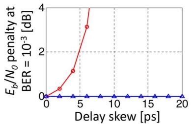  
(c）

(b)  
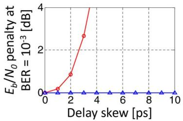  
(d)  
Fig. 5. ${ E _ { b } } / { N _ { 0 } }$ penaltyat BER of $1 0 ^ { - 3 }$ as a function of the IQ delay skew when neither IQ phase nor IQ gain mismatch is included.(a) 4-QAM.(b) 16-QAM.(c) 64-QAM. (d) 256-QAM. Red and blue curves represent the penalty when the conventional configuration and the proposed configuration are used, respectively.

The ${ E _ { b } } / { N _ { 0 } }$ penalty as a function of the IQ gain mismatch is shown in Fig. 4 when neither IQ phase mismatch noriQ delay skew is included. We set the gain of the Iport as a reference such that $\alpha _ { X - I } = 1$ and $\alpha _ { y - I } = 1$ and vary $\alpha _ { x - Q }$ and $\alpha _ { y - Q }$ to introduce the IQ gain mismatch. As far as the $E _ { b } / N _ { 0 }$ \_penalty is less than 2 dB, tolerances of the conventional configuration are about 4 dB, 1.75 dB,0.75 dB,and 0.4 dB for 4-,16-, 64-,and 256-QAM formats,respectively. However,with the proposed scheme, no significant penalty is observed over a wide range of the IQ gain mismatch.

Next, we calculate the ${ E _ { b } } / { N _ { 0 } }$ penalty due to the IQ delay skew when neither IQ gain nor IQ phase mismatch isinvolved. As shown inFig.5,wefind that the conventional FIR-filtering scheme is very sensitive to the IQ delay skew and the tolerance drastically decreases with the increase in the level of modulation; however,the proposed method has a very wide range of tolerance to such IQ delay skew. In fact, a quasi-continuous delay can be generated even by using T/2-spaced FIR filters, as shown in [14].Therefore,any amount of delay skew can be compensated for with T/2-spaced FIR filters having a sufficient number of delay taps.

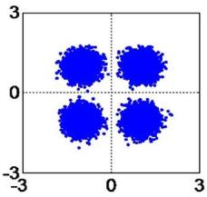

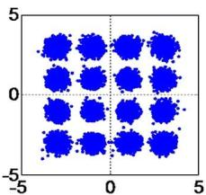

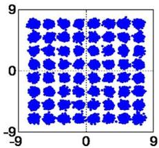

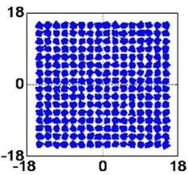

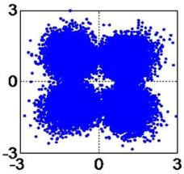

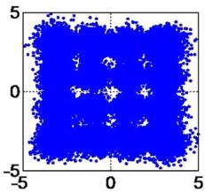

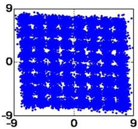

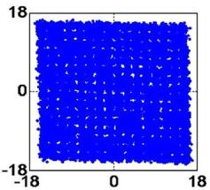

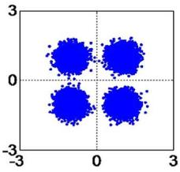  
(a)

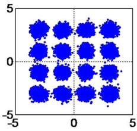

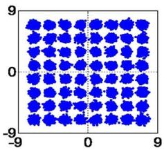  
(c）

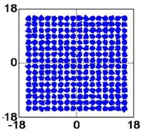  
(d)  
Fig. 6.Constellation diagrams of the recovered signal for (a) 4-QAM,(b) 16-QAM,(c) 64-QAM,and (d) 256-QAM formats. Upper diagrams show constelation maps when the conventional FIR-filter configuration is used and any iQ imbalance is notincluded.Middle diagrams are those with the conventional FIR-filter configurationwhen IQ imbalances given in Table1 are involved.Lower diagrams are constelation maps calculated with the proposed scheme when the same IQ imbalances are included.

TABLE 1  
Values of IQ imbalances used in che Calculation of constellation maps shown in Fig. 6
<table><tr><td rowspan=1 colspan=1>Modulationformat</td><td rowspan=1 colspan=1>δ[deg.]</td><td rowspan=1 colspan=1>α[dB]</td><td rowspan=1 colspan=1>T[ps]</td></tr><tr><td rowspan=1 colspan=1>4-QAM</td><td rowspan=1 colspan=1>20</td><td rowspan=1 colspan=1>-4</td><td rowspan=1 colspan=1>20</td></tr><tr><td rowspan=1 colspan=1>16-QAM</td><td rowspan=1 colspan=1>10</td><td rowspan=1 colspan=1>-2</td><td rowspan=1 colspan=1>10</td></tr><tr><td rowspan=1 colspan=1>64-QAM</td><td rowspan=1 colspan=1>6</td><td rowspan=1 colspan=1>-0.7</td><td rowspan=1 colspan=1>6</td></tr><tr><td rowspan=1 colspan=1>256-QAM</td><td rowspan=1 colspan=1>3</td><td rowspan=1 colspan=1>-0.4</td><td rowspan=1 colspan=1>4</td></tr></table>

Finally,we investigate the combined effct of allof te IQ imbalances.Fig.6 shows constellation diagrams for different modulation formats. In the simulation, ${ E _ { b } } / { N _ { 0 } }$ for each polarization are 10 dB, 14 dB,18 dB,and 23 dB for 4-,16-, 64-,and 256-QAM formats,respectively. Upper diagrams show constellation maps calculated with the conventional FIR-fiter configuration when any IQ imbalances are not included. Middle and lower diagrams are calculated with the conventional and proposed schemes,respectively,when IQ imbalances listed in Table 1 are included. As shown in the middle diagrams,the conventional approach fails to compensate for the IQ imbalances. However, the lower constelations are as clear as the upper constellations,showing that the proposed method can perfectly compensate for those IQ imbalances.

In our simulations,we do not include the effect of the limited ADC resolution. However， we generally need ADCs with higher bit resolution as the increase in the IQ imbalance.This situation is similar to other IQ-imbalance compensation methods.

It is also important to mention the computational complexity of the proposed scheme compared with that of the conventional FIR-filter scheme.The hardware-implementation complexity for a multiplier is much higher than that of an adder. Hence,if we evaluate the computational complexity in terms of the number of real multiplications,the conventional FIR-filter configuration and the proposed configuration\_have the same computational cost. This is because a complex-number multiplication in the DSP circuit is realized by using four real-number multiplications.

## 5. Conclusion

We have proposed a novel FIR-filter configuration，which can compensate for IQ imbalances generated in the front-end circuit of coherent optical receivers.With intensive computer simulations, we have evaluated the impact of IQ imbalances on the performance of dual-polarization 4-,16-, 64-, and 256-QAM systems and verified that the proposed scheme can efectively compensate for them.

## References

[1] E.Yamazaki,S.Yamanaka,Y.Kisaka,T.Nakagawa,K.Murata,E.Yoshida,T.Sakano,M.Tomizawa,Y.Miyamoto S.Matsuoka,J.Matsui,A.Shibayama,J.Abe,Y.Nakamura，H.Noguchi，K.Fukuchi，H.Onaka，K.Fukumitsu, K.Komaki,O.Takeuchi,Y.Sakamoto,H.Nakashima,T.Mizuochi,K.Kubo,Y.Miyata,H. Nishimoto,S.Hirano,and K.Onohara,“Fast optical channel recovery in field demonstration of 100-Gbit/s Ethernet over OTN using real-time DSP,”Opt. Exp.,vol.19,no.14, pp.13 139-13 184,Jul.2011.

[2]P.J.WinzerandR.-J.Essiambre,“Advancedoptical modulation formats,”in\_Optical FiberTelecommunication, V. B.I.P.Kaminow,T.Li,and A.E.Willner, Eds.Amsterdam,The Netherlands: Elsevier, 2008.

[3]M.Seimetz,“Laser linewidth limitationsforoptical systems withigh-ordermodulationemployingfeedforwarddigital carierphase estimation,”presentedattheOpt.Fiber Commun.Conf.,San Diego,CA,USA,Mar.2008,PaperOTuM2.

[4] K.Kikuchi，“Analysesof wavelength-and\_polarization-divisionmultiplexedtransmisioncharacteristicsofoptical quadrature-amplitude-modulation signals,”Opt. Exp.,vol.19,no.19,pp.17 985-17 995,Sep.2011.

[5] Md.S.FarukandK.Kikuchi,“Front-endlQ-erorcompensation incoherentopticalreceivers,”presentedattheOpto-Electron. Commun. Conf.，Busan,Korea,Jul. 2012,Paper 4B2\_5.

[6]K.KikuchiCoherentopticalcommunications:Historicalperspectivesandfuturedirections,”inHighSpectralDensity OpticalCoictiooya.chdis.ork Verlag,2010.

[7] S.J.Savory“Digitalcoherentoptical receivers: Algorithmsandsubsystems,”IEEEJ.Sel.Topics QuantumElectron, vol.16,no.5,pp.1164-1179, Sep./Oct. 2010.

[8]T.Tanimura,S.Oda,T.Tanaka,T.Hoshida,Z.Tao,and J.C.Rasmussen,“A simple digital skew compensator for coherent receiver,”presented at the Eur. Conf. Opt.Commun.,Vienna,Austria,Sep.2009,Paper 7.3.2.

[9]I.Fatadin,S.J.Savory,andD.Ives,“Compensationofquadratureimbalance inanoptical QPSKcoherentreceiver,” IEEE Photon.Technol.Let.,vol.20,no.20,pp.1733-1735,Oct.2008.

[10] S.H.Chang, H.S. Chung,and K. Kim,“Impact of quadrature imbalance in optical coherent QPSK receiver,” IEEE Photon.Technol. Lett.,vol.21,no.11,pp.709-711, Jun.2009.

[11]C.S.Petrou,A.Vgenis,I.Roudas,and L.Raptis,“Quadratureimbalance compensation for PDM QPSK coherent optical systems,”IEEE Photon.Technol.Lett,vol.21,no.24,pp.1876-1878,Dec.2009.

[12] S.Haykin,Adaptive Filter Theory,4th ed.Englewood Cliffs,NJ,USA: Prentice-Hal,2001.

[13]D.N.Godard,“Self-recoveringequalizationandcarrer tracking intwo-dimensional datacommunicationsystems,” IEEETrans.Commun.,vol.COM-28,no.11,pp.1867-1875,Nov.1980.

[14]K.Kikuchi，“Clock recoveringcharacteristicsofadaptivefinite-impulse-responsefitersindigitalcoherentoptical receivers,”Opt. Exp.,vol.19,no.6,pp.5611-5619,Mar.2011.

[15]K.Kikuchi“Performanceanalysesof polarizationdemultiplexing basedonconstant-modulusalgorithmindigitalcoherent optical receivers,”Opt. Exp.,vol.19, no.10,pp.9868-9880,May 2011.

[16] S.J.Savory“Digital filters forcoherent optical receivers,”Opt.Exp.,vol.16,no.2,pp.804-817,Jan.2008.

[17] Md.S.Faruk,Y.Mori,C.Zang,K.garashiandK.ikuchi“utiimpairmentmonitoringfromadaptivefiniteilseresponse filters ina digital coherent receiver,”Opt.Exp.,vol.18,no.26,pp.26 929-26 936,Dec.2010.

[18]Y.MoriC.Zhang，andK.Kikuchi“Novelconfigurationoffinite-impulse-responsefilterstoleranttocarrier-pase fluctuationsindigitalcoherentopticalreceiversforhigher-orderquadratureamplitudemodulationsignals,”Opt.Exp., vol. 20,no.24,pp.26 236-26 251, Nov. 2012.