# Self-Recovering Equalization and Carrier Tracking in Two-Dimensional Data Communication Systems

DOMINIQUE N.GODARD,MEMBER,IEEE

Abstract-Conventionalequalizationand carrierrecovery algorithms for minimizing mean-square error in digital communi-·cation systems generally require an initial training period during which a known data sequence is transmitted and properly synchronized at the receiver.

This paper solves the general problem of adaptive channel equalization without resorting to a known training sequence or to conditions of limited distortion.The criterion for equalizer adaptation is the minimization of a new class of nonconvex cost functions which are shown to characterize intersymbol interference independently of carrier phase and of the data symbol constellation used in the transmission system.Equalizer convergence does not require carrier recovery，so that carrier phase tracking can be carried out at the equalizer .output in a decision-directed mode. The convergence properties of the self-recovering algorithms are analyzed mathematically and confirmed by computer simulation.

## I. INTRODUCTION

APLICiaeh sign of data communications equipment,and particularly the advent in recent years of microprocessor-based modems, resulted in improved reliability and performance of communications systems.In addition to the execution of usual transmitter and receiver tasks,the high flexibility of microprocessor-based modems enables them to provide a variety of functions such as self-diagnostics,the gathering of information on line quality,or automatic switching to and from full and fallback speeds,and thus to contribute to network management. The computing power available also makes practical the implementation of recent advances in signal theory.These significant features of microprocessor modems are of great interest with the growing use of multipoint networks for computer communications applications,where trends to data throughput enhancement give rise to new problems,particularly in the field of automatic equalization.

Typically，adaptive equalizers need an initial training period in which a particular data sequence,known and available in proper synchronism at the receiver,is transmitted.In a multipoint network,the basic architecture of which is shown in Fig.1,the problem of fast startup equalization is of paramount importance.The control station usually operates in carrier-on mode,and tributary terminals are allowed to transmit only when polled by the control modem.Messages from tributary to control station often being short, the effective data throughput is,to a large degree,dependent on the startup time of the control modem which,at each return message, must adapt to the particular channel and transmitter from which data are received.There is therefore considerable interest in equalizer adjustment algorithms that converge much faster than the conventional estimated-gradient algorithm [1]-[3].

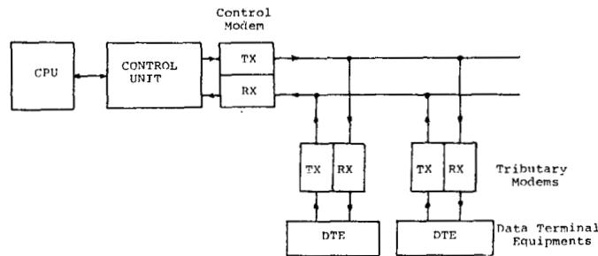  
Fig.1．Typical multipoint network.

A second problem peculiar to multipoint networks is that of retraining a tributary receiver which,because of drastic changes in channel characteristics or simply because it was not powered-on during initial network synchronization,is not able to recognize data and polling messages. Since lines are shared, the control modem has to interrupt data transmission and initiate a new synchronizing procedure generally causing all tributaries to retrain [4].It is clear that,particularly for large or heavily loaded multipoint systems,data throughput is increased and network monitoring is made easier by giving tributary receivers the capability to achieve complete adaptation without the cooperation of the control station,and therefore without disrupting normal data transmission to other terminals.The purpose of this paper is the design of processing algorithms which will allow for receiver synchronization without requiring the transmission of a known training sequence.

While the subject of fast startup equalization is a wellcovered topic (see for instance the references given in [2] and :[6]),the communications literature is very poor with respect to the problem of self-recovering equalization and carrier tracking which is dealt with in this paper.As a matter of fact, we are only aware of one paper [5] where this problem is considered in the context of amplitude-modulated data transmission systems.In [5],the multilevel signal is treated by the equalizer as a binary signal, that is its polarity,the remaining signal being considered as random noise.This approach cannot be readily extended to combined amplitude and phase modulation systems, in particular since the problem of carrier phase recovery is superimposed to that of equalization.

In this paper,we shall place ourselves in the context of twodimensional modulation schemes generally used in high-speed voice-band modems,and which we describe in Section II.A new variety of cost functions for equalizer adjustment,independent of carrier phase and of the symbol constellation encoding the data is presented and discussed in Section III. Equalization algorithms,requiring the same computing power as the estimated-gradient algorithm minimizing the equalized mean-squared error,are given in Section IV,and their convergence properties are addressed in Section V. The cost functions to be minimized are shown to be nonconvex,but means for circumventing this difficulty are suggested.Finally,computer simulations,conducted in the presence of noise and severe distortions,confirm the effectiveness of the approach.

## II.TWO-DIMENSIONAL MODULATION SCHEME

We consider a synchronous double-sideband quadrature amplitude modulated data transmission system of the general form shown in Fig.2.The binary message to be transmitted is usually scrambled and converted by some coding law into data symbols $\{ a _ { n } \}$ taken from a two-dimensional constellation,and the two components are transmitted by amplitude-modulating two quadrature carrier waves. Such a modulation scheme can be treated in a concise manner by combining in-phase and quadrature components into complex-valued signals.Denoting by ${ \pmb g } _ { \bf 0 } ( t )$ the baseband real signal element,the symbol interval $T ,$ and the carrier frequency $f _ { 0 }$ ,the transmitted signal is of the form

$$
u ( t ) = \mathrm { R e } \sum _ { n } a _ { n } g _ { 0 } ( t - n T ) \exp { j 2 \pi f _ { 0 } t } .\tag{1}
$$

Assuming a dispersive transmission medium with additive noise $w ( t )$ ,the receiver input signal can be expressed as

$$
x ( t ) = \mathrm { R e } \sum _ { n } a _ { n } g ( t - n T ) \exp j ( 2 \pi f _ { 0 } t + \varphi ( t ) ) + w ( t ) ,\tag{2}
$$

where ${ \pmb g } ( t )$ is a generally complex baseband signal element [7] and (t) is a time-varying phase shift due to frequency offset and phase jitter.

At the receiver,the concept of carrier tracking after equalization is employed. This is motivated by the fact that a proper design of the carrier tracking loop allows removal of relatively high-frequency phase jitter [8].The real-valued signal x(t) first enters ä phase splitter whose complex transfer function r(t) is usually matched to the transmitted signal element,i.e.,

$$
\begin{array} { r } { \pmb { r } ( t ) = g _ { 0 } ( - t ) \exp { j 2 \pi f _ { 0 } t } , } \end{array}\tag{3}
$$

and,for the sake of simplicity,we shall assume that demodulation by a local carrier with frequency $f _ { 0 }$ is carried out before equalization,so that the equalizer has essentially to process a complex baseband signal of the general form

$$
y ( t ) = \sum _ { n } a _ { n } h ( t - n T ) \exp j \varphi ( t ) + v ( t ) ,\tag{4}
$$

where $h ( t )$ is the overall baseband equivalent impulse response an v(t） is complex filtered noise.Although we consider a tapped delay-line equalizer having a tap spacing equal to T, the analyses which will be developed also apply to the case of fractionally spaced equalizers [9].

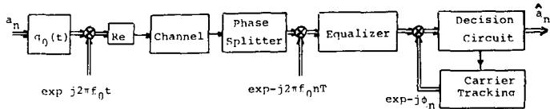  
Fig.2. Two-dimensional transmission system.

Not shown on the receiver block-diagram of Fig.2,but necessary in actual modems,are the automatic gain control (AGC), timing recovery circuit,and descrambler. Timing con-- trol and AGC do not require knowledge of the transmitted data [1O] and descramblers usually are self-synchronizing. Therefore,as far as receiver self-adaptation is concerned,it is sufficient to concentrate only on equalization and carrier tracking problems.

Using complex vector notation, the equalizer output signal $z _ { n }$ at time $t = n T$ can be written as

$$
z _ { n } = y _ { n } ' c _ { n } ,\tag{5}
$$

where $y _ { n }$ is the vector of tap-output signals and $c _ { n }$ the tapgain vector at time nT,both being N-dimensional.Throughout the paper,a prime(') denotes the transpose of a vector.The equalizer output sample is rotated by an estimated carrier phase $\hat { \varphi } _ { n }$ and presented to the decision circuit.

Conventionally,the criterion for adjusting $c _ { n }$ and $\hat { \varphi } _ { n }$ is the minimization of the mean-squared error

$$
\bar { E } ^ { 2 } = E | z _ { n } \exp - j \hat { \varphi } _ { n } - a _ { n } | ^ { 2 } ,\tag{6}
$$

where E indicates expectation over all possible noise and data sequences.Derivation of (6) with respect to c and $\hat { \varphi }$ leads to the classical stochastic gradient algorithms

$$
c _ { n + 1 } = c _ { n } - \lambda _ { c } y _ { n } { } ^ { * } ( z _ { n } \exp { - j \hat { \varphi } _ { n } } - a _ { n } ) \exp { j \hat { \varphi } _ { n } } ,\tag{7}
$$

$$
\begin{array} { r } { \hat { \varphi } _ { n + 1 } = \hat { \varphi } _ { n } - \lambda _ { \varphi } I m { a _ { n } } ^ { * } z _ { n } \exp - j \hat { \varphi } _ { n } , } \end{array}\tag{8}
$$

$\lambda _ { c }$ and $\lambda _ { \varphi }$ being positive real, possibly time-varying step-size parameters,and the superscript \* denoting complex conjugate.

At this point,several remarks can be made.

1）Equation (8） describes the operation of a first-order phase-locked loop. In the presence of frequency offset,a second-order loop is necessary to lock with a zero-mean steadystate phase error.

2) As is obvious from (5) and (6),if a combination $( c , \hat { \varphi } )$ minimizes the mean-squared error， then any combination (c exp $j \psi , \hat { \varphi } + \psi )$ is also optimum.Later we shall take advantage of this “tap rotation” property of passband equalizers [11].

3) It is important to note that (7) and (8)show a coupling between equalizer updating and carrier tracking loops.If a decision-directed approach $( a _ { n }$ replaced in(7）and (8) by receiver's decisions $\hat { a } _ { n } )$ is employed for receiver training, successful adaptation requires that c and $\hat { \varphi }$ be simultaneously close enough to their optimum values.

At data rates of 9600 or 12 000 bits/s,even without assuming severe channel distortions,the probability of symbol error in unequalized transmission systems is very close to 1.It is generally observed that decision-directed recovery fails to converge when the error probability is in the order of O.1, except in the case of pure phase modulation.

This exception has not been well understood so far,and we throw some light on this subject in the next section.

## III. COSTFUNCTIONS FOR EQUALIZER ADAPTATION

The primary goal of our self-recovering equalization and carrier tracking technique will be to reduce the effects of channel distortions so that the receiver's decisions become safe enough to use the conventional decision-directed gradient algorithms. Intersymbol interference (ISI) being on actual channels of much greater importance than noise,it will be assumed throughout the theoretical analyses that the noise term in (4) can be neglected.

In the suppressed-carrier transmission systems we are dealing with,carrier phase recovery from the received data signal requires that the system be equalized.Furthermore, even in the absence of phase jitter and frequency offset,the receiver's initial decisions are not safe enough estimates of the transmitted symbols to allow equalizer adaptation.The general problem of self-recovering equalization can therefore be stated as follows: find a cost function that characterizes the amount of intersymbol interference at the equalizer'output independently of the data symbol constellation and of carrier phase.

Our criterion will be the minimization of functions $\mathcal { D } ^ { ( { p } ) }$ called dispersion of order p (p integer >O),defined by

$$
\begin{array} { r } { \mathcal { D } ^ { ( p ) } = E ( \vert z _ { n } \vert ^ { p } - R _ { p } ) ^ { 2 } , } \end{array}\tag{9}
$$

with the $R _ { p }$ being positive real constants which we shall discuss later.

The rationale for such a choice will become clear by comparing the dispersion functions with cost functions

$$
G ^ { ( p ) } = E ( \mid z _ { n } \mid ^ { p _ { - } } \mid a _ { n } \mid ^ { p } ) ^ { 2 } ,\tag{10}
$$

for which only independence from carrier phase is achieved.

Let $\{ \pmb { s } _ { k } \}$ be the samples at the rate 1/T Hz of the overall transmission system impulse response,including the equalizer. The equalizer output signal is then of the general form

$$
z _ { n } = \ \sum _ { k } \ a _ { n - k } s _ { k } \exp { j \psi _ { n } } ,\tag{11}
$$

where $\psi _ { n }$ is the phase shift due to frequency offset and phase jitter.The eye patterns observed for pure phase modulation and combined amplitude and phase modulation examples,in the case where only one ISI term is nonzero,are pictured in Fig.3.The transmitted symbols are marked by circles and received points by dots.It is clear that there exists no ISI term able to produce only phase errors which are not“seen”’by (10),and therefore that minimizing $G ^ { ( { p } ) }$ ,i.e., equalizing only the amplitude of $z _ { n }$ ,will lead to a small mean-squared error.

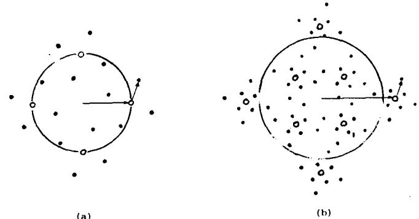  
Fig.3.Observed eye patterns (one ISI term). (a) Pure phase modulation. (b) Combined amplitude and phase modulation.

It should be noted here that, for pure phase modulation,channel distortions can simply be equalized by constraining the equalizer output signal to have constant magnitude.This is achieved by the decision-directed gradient algorithm even in the presence of decision errors,which explains why its convergence is generally observed.

The minimization of $G ^ { ( { p } ) }$ leads to the minimization of ISI in a sense which we now specify.For mathematical convenience,we shall consider $p = 2$ . The data symbol constellation is assumed to have symmetries so that

$$
E { { a } _ { n } } ^ { 2 } = 0 .\tag{12}
$$

Data symbols being stationary and uncorrelated

$$
E a _ { n } * _ { a _ { m } } = E \mid a _ { n } \mid ^ { 2 } \delta _ { n m } ,\tag{13}
$$

one has from (11),using(12) and (13)

$$
\begin{array} { l } { { E | z _ { n } | ^ { 4 } = \{ E | a _ { n } | ^ { 4 } - 2 ( E | a _ { n } | ^ { 2 } ) ^ { 2 } \} \sum _ { k } | s _ { k } | ^ { 4 } } } \\ { { \ } } \\ { { \displaystyle ~ \cdot ~ + 2 ( E | a _ { n } | ^ { 2 } ) ^ { 2 } \left( \sum _ { k } | s _ { k } | ^ { 2 } \right) ^ { 2 } , } } \end{array}\tag{14}
$$

$$
\begin{array} { l } { E \mid z _ { n } \mid ^ { 2 } \mid a _ { n } \mid ^ { 2 } = E \mid a _ { n } \mid ^ { 4 } \mid s _ { 0 } \mid ^ { 2 } } \\ { \qquad + ( E \mid a _ { n } \mid ^ { 2 } ) ^ { 2 } \sum _ { k } ^ { \prime } \mid s _ { k } \mid ^ { 2 } } \end{array}\tag{13}
$$

where

$$
\sum _ { k } ^ { }
$$

indicates summation with deletion of the $k = 0$ term.

It follows from (14) and (15) that,for p =2,(10) may be written as

$$
\begin{array} { l } { { G ^ { ( 2 ) } = E | a _ { n } | ^ { 4 } ( 1 - | s _ { 0 } | ^ { 2 } ) ^ { 2 } + E | a _ { n } | ^ { 4 } \sum _ { k } ^ { \prime } | s _ { k } | ^ { 4 } } } \\ { { \ } } \\ { { \displaystyle ~ + 2 ( E | a _ { n } | ^ { 2 } ) ^ { 2 } \{ (  \sum _ { k } { } ^ { \prime } | s _ { k } | ^ { 2 } ) ^ { 2 } -  \sum _ { k } { } ^ { \prime } | s _ { k } | ^ { 4 } \}  } } \\ { { \  \qquad + \{ 4 ( E | a _ { n } | ^ { 2 } ) ^ { 2 } | s _ { 0 } | ^ { 2 } - 2 ( E | a _ { n } | ^ { 2 } ) ^ { 2 } \} \sum _ { k } { } ^ { \prime } | s _ { k } | ^ { 2 } ,  } } \end{array}\tag{16}
$$

showing that $G ^ { ( 2 ) }$ has a minimum when $\mid s _ { 0 } \mid ^ { 2 }$ is close to unity and ISI terms $\{ s _ { k } \} , k \neq 0 .$ ,have small magnitude.

The same type of computation can be carried out for the dispersion of order 2,the evaluation of which does not require the knowledge of the transmitted data sequence. One obtains

$$
\begin{array} { l } { { \displaystyle { \mathcal D } ^ { ( 2 ) } = \{ E | a _ { n } | ^ { 4 } - 2 ( E | a _ { n } | ^ { 2 } ) ^ { 2 } \} \sum _ { k } | s _ { k } | ^ { 4 } } } \\ { { \displaystyle ~ + 2 ( E | a _ { n } | ^ { 2 } ) ^ { 2 } \left( \sum _ { k } | s _ { k } | ^ { 2 } \right) ^ { 2 } } } \\ { { \displaystyle ~ - 2 R _ { 2 } E | a _ { n } | ^ { 2 } \sum _ { k } | s _ { k } | ^ { 2 } + R _ { 2 } ^ { 2 } } . } \end{array}\tag{17}
$$

In the next section,it is demonstrated that $R _ { 2 }$ must be chosen equal to $E ^ { \mid } a _ { n } \mid ^ { 4 } / E ^ { \mid } a _ { n } \mid ^ { 2 }$ .It is then easy to show that (17) may be written under the particular form

$$
\begin{array} { l } { { \displaystyle { \mathcal D } ^ { ( 2 ) } = E | a _ { n } | ^ { 4 } ( 1 - | s _ { 0 } | ^ { 2 } ) ^ { 2 } + E | a _ { n } | ^ { 4 } \sum _ { k } ^ { \prime } | s _ { k } | ^ { 4 } } } \\ { ~ } \\ { { + 2 ( E \{ a _ { n } | ^ { 2 } \} ) ^ { 2 } \Bigg \{ \Bigg ( \sum _ { k } ^ { \prime } | s _ { k } | ^ { 2 } \Bigg ) ^ { 2 } - \sum _ { k } ^ { \prime } | s _ { k } | ^ { 4 } \Bigg \} } } \\ { { + \left\{ 4 ( E | a _ { n } | ^ { 2 } ) ^ { 2 } | s _ { 0 } | ^ { 2 } - 2 E | a _ { n } | ^ { 4 } \right\} } } \\ { { ~ \cdot ~ \sum _ { k } ^ { \prime } | s _ { k } | ^ { 2 } + { R _ { 2 } } ^ { 2 } - E | a _ { n } | ^ { 4 } . } } \end{array}\tag{18}
$$

Comparing (16) and (18),it is seen that,apart from an additive constant, $\dot { G } ^ { ( 2 ) }$ and $\mathcal { D } ^ { ( 2 ) }$ have very similar expressions,provided that the data symbol constellation is such that the quantity

$$
4 ( E | a _ { n } | ^ { 2 } ) ^ { 2 } | s _ { 0 } | ^ { 2 } - 2 E | a _ { n } | ^ { 4 }
$$

is positive when $\mid s _ { 0 } \mid ^ { 2 }$ is close to unity.

It may then be concluded that the dispersion has at least a local minimum to which corresponds a small mean-squared error,defined in the absence of noise by

$$
\mathcal { E } ^ { 2 } = E | a _ { n } | ^ { 2 } \left\{ | . 1 - s _ { 0 } | ^ { 2 } + \sum _ { k } | s _ { k } | ^ { 2 } \right\}
$$

The existence of other minima will be studied in detail in Section V. Now we present equalizer adjustment algorithms and show that,for an infinite length equalizer,perfect equalization is one steady-state solution of the adaptation process.

## IV. SELF-RECOVERING EQUALIZATION ALGORITHMS

Equalizer tap-gains are adjusted according to the classical steepest descent algorithm

$$
c _ { k + 1 } = c _ { k } - \mu _ { p } \left[ \frac { \partial \mathcal { D } ^ { ( p ) } } { \partial c } \right] _ { c = c _ { k } } , \qquad \mu _ { p } > 0 .\tag{19}
$$

In order to take the derivative of (9) with respect to $^ { c , }$ one

must assume that the equalizer gains are not identically zero. It can easily be shown that

$$
\frac { \partial } { \partial { c } } \left| y _ { n } { ' } c \right| = y _ { n } { ^ * } y _ { n } { ^ { \prime } } c \left| y _ { n } { ^ { \prime } } c \right| { ^ { - 1 } } ,\tag{20}
$$

from which we obtain

$$
\begin{array} { r l } { \left[  { \frac { \partial \mathcal { D } ^ { ( p ) } } { \partial c } } \right] _ { c = c _ { k } } } & { \stackrel { \cdot } { = } 2 p E y _ { n } { ^ { * } } y _ { n } { ^ { \prime } } c _ { k } | y _ { n } { ^ { \prime } } c _ { k } | ^ { p - 2 } } \\ & { \cdot ( | y _ { n } { ^ { \prime } } c _ { k } | ^ { p } - R _ { p } ) . } \end{array}\tag{21}
$$

As is usually done when minimizing the mean-squared error, one can drop the expectation term in (21) and transform (19) into the stochastic approximation algorithm

$$
c _ { n + 1 } = c _ { n } - \lambda _ { p } y _ { n } { } ^ { * } z _ { n } \mid z _ { n } \mid ^ { p - 2 } ( \mid z _ { n } \mid ^ { p } - R _ { p } ) ,\tag{22}
$$

where $\lambda _ { p }$ is a positive and small enough step-size parameter.

Now we can define the values of the constants $R _ { p }$ It should be noted that,from (21),changing $R _ { p }$ into $\alpha R _ { p } ( \alpha > 0 )$ will result in changing the steady-state solutions  of (22),assuming that they exist,into $\alpha ^ { 1 / p } \tilde { c }$ The value of $R _ { p }$ then only controls equalizer amplification.Naturally,we require that tap-gain increments (21) be zero when perfect equalization is achieved.This condition will define the constants $R _ { p } .$

Limiting ourselves to the case where the phase shift $\varphi ( t )$ in (4) is of the form

$$
\varphi ( t ) = \varphi _ { 0 } + 2 \pi \Delta f t ,\tag{23}
$$

where $\varphi _ { 0 }$ is a constant and $\Delta f$ the frequency offset, the system is perfectly equalized when the equalizer output signal is given by

$$
z _ { n } = a _ { n } \exp { j ( \psi + 2 \pi \Delta f n T ) } ,\tag{24}
$$

$\psi$ being any constant phase shift,owing to the tap-rotation property of passband equalizers.

Using (4) for expressing the components of $y _ { n } ,$ substituting (24) into (21) and noting that data symbols are uncorrelated, the gradient of the dispersion of order p with respect to c is zero for $R _ { p }$ given by

$$
R _ { p } = \frac { E \mid a _ { n } \mid ^ { 2 p } } { E \mid a _ { n } \mid ^ { p } } .\tag{25}
$$

From the definition of the dispersion and from (22), equalizer adaptation does not require carrier recovery.If, therefore,convergence to ideal tap-gain settings is obtained, i.e., when (24) becomes a good approximation to the equalizer output signal,carrier tracking can be carried out in the decision-directed mode,provided that the loop gain $\lambda _ { \varphi }$ in (8) is large enough to handle frequency offsets at most equal to ±7 Hz according to CCITT recommendations V27 and V29.The phase ambiguity in the receiver's decisions inherent in suppressed-carrier systems with symmetric signal constellations will be removed by differential phase encoding at the transmitter,so that an absolute phase reference is not necessary. The block diagram of Fig.4 shows the principle of operation of the self-recovering technique.

We conclude this section by discussing the influence of $\pmb { p } .$ In (22), the signal

$$
\epsilon _ { n } = z _ { n } | z _ { n } | ^ { p - 2 } \big ( | z _ { n } | ^ { p } - R _ { p } \big )\tag{26}
$$

replaces the usual error signal in the least mean-square algorithm:Note first that,except for pure phase modulation, $\epsilon _ { n }$ is not small even when equalization is perfect,and its dynamic range is an increasing function of p.Therefore,the selection of the step-size $\lambda _ { p }$ for ensuring convergence and reasonably small tap-gain fluctuations becomes increasingly difficult with $\pmb { p } .$ Furthermore,the computation of the equalizer-coefficient increments in (22） in a digital implementation with finite length arithmetic would suffer from precision or overflow problems for large p [12].This limits the practical applications of $\mathcal { D } ^ { ( p ) }$ to $p = 1$ or 2.For p = 1,(22) becomes

$$
c _ { n + 1 } = c _ { n } - \lambda _ { 1 } y _ { n } { } ^ { * } z _ { n } \left( 1 - { \frac { R _ { 1 } } { \vert z _ { n } \vert } } \right) ,\tag{27}
$$

with

$$
R _ { 1 } = \frac { E | a _ { n } | ^ { 2 } } { E | a _ { n } | } .
$$

But choosing $p = 2$ leads to the algorithm

$$
c _ { n + 1 } = c _ { n } - \lambda _ { 2 } y _ { n } { } ^ { * } z _ { n } \big ( | z _ { n } | ^ { 2 } - R _ { 2 } \big )\tag{28}
$$

with

$$
R _ { 2 } = \frac { E \vert a _ { n } \vert ^ { 4 } } { E \vert a _ { n } \vert ^ { 2 } }
$$

which is remarkably simple to implement in a microprocessorbased receiver. The speeds of convergence of adaptation algorithms (27) and (28） will be compared in the computer simulation section.

## V.CONVERGENCE PROPERTIES

In this section,we analyze the convexity of the dispersion. We show that the dispersion is not a convex function,but that its absolute minimum is reached for zero ISI at the equalizer output.The problem raised by the existence of local minima is also shown to be soluble by simple initialization of the equalizer reference tap-gain.Our analysis will be limited to $p = 1$ and 2 for the reasons mentioned above.The equalizer will also be assumed of infinite length.

Our problem is to find the solutions to

$$
\frac { \partial \mathcal { D } ^ { ( p ) } } { \partial c } = E y _ { n } { ^ { * } y _ { n } } ^ { \prime } c \lvert y _ { n } { ^ { \prime } c } \rvert ^ { p - 2 } ( \lvert y _ { n } { ^ { \prime } c } \rvert ^ { p } - R _ { p } ) = 0 .\tag{29}
$$

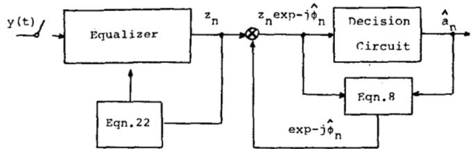  
Fig. 4.Structure of the self-recovering technique.

We were not successful in deriving the solutions to (29) directly in terms of c.We shall therefore consider the much simpler problem which, from (11),consists of expressing the dispersion under the form

$$
{ \mathcal { D } } ^ { ( p ) } = E \bigg ( \bigg | \sum _ { k } a _ { n - k } s _ { k } \bigg | ^ { p } - R _ { p } \bigg ) ^ { 2 }
$$

and solving

$$
\frac { \partial \mathcal { D } ^ { ( p ) } } { \partial s _ { l } } = 0 , \qquad \mathrm { f o r ~ a n y ~ } l .
$$

To begin with,let us consider $p = 2$ . One has

$$
\frac { \partial \mathcal { D } ^ { ( 2 ) } } { \partial s _ { l } } = 4 E a _ { n - l } * \sum _ { k } a _ { n - k } s _ { k } \Bigg ( \Bigg | \sum _ { k } a _ { n - k } s _ { k } \Bigg | ^ { 2 } - R _ { 2 } \Bigg )\tag{30}
$$

Using (12)and (13) and after some manipulations,one obtains

$$
s _ { l } \left\{ E | a _ { n } | ^ { 4 } ( \mid s _ { l } \mid ^ { 2 } - 1 ) + 2 ( E | a _ { n } | ^ { 2 } ) ^ { 2 } \sum _ { k \neq l } | s _ { k } | ^ { 2 } \right\}\tag{31}
$$

This set of equations has an infinite number of solutions which we shall denote by $S _ { M } , M = 0 , \ 1 , \cdots$ .The general solution $s _ { M }$ can be defined as follows: all samples $\{ \boldsymbol { s } _ { \pmb { k } } \}$ are equal to zero,except M of them. The M nonzero samples all have equal squared magnitude $\sigma _ { M } { } ^ { 2 }$ defined by

$$
\sigma _ { M } { } ^ { 2 } = E | a _ { n } | ^ { 4 } \{ E | a _ { n } | ^ { 4 } + 2 ( M - 1 ) ( E | a _ { m } | ^ { 2 } ) ^ { 2 } \} ^ { - 1 } .\tag{32}
$$

Note that $S _ { 1 }$ is the ideal case of zero ISI at the equalizer output and that solution $s _ { 0 }$ ,for which the equalizer coefficients are identically zero,must be discarded.For each solution $s _ { M }$ it is now possible to compute the values of the energy $E _ { M }$ and of the dispersion $\mathcal { D } _ { M } ^ { \mathbf { \Lambda } ( 2 ) }$ at the equalizer output. Using (32) and the statistical properties of the data symbols,one has

$$
E _ { M } = M E \mid a _ { n } \mid ^ { 4 } E \mid a _ { n } \mid ^ { 2 } \{ E \mid a _ { n } \mid ^ { 4 } + 2 ( M - 1 ) ( E \mid a _ { n } \mid ^ { 2 } ) ^ { 2 } \} ^ { - 1 } ,\tag{33}
$$

$$
\begin{array} { r l r } {  { \mathcal { D } _ { M } { } ^ { ( 2 ) } = { R _ { 2 } } ^ { 2 } - M ( E \mid a _ { n } \mid ^ { 4 } ) ^ { 2 } } } \\ & { } & { \cdot \{ E \mid a _ { n } \mid ^ { 4 } + 2 ( M - 1 ) ( E \mid a _ { n } \mid ^ { 2 } ) ^ { 2 } \} ^ { - 1 } . } \end{array}\tag{34}
$$

From (33)and $( 3 4 ) ,$ it is easy to show that,if the data symbol constellation satisfies the condition

$$
E | a _ { n } | ^ { 4 } < 2 ( E | a _ { n } | ^ { 2 } ) ^ { 2 } ,\tag{35}
$$

then

$$
{ \mathcal D } _ { M } { \bf \Lambda } ^ { ( 2 ) } < { \mathcal D } _ { M + 1 } { \bf \Lambda } ^ { ( 2 ) } ,\tag{36}
$$

$$
E _ { M } > E _ { M + 1 } , \qquad M \ne 0 .
$$

The absolute minimum of the dispersion is therefore reached in the case of zero ISI and solution $s _ { 1 }$ is that for which the energy is the largest.

This gives a first indication as to how the equalizer gains must be initialized: they must be such that the energy at the equalizer output be sufficiently large,at least greater than $E _ { 2 }$ A second,generally more restrictive condition is given by inspection of the expression of $\mathcal { V } ^ { ( 2 ) }$ when written under the particular form (18). The existence of a minimum corresponding to zero ISI appears obvious only if the quantity multiplying $\Sigma _ { k } ^ { \prime } | s _ { k } \ ^ { \prime 2 }$ in (18) is positive,which imposes

$$
\vert s _ { 0 } \vert ^ { 2 } > \frac { E \vert a _ { n } \vert ^ { 4 } } { 2 ( E \vert a _ { n } \vert ^ { 2 } ) ^ { 2 } } .\tag{37}
$$

Denoting by $h _ { 0 }$ the channel impluse response sample having the largest magnitude,condition (37) is met by initializing all equalizer gains to zero except the reference tap-gain which must be such that

$$
\mid c _ { 0 } \mid ^ { 2 } > \frac { E \mid a _ { n } \mid ^ { 4 } } { 2 \mid h _ { 0 } \mid ^ { 2 } ( E \mid a _ { n } \mid ^ { 2 } ) ^ { 2 } } .\tag{38}
$$

Computer simulations will show that (38) is in fact a sufficient but nonnecessary condition for convergence.

Throughout this analysis,we were led to impose two conditions on the data symbol constellation.Condition (12) implies some kind of symmetry in the constellation. Such symmetries appear when，as we assumed,data are phasedifferentially encoded. It should be noted,however,that our self-recovering technique does not apply to the case of biphase modulation where $E a _ { n } { } ^ { 2 }$ is not zero.

Condition (35) expresses the fact that the signal constellation must be sufficiently compact and is met for all constellations of practical interest,since they are selected so that their peak to average energy ratio is reasonably small (of order of 2) for good noise immunity [13].

The analysis of the dispersion of order 1 is more difficult to carry out.However, $\mathcal { D } ^ { ( 1 ) }$ may be shown to have the same kind of general properties as $\mathcal { V } ^ { ( 2 ) }$ .For $p = 1$ ,one obtains instead of (30）

$$
\frac { \partial \mathcal { D } ^ { ( 1 ) } } { \partial s _ { l } } = E a _ { n - l } \ast \sum _ { k } a _ { n - k } s _ { k } \left( 1 - R _ { 1 } \Bigg | \sum _ { m } a _ { n - m } s _ { m } \Bigg | ^ { - 1 } \right)\tag{39}
$$

which is zero for any lif

$$
s _ { l } = \frac { 1 } { E \mid a _ { n } \mid } E \left\{ \frac { \displaystyle a _ { n - l } { * \sum _ { k } a _ { n - k } s _ { k } } } { \Bigg | \displaystyle \sum _ { k } a _ { n - k } s _ { k } \Bigg | } \right\} \forall l .\tag{40}
$$

As is the case for (31),this set of equations has an infinite number of solutions $s _ { M } ^ { \prime } , M = 0 , 1 \cdots$ , that can be defined as follows:all samples $\{ s _ { k } \}$ are equal to zero,exceptM of them. Owing to the stationarity of the data sequence,the M nonzero samples all have equal magnitude $\pmb { \sigma } _ { M } ^ { \prime }$ given by

$$
{ \sigma _ { M } } ^ { \prime } = \frac { 1 } { E | a _ { n } | } E \left\{ \frac { a _ { n } * \displaystyle \sum _ { m = 0 } ^ { M - 1 } a _ { n - m } } { \displaystyle \left| \sum _ { m = 0 } ^ { M - 1 } a _ { n - m } \right| } \right\} , \qquad M \geqslant 1 .\tag{41}
$$

Clearly, solution ${ \pmb S _ { 1 } } ^ { \prime }$ corresponds to zero ISI.

There is no simple expression for the values of the dispersion and of the energy at the equalizer output corresponding to each solution ${ \cal { S } } _ { M } { } ^ { ' }$ .However,(41) can be evaluated for any given symbol constellation on a computer.Such computations showed that solution ${ \pmb S _ { 1 } } ^ { \prime }$ is that for which the energy is the largest and the dispersion is minimized,which imposes on the equalizer reference gain initialization the same type of constraints as in the case for $p = 2$

This is confirmed by computer simulation in the next section.

## VI. COMPUTER SIMULATIONS

In the theoretical analysis,an infinite length equalizer and the absence of noise had to be assumed.We now check the validity of the theory by presenting equalizer convergence results obtained with the stochastic adaptation algorithms

$$
\displaystyle c _ { n + 1 } = c _ { n } - \lambda _ { 1 } y _ { n } * \left( 1 - \frac { R _ { 1 } } { \vert z _ { n } \vert } \right)\tag{27}
$$

and

$$
c _ { n + 1 } = c _ { n } - \lambda _ { 2 } y _ { n } { } ^ { * } z _ { n } ( \mid z _ { n } \mid ^ { 2 } - R _ { 2 } )\tag{28}
$$

corresponding to $p = 1$ and 2,respectively.

The channels considered in the simulations are defined by the amplitude and group-delay characteristics shown in Fig.5. We assumed a transmission speed of 240o bauds with the carrier located at 17Oo Hz,and an equalizer with 30 complex tap gains.The four data symbol constellations given in Fig.6 were tested,corresponding to bit rates of 7200,9600,and 12 000 bits/s.For both channels,the binary eye is closed and we checked the failure of decision-directed attempts to achieve equalizer training，except in the case of the 8-phase constellation.

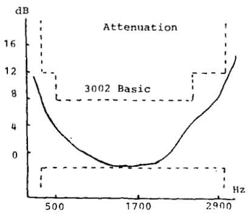

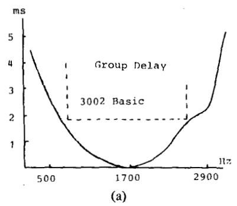

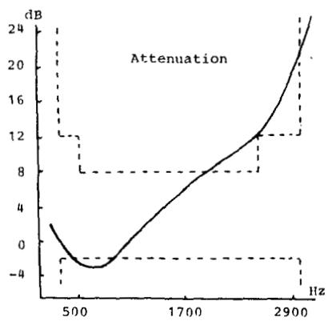

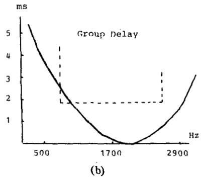  
Fig.5． (a) Channel 1.Amplitude and delay distortions.(b) Channel 2.Amplitude and delay distortions.

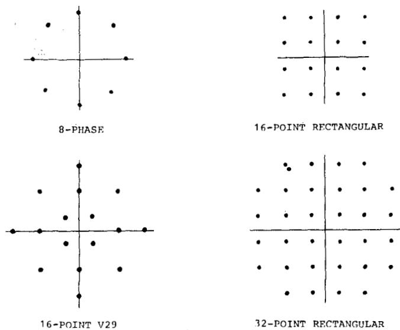  
Fig.6．Data symbol constellations.

Two simulation programs have been written.The first one, for a given channel, calculates the sample values of the waveform $h ( t )$ ，normalizes the energy $\Sigma _ { n } \mid h ( n T ) \mid ^ { 2 }$ to unity,and determines the optimum (in the sense of minimum meansquared error） equalizer coefficients $\pmb { c _ { \mathrm { o p t } } }$ and the minimum attainable mean-squared error ${ { \varepsilon } _ { \operatorname* { m i n } } } ^ { 2 }$ .It also rotates the $\pmb { c _ { 0 } } _ { \mathrm { p t } }$ vector components so that the imaginary part of the optimum reference coefficient is equal to zero.The second program generates a random data signal with a frequency offset of 8 Hz,adds white noise to it and simulates the equalizer adaptation algorithms and a second-order carrier-phase tracking loop operating in decision-directed mode.Since，in fact,we are interested in reducing the mean-squared error,the actual MSE is periodically calculated according to

$$
\begin{array} { r } { \begin{array} { r } { \mathbb { E } _ { n } { } ^ { 2 } = ( c _ { \mathrm { o p t } } - \hat { c } _ { n } ) ^ { * { } ^ { \prime } } A ( c _ { \mathrm { o p t } } - \hat { c } _ { n } ) + \mathbb { E } _ { \mathbf { m i n } } { } ^ { 2 } , } \end{array} } \end{array}
$$

where A is the channel correlation matrix and $\hat { c } _ { n }$ is derived from actual gains $c _ { n }$ by rotating them so that the reference tap-coefficient is real.

Denoting by $\lambda _ { 0 }$ the optimum step-size proposed by Ungerboeck [14] when the data sequence is known at the receiver

$$
\lambda _ { 0 } = ( 3 0 E \vert a _ { n } \vert ^ { 2 } ) ^ { - 1 } ,
$$

$\lambda _ { 1 }$ and $\lambda _ { 2 }$ in (27） and (28） were initially chosen equal to $\lambda _ { 0 } / 5$ and $\lambda _ { 0 } / 2 0 0$ ,respectively,and divided by 2 each 10 000 iterations in the course of the convergence process.These choices were found appropriate α posteriori from simulation results.When choosing $\lambda _ { 1 }$ and $\lambda _ { 2 }$ greater than indicated,the equalizer comes close to instability.

Equalizer gains were initially set to zero,except $\dot { \boldsymbol { c } } _ { 0 }$ the initial value of which was a variable parameter in the simulation program.

For $p = 1$ ,reliable convergence was obtained when taking $c _ { 0 } > 0 . 8$ for channel 1 and $c _ { 0 } > 1 . 2$ for channel 2 whose distortions are extremely severe.For $p = 2$ ,one had to take $c _ { 0 } > 1 . 3$ for channel 1 and $c _ { \mathbf { 0 } } > 2$ for channel 2.

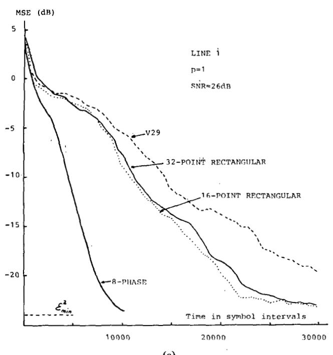

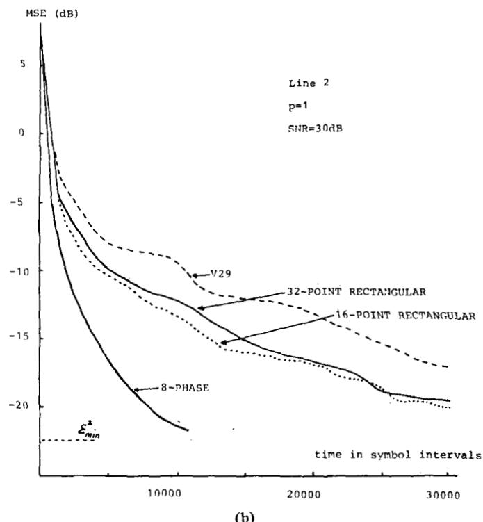

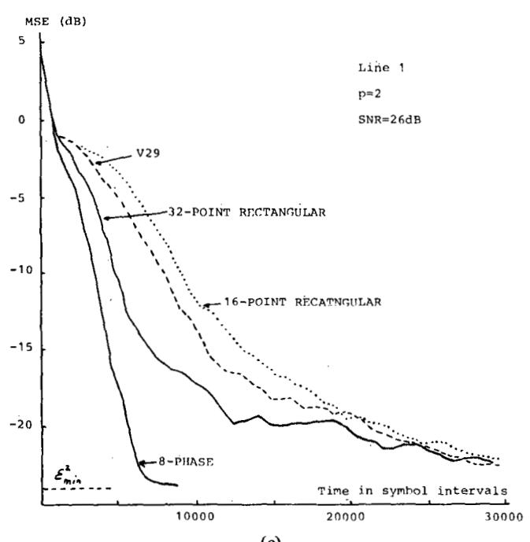

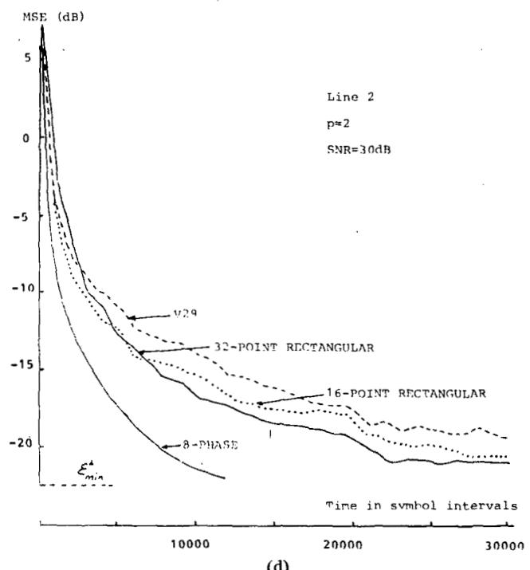  
Fig.7.(a) Speed of convergence-Line 1,p =.1. (b) Speed of convergence-Line 2,p = 1. (c) Speed of convergence-Line $1 , p = 2 .$ (d) Speed of convergence-Line $2 , p = 2 .$

In the case of the V/29 constellation,for which the ratio $E ^ { \mid } a _ { n } ~ ^ { \mid ^ { 4 } } / ( \dot { E } ^ { \mid } a _ { n } ~ ^ { \mid ^ { 2 } } ) ^ { 2 }$ is the largest,condition (38) imposes to choose $c _ { 0 } > 1 .$ 4 forchannel 1and $c _ { 0 } > 2 . 4$ for channel 2.The results obtained by simulations are therefore in good agreement with the analysis of Section V.

The speed of convergence of algorithms (27) and (28) is illustrated by the plots of Fig. 7 where each curve was .obtained by averaging five computer runs with different initializations of noise and data sources.The convergence for $p = 2$ appears to be faster than for $p = 1$

It should also be noted that the equalizer coefficients minimizing the dispersion functions closely approximate those which minimize the mean-squared error.

The eye is open when the MSE approaches-15 dB.At that point,convergence could be speeded up by switching the equalizer into decision-directed mode. One may therefore consider that the time to adapt the equalizer is of order of 10 s.

It must be noted that no difficulties were encountered when updating the carrier.phase estimate $\hat { \varphi } _ { \pmb { n } }$ using the receiver's decisions from the beginning of equalizer adjustment.

Finally，we also tested the convergence properties of the dispersion of order 3.Convergence in that case is much slower and requires that the step-size parameter be smaller than $1 0 ^ { - 4 } \lambda _ { 0 }$ . Such a small value is not practical to implement with fixed-point arithmetic.

## VII. SUMMARY AND CONCLUSIONS

We have introduced in this paper a new class of cost functions and algorithms for automatic equalization in data receivers employing two-dimensional modulation．Equalizer adaptation does not require the knowledge of the transmitted data sequence nor carrier phase recovery and is also,apart from a constant multiplier in final tap-gain setings,independent of the data symbol constellation used in the transmission system.

The cost functions to be minimized are not convex,but convergence to optimal gains can be ensured by employing small step-size parameters in adaptation loops and initializing the equalizer reference gain to any large enough value, typically in the order of 2 when the equalizer input energy is normalized to that of the data symbol constellation. Practically,data receivers are usually equipped with an automatic gain control circuit, so that equalizer initialization should not be a critical problem.

Simulations have shown that the self-recovering algorithms are extemely robust with respect to channel distortions.

As expected, since data symbols are not known at the receiver,equalizer convergence is slow,of the order of 1O s for transmission at 24Oo bauds over severely distorting lines.However,for the purpose of retraining a tributary receiver in multipoint networks without disrupting normal data transmission，speed of convergence is not of paramount importance.For this reason，no attempts were made to define theoretically the step-size parameters which should be used, and to evaluate the influence of the number of taps on the speed of convergence.

The algorithms which we have proposed do not require more computing power than the conventional gradient algorithm for minimization of the mean-squared error,which makes their implementation easy,and therefore attractive,in microprocessor-based data receivers.

## REFERENCES

{1]K.H. Mueller and D. A. Spaulding,“Cyclic equalization-A new rapidly converging equalization technique for synchronous data

communication,’Bell Syst.Tech.J.,vol.54,pp.370-406,Feb. 1975.

[2]D.N. Godard,Channel equalization using a Kalman filter for fast data transmission, IBMJ.Res.Develop.,vol.18,pp.267-273, May 1974.

[3]R.D. Gitlin and F.R.Magee,Self-orthogonalizing adaptive .equalization algorithms,’IEEE Trans.Commun.，vol.COM-25, pp.666-672,July 1977.

[4]G.D.Forney,S.U.H.Qureshi,and C.K.Miller，‘Multipoint networks: Advances in modem design and control,’ presented at the Nat.Telecommun.Conf.,Dallas,TX,Nov.1976.

[5]Y. Sato,“A method of self-recovering equalization for multilevel amplitude-modulation systems,’IEEE Trans.Commun.，vol. COM-23,pp.679-682,June 1975.

[6]R.W.Lucky，“A survey of the communication theory literature: 1968-1973,IEEE Trans.Inform.Theory，vol.IT-19,pp.725- 739,Nov.1973.

[7]L.E.Franks,Signal Theory.Englewood Cliffs,NJ:Prentice-Hall, 1969,pp.79-87.

[8]D.D.Falconer,Jointly adaptive equalization and carrier recovery in two-dimensional digital communication systems,’Bell Syst. Tech.J.,vol.55,pp.316-334,Mar.1976.

[9]G．Ungerboeck,“Fractional tap-spacing equalizer and consequences for clock recovery indata modems, IEEE Trans. Commun.,vol.COM-24,pp.856-864,Aug.1976.

[10]D.N.Godard,“Passband timing recovery in an all-digital modem receiver,’IEEE Trans.Commun.，vol.COM-25，pp.517\~523, May 1978.

[11]R.D.Gitlin,E.Y.Ho,and J.E.Mazo,“Passband equalization of differentially phase-modulated data signals,"Bell Syst.Tech.J., vol.52,pp.219-238,Feb.1973.

[12]R.D.Gitlin and S.B．Weinstein,On the required tap-weight precision for digitally implemented，adaptive，mean-squared equalizers,Bell Syst.Tech.J.,vol.58,pp.302-321,Feb.1979.

[13]G.J.Foschini，R.D.Gitlin,and S.B.Weinstein，“On the selection of a two-dimensional signal constellation in the presence of phase jitter and Gaussian noise,"BellSyst.Tech.J.,vol.52,pp. 927-965,July-Aug.1973.

[14]G. Ungerboeck,“Theory on the speed of convergence in adaptative equalizers for digital communication, IBMJ.Res.Develop.,vol. 16、pp.546-555、Nov.1972.

##

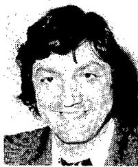

Dominique N.Godard (M'8O） was bomn in Lyon, France,on December 29,1947.He received the Mastership degree in physics from the University ofLyon,France,in 1971,the Elaborate Study degree in electronics from the University of Paris in 1972，and the Ph.D.degree in electrical engineering in 1974.

Since i974， he has been employed by Compagnie IBM France,La Gaude Laboratory, France,where he isa member of the Advanced Technology Department. His present interests

cover data transmission systems,digital signal processing,and detection and estimation theory.