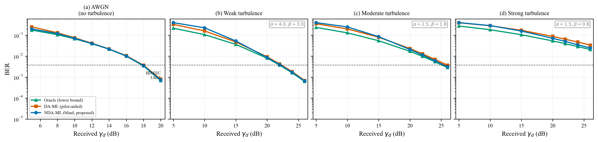

# 导师简报 v2：星地 FSO 湍流下自适应载波相位恢复 —— CCISP 投稿计划

> 2026-07-09 v2 | 张哲铜
> 目的：汇报投稿计划（CCISP 2026，7/20 截稿），请老师把关两层贡献的主次 + 确认 baseline 组织。
> v1（同日）主卖点/baseline 已按后续分析更新，本版为重写。

---

## 一句话

星地 FSO 强湍流下，盲类载波相位恢复（NDA-ML，全块积分）比导频辅助类（DA-ML）有 **+1.2~1.8 dB 真实增益**（30 seed，扣除 1.25 dB 导频开销后），机制是 deep fade 击穿短导频。在此基础上提出 per-block 有效 SNR 驱动的 DA/NDA 切换，在两法各有优势的 crossover 区稳定改善 +0.27~0.48 dB。**计划投 CCISP 2026（11 月，IEEE+EI+Scopus），请老师定主卖点和确认 baseline。**

---

## 1. 投稿目标

| 会议 | 时间 | 检索 | 体例 |
|---|---|---|---|
| **CCISP 2026**（合肥，11/19-22）| 截稿 **7/20**（11 天）| IEEE Xplore + EI + Scopus | IEEE 模板，4-6 页，4-6 图 |

备选 ICECAI 2026（长沙，截稿 8/8，检索等价）。两者都是 IEEE 会议 EI 检索，CCISP 历史更久（10 届）。

---

## 2. 两层贡献（请老师定主次）

我的工作有**两层贡献**，baseline 对应关系不一样，想请老师定哪层当主卖点。

### 第一层：NDA-ML vs DA-ML 的 fair_gain（盲类 vs 导频类）

**发现**：湍流越强，盲估计（NDA-ML，全块积分）相对导频估计（DA-ML）的优势越大。

| 场景 | fair_gain 总 (dB, 30 seed) | 扣 1.25dB 导频开销后真实增益 | 95% CI |
|---|---|---|---|
| AWGN（无湍流）| +1.34 | +0.09 | [+1.33, +1.35] |
| weak（下行弱）| +1.43 | +0.18 | [+1.35, +1.51] |
| moderate（下行中）| +1.44 | +0.19 | [+1.28, +1.60] |
| **strong（下行强）** | +2.51 | **+1.26** | [+2.42, +2.60] |
| **uplink_strong（上行强）** | +3.10 | **+1.85** | [+2.99, +3.21] |

**物理解释**：强湍流 deep fade 频发 → 导频落入 deep fade 时崩溃（DA/oracle 退化到 1.62×）；盲估计用全块积分更鲁棒（NDA/oracle 仅 1.19×）+ 不付导频开销。

**诚实说明**：weak/moderate 的真实增益仅 ~0.1-0.2 dB（CI 重叠，统计不可分）；AWGN/弱湍流承认无显著真实增益。趋势是"弱湍流平 → 强湍流跳"两段，非严格单调。

**这一层 baseline = DA-ML**（导频辅助，30 seed，pilot spacing=4 近最优）。

### 第二层：A4 per-block 有效 SNR 驱动的 DA/NDA 切换

**发现**：DA 和 NDA 各有优势区，存在 crossover（低有效 SNR 导频赢，高有效 SNR 盲赢），切换点汇聚到 per-block 有效 SNR ≈ 12-14 dB。

**方法**：按每块有效 SNR 自动切换（两层判据全接收端可测，不用 oracle）。

| 场景 | 切换 vs max(DA,NDA) @ crossover 区 | 95% CI |
|---|---|---|
| weak | +0.27 dB | [+0.19, +0.36] |
| moderate | +0.48 dB | [+0.41, +0.55] |
| strong | +0.40 dB | [+0.36, +0.45] |

三场景 CI 下界全为正，统计显著超越"始终用一种"。

**这一层 baseline = 固定 DA-ML / 固定 NDA-ML**（"不做切换"的固定版本，30 seed）。

### 两层关系（我的判断，待老师确认）

- **第一层（fair_gain）是真实增益的主载体**（+1.2-1.8 dB，物理天花板清晰）
- **第二层（切换）是兑现 fair_gain 的工程机制**（+0.27-0.48 dB，在 crossover 区榨取两法各自优势）
- 标题数字用**去导频的 +1.2 dB**（strong），不用含导频水分的 +2.5 dB

**想问老师**：主卖点定 fair_gain（第一层）还是切换（第二层）？还是两层并列？

---

## 3. baseline 组织（按老师 7/8 电话定的 5 条标准）

老师电话定的 baseline 选取标准：① 同场景（星地湍流）② 同类型层级（载波同步/定时/均衡层，不钻子层）③ 不找接近方法（NDA-ML vs VV 同族=近亲，不当主 baseline）④ 近年+权威 ⑤ 复现源挑扎实权威。

| 角色 | 方法 | 数据 | 合法性背书（近年 Trans）|
|---|---|---|---|
| **我们方法** | NDA-ML（单载波时域，per-block 切换）| 30 seed | Du PTL 2025（方法源头）|
| **主 baseline** | DA-ML（pilot sp=4，近最优）| 30 seed | TVT 2023 / OE 2024 / TVT 2025（3 篇严格 Trans）|
| **异族参照** | DPLL（判决-directed 闭环，不同族）| 5 seed ablation | Paillier JLT 2020 |
| **fellow 参照**（不当主 baseline）| VV / BPS（升幂同族）| 5 seed ablation | VV TIT 1983 / BPS JLT 2009 + JLT 2021 电路实现 |
| **上界** | oracle（真实信道补偿）| 30 seed | — |

**经调研 3 篇同类论文验证**（含 Wang 2025 OE 切换型 + Barbosa 2020 JLT 切换型 + BUPT 同门学位论文）：切换型 CPR 的 baseline 惯例即"不做切换的固定版本 + 异族参照 + 同族 fellow + 上界"，本结构符合惯例且更严谨（多了 DPLL + oracle 两层）。

**诚实标注的局限**：
- 异族/fellow 参照（DPLL/VV/BPS）只有 5 seed，主对比（DA/NDA/oracle）是 30 seed
- "NDA-ML vs VV/BPS 全场景持平"经核查是**数学同族必然**（D-008/D-009），VV 本就不该当主 baseline，这里只作定位参照

---

## 4. 文献家底（17 篇，诚实标注档级）

老师 7/7 反馈担心"对比文献达不到 transactions 水平"。三轮检索（59 组查询、~544 篇去重）后的现状：

| 维度 | 数量 | 占比 |
|---|---|---|
| 近年（2020+）| 12/17 | 71% |
| IEEE Transactions 严格级 | 7/17 | 41% |
| **近年 + 严格 Trans** | **5/17** | **29%** |

**核心瓶颈**：方法思想源头（Du PTL 2025）是 Letters 级。但每个自实现 baseline 算法都有近年严格 Trans 合法性背书（DA-ML 3 篇 / NDA-ML 4 篇 / DPLL 1 篇 / VV-BPS 1 篇）。

**关键发现（空白转化）**："NDA 载波相位恢复"专题在 2020+ 严格 IEEE Trans 是空白（三轮检索独立证实，最新仍是 Du PTL 2025 Letters）。**这本身说明该子领域有空白，我们的工作填补其中**——从"只有 1 篇 Letters"转化为卖点。

**结论**：当前对照**够投 CCISP 会议**（绰绰有余）；投 IEEE Trans 需补方法深度（CRLB 紧致性证明 + 多场景验证），不在本轮范围。

---

## 5. 新颖性

**单载波 CPR 里 pilot/blind 之间的 per-block 硬切换，没人做过。** 最接近的三类都不是切换：
- 静态比较 pilot vs blind（Song 2020）：比较后选一个全局用，不切换
- 级联/组合（Moretti 2013 TWC）：pilot 粗估 + DD/BPS 细估，两个同时跑，付双倍复杂度
- 算法内自适应参数（窗长/环路带宽调参）：单一算法内调参，不跨算法切换

**补强**：Wang 2025 OE 的 MSDM 切换是 per-symbol 瞬时残差型，粒度/机制与我们的 per-block 有效 SNR 不同，不构成撞车。

**为什么没人做**：光纤恒参信道里 pilot 几乎总赢，没有 crossover，没动机切换。crossover 是 FSO 强湍流特有的（per-block 信噪比大幅波动）。

---

## 6. 图怎么画（想请老师指方向，以下都是初步的）

> ⚠️ **本节所有图都是初步的**：直接根据已有 30 seed 实验结果画的，**没有补新数据点**，**横纵轴范围/用什么比较/画几张分别是什么，我都没定**。我卡在图的整体设计，想请老师给方向。

### 6.1 我的困境

我查了同领域 5 篇论文（含 1 篇 BUPT 同门学位论文）的图表惯例，发现：
- **BER 性能曲线是标配**（7/7 论文都有），但**每张线不多**（3-4 条），而且**我的 +1.2dB 增益在 BER 对数轴上天生看不太出来**（三条线贴一起）
- 论文图普遍**多样化**：系统框图 + 算法框图 + BER 曲线 + 星座图 + 参数扫描 + 复杂度表，不是靠一张图塞满

但我自己画了两版 BER 曲线都觉得不对劲，不知道问题出在画法还是数据还是图型选择。

### 6.2 我画的两版（都不满意）

**v1（4 子图横排，垃圾）**：

- 问题：横向太扁（4 子图挤成一条带）、三线贴一起差距看不见、线太粗、marker 难看（大方块三角）、点稀疏

**v2（单图聚焦 strong 场景，稍好但仍没底）**：

- 改进：单图不挤了、纵轴收窄、线变细 marker 变小、标了"NDA→oracle"箭头
- 仍有的问题：低 SNR 区 DA/NDA 还是贴一起（数据真实，噪声主导 DA 略赢）；只有 strong 一个场景没对照；**我不确定这种画法行不行**

**对标参考**（同领域好图画法）：`papers/doi/10.3389_fphy.2024.1452087/source.pdf`（两阶段 CPE，Frontiers 2024，跟我领域最对口）的 Fig 7（BER vs OSNR）——单栏单图 3 线、纵轴聚焦、点密。

### 6.3 我没想清楚的具体问题（请老师指）

1. **画几张图、分别是什么**：我初步想画 系统框图 + BER 曲线 + fair_gain 增益图 + 切换机制图 + 线宽扫描，但这只是我的想法，不知道对不对。同领域论文一般几张？
2. **BER 曲线差距小怎么办**：我的 +1.2dB 在 BER 对数轴上贴一起。是接受 BER 曲线只证明"性能/趋势"，增益靠单独的 fair_gain 图展示？还是要补什么（补 SNR 点？补更多 baseline 让曲线散开？）？**当前 BER 数据每场景只有 7-8 个 SNR 点（30 seed），没补点。**
3. **横纵轴用什么**：横轴用 SNR（dB）。但湍流强度怎么标？我查了自己的仿真，下行 weak/moderate/strong 用的是 Gamma-Gamma α/β 参数（4/3、2.5/1.8、1.5/0.8），**没有标定 Rytov 方差 σ²R**（我查了综述 sat.1553 发现它用 lognormal 不是 Gamma-Gamma，我的 α/β 和它的 σ²R 对不上，这个标定是个债，但我不知道会议论文要不要这么严）。
4. **纵轴范围**：BER 画到多低？我的 strong 场景最低 BER 才 2e-2（HD-FEC 3.8e-3 都达不到），AWGN 能到 7e-4。范围怎么定？
5. **fair_gain 怎么呈现**：我的主卖点 +1.2dB，是画成 fair_gain vs 场景的柱状/折线小图，还是放表格，还是文字描述？

### 6.4 我现有的数据家底（能画什么）

| 数据 | seed | 能画 |
|---|---|---|
| 主实验 BER（DA/NDA/oracle）| 30 seed × 6 场景 | BER vs SNR 曲线 |
| fair_gain（扣导频）| 30 seed × 6 场景 | 增益柱状/折线 |
| A4 切换 | 30 seed × 4 场景 | 切换增益、crossover |
| 线宽扫描 | 5 seed × 4 线宽 × 4 场景 | 参数敏感性 |
| 相位跟踪 MSE | 5 seed | NDA 最优块长 |
| 星座图 / 时域波形 | **没有** | 需补数据才能画 |

---

## 7. 想问老师的

1. **主卖哪层**：fair_gain（盲 vs 导频 +1.2dB）还是切换（per-block +0.27-0.48dB）？还是两层并列？（见 §2）
2. **baseline 确认**：主 baseline 用 DA-ML（30 seed），DPLL/VV/BPS 只当参照（5 seed），这个组织 OK 吗？（见 §3）
3. **CCISP 够不够格**：当前对照 + 贡献，投 CCISP 会议（EI 检索）够吗？还是要补什么？
4. **标题数字**：用去导频的 +1.2 dB 还是含导频的 +2.5 dB？（我倾向 +1.2，诚实且不易被一票否决）
5. **【最想问】图怎么组织**：见 §6。我画了两版都不满意，卡在"画几张/每张什么/差距小怎么办/横轴怎么标"，请老师给方向。

---

## 附：数据文件位置

- 主实验 30 seed：`results/sc_nda_ml_main_30seed/_fair_gain_summary_30seed.json` + `_main_experiment_30seed.json`
- A4 切换 30 seed：`explore/nda-awgn-tracking-sandbox/_a4_switch_30seed.json`
- 线宽扫描 5 seed：`results/sc_nda_ml_linewidth_sweep/_linewidth_sweep_summary.json`
- VV/BPS/DPLL ablation 5 seed：`results/sc_nda_ml_{vv,bps,dpll}_ablation_improved/`
- 文献清单：`COMPARISON_REFS.md`（17 篇档级标注）
- **图（初步，见 §6）**：v1 四子图 `figures/fig2_ber_curves.png`、v2 单图 `figures/fig2_v2_strong_single.png`、对标参考 `papers/doi/10.3389_fphy.2024.1452087/source.pdf` Fig 7
