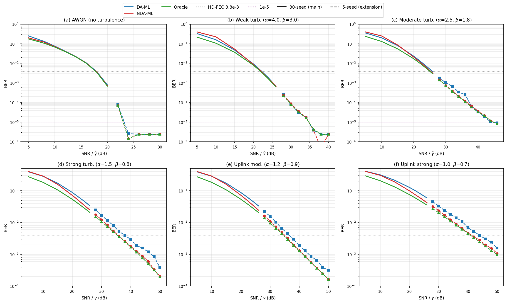

# 导师简报 v4：星地自由空间光通信（FSO）强湍流下载波相位恢复 —— 投稿计划（数据更新后）

> 2026-07-10 v4 | 张哲铜
> 相对 v3 的变化：① 重新核查了切换方法的计算口径，结论有重大修正（切换的独立增益远小于之前报告的）② 完成了强湍流误码率处理的领域调研 ③ 更新了对主卖点的判断。本版全部数字已核查计算口径。
> 术语约定：FSO = 自由空间光通信（Free-Space Optical）；CPR = 载波相位恢复（Carrier Phase Recovery）；DA-ML = 导频辅助最大似然估计（Data-Aided ML）；NDA-ML = 盲最大似然估计（Non-Data-Aided ML）；FEC = 前向纠错编码（Forward Error Correction）；BER = 误码率（Bit Error Rate）；SNR = 信噪比（Signal-to-Noise Ratio）。

---

## 一句话

星地自由空间光通信（FSO）的强湍流场景下，我们**量化并归因了盲载波相位估计相对导频估计的优势**：强湍流/上行场景去掉导频开销后的纯物理增益 +1.2~1.9 dB（30 seed）；若把导频 overhead 当系统成本罚掉，总增益 +2.4~3.1 dB。无湍流/弱湍流纯增益仅 +0.1 dB（统计不显著），诚实承认这些场景盲相对导频几乎无优势。此前报告的"按块切换估计器的方法带来额外 +0.27~0.48 dB"经重新核查计算口径后**大幅下修**——切换方法的独立增益很有限，不足以作为独立卖点。误码率曲线方面，我们查了领域惯例，想跟老师确认 10⁻⁵ 底线的含义。**计划投 CCISP 2026（合肥 11 月，IEEE + EI + Scopus）。**

---

## 1. 我们的工作（两部分，结论有重大修正）

我们的工作有两部分。**第一部分（净增益）结论稳定，是主卖点**；**第二部分（切换方法）经重新核查后结论大幅下修，不再适合作为独立卖点**。

### 第一部分：净增益——强湍流下盲估计比导频估计好多少

载波相位恢复有两种基本思路：

| | 导频辅助估计（DA-ML）| 盲估计（NDA-ML）|
|---|---|---|
| 怎么估相位 | 发送端**插入已知导频符号**，接收端用导频直接估 | **不发导频**，用整个数据块信号自己估 |
| 代价 | 导频占用信号资源（仿真里占 1.25 dB 功率开销）| 不占资源，但信号质量差时可能估不准 |
| 传统认知 | 光纤/弱湍流里导频稳赢 | 恒参信道没必要 |

**我们发现**：到星地 FSO **强湍流**，信号会深度衰落。这时若导频段恰好落在衰落区，**导频本身失效**，导频估计会崩溃；而盲估计用整个数据块积分，衰落只影响块的一部分，**盲估计反而更稳**。

**净增益（net gain）**= 盲估计相对导频估计的优势。这里有个**口径问题**——导频法为了发导频，发送端必须多发 1/4 的符号（导频间隔 = 4），相同信息速率下总发射功率多 1.25 dB。所以"盲比导频好多少"有两种算法，我们都列出来，想请老师定主报哪个：

- **口径① 系统能效视角（fair_gain）**：在"相同信息吞吐、相同总发射功率"下比，导频多发的 1.25 dB 算它真实的系统成本。这个口径的增益 = 纯性能差 + 导频罚分。
- **口径② 纯算法性能视角（naive）**：只看"同信道同功率下两条 BER 曲线谁低"，不罚导频 overhead。这个口径的增益 = 纯性能差，导频开销作为已知系统参数另算。

两个口径的换算：**fair_gain = naive + 1.25 dB**。

**结果（30 seed 蒙特卡洛，标准 BER 统一分母，代码已核查）**：

> ⚠️ **表里还有第二层区分**：前三场景是"单点增益"（在 HD-FEC 译码阈值 3.8×10⁻³ 那个点测），后三场景是"工作区多点平均"（HD-FEC 不可达，取 γ_tot ≥ 15 dB 区间逐点平均）。这两个测法不同，跨场景比大小要谨慎。

| 场景 | 口径① fair_gain (dB) | 口径② naive 真实增益 (dB) | 测法 | BER 能否到 10⁻⁵ |
|---|---|---|---|---|
| 无湍流（AWGN）| +1.34 | **+0.09** | HD-FEC 处单点 | ✅（可达）|
| 弱湍流（下行）| +1.43 | **+0.18** | 单点 | ✅（可达）|
| 中湍流（下行）| +1.44 | **+0.19** | 单点（17 seed 有效）| ✅（46 dB 刚跨）|
| **强湍流（下行）** | +2.51 | **+1.26** | 工作区多点平均 | ❌（到不了，见 §2）|
| **强湍流（上行中）** | +2.44 | **+1.19** | 工作区多点平均 | ❌ |
| **强湍流（上行强）** | +3.10 | **+1.85** | 工作区多点平均 | ❌ |

**两种口径各自的读法**：

- **口径①（fair_gain，大数字）**：把导频 overhead 当真实成本罚掉。强湍流/上行 +2.4~3.1 dB，看着大。但这其中 1.25 dB 是"不发导频白省的"，审稿人可能质疑"你这增益是省导频省出来的，不是算法好"。
- **口径②（naive 真实增益，小数字）**：只算纯性能差，把"白省的导频开销"剔掉。**强湍流/上行 +1.19~1.85 dB 是去掉导频开销后的纯物理增益**（物理解释：强湍流 deep fade 频发，导频落入衰落段会崩溃，盲估计用全块积分更鲁棒）；但无湍流/弱湍流仅 +0.09~0.19 dB（CI 重叠，统计不可分），**诚实承认这些场景盲相对导频几乎没有真实优势**。

**我们的倾向**：主报**口径②（naive）**，因为它把"导频白送的水分"剔掉，数字虽小但全是真的算法优势，不易被质疑；导频 overhead 作为系统参数在方法描述里交代。这样强湍流真实增益 +1.2~1.9 dB，弱湍流诚实归零，趋势"弱湍流平→强湍流跳"清晰。但这是叙事选择，想听老师意见（见 §4 第 4 问）。

**两条补充说明**：

- **BER 越低净增益越小**（信息论必然，两口径都成立）：误码率趋近 0 时盲和导频都趋近零差错，增益趋近 0。我们插值估算（非直接实测）naive 增益在 10⁻⁵ 处趋近 0。**所以"增益在 10⁻⁵ 处仍显著为正"无论哪个口径都不成立**——这是 §2 要请老师定的核心矛盾。
- **工作区多点平均**这个测法本身偏大：强湍流逐点增益随 SNR 递增（15 dB 处 +1.89，24 dB 处 +2.78 fair 口径），高 SNR 端把均值拉高了。

**对比方法** = 导频辅助估计 DA-ML（导频间隔 = 4，近最优配置）。**这是盲估计相对导频的固有性质，我们做的是量化 + 物理归因**，不是"我们发明了一个增益方法"——这点在论文措辞里会守诚信边界。

### 第二部分：切换方法——按块信号质量自动选估计器（结论大幅下修）

> ⚠️ 本节是相对 v3 的**重大修正**。v3 报告切换方法有 +0.27~0.48 dB 独立增益，经重新核查计算口径后发现这个数字来自代码错误，修正后切换的独立增益很有限。

背景：强湍流下盲和导频各有赢的区间——块信号质量差时导频赢（导频是"硬锚"再差有兜底），块信号质量好时盲赢（够准还省开销）。存在一个切换点（块有效信噪比约 12-14 dB），且不同场景下切换点几乎汇聚到同一处。

**我们之前提出的方法**：接收端每收到一个数据块，测它的块有效信噪比（接收端自测，不需知道真实信道），低于阈值用导频、高于用盲。

**重新核查的经过**：之前报告"切换方法比始终用固定一种赢 +0.27~0.48 dB"。这个数字来自切换实验脚本，我们重新核查后发现两个计算口径错误：
1. **分母口径不一致**：切换方法的误码率用了混合分母（选中导频的块用一种、选中盲的块用另一种），和两个固定方法都不在同一口径，比较不公平。
2. **对照对象不合理**：之前的对照是"每块都事后选了更好的那个"——这是理想策略（任何实际判据都不可能做到），拿切换跟它比，等于让切换既判断准又赢两边。

修正这两个口径错误后（统一用全块比特为分母；对照改回两个真实的固定方法），30 seed 重跑结果：

| 切换方法 vs | 场景范围 | 增益（dB）| 统计显著性 | 解读 |
|---|---|---|---|---|
| **vs 固定盲估计** | 强湍流/上行，低信噪比区（5-15 dB）| **+1.3 ~ +2.3** | CI 下界全正，显著 | 切换的真实价值：低信号质量区避开盲估计的崩溃 |
| vs 固定盲估计 | 高信噪比区 | ≈ 0 | 持平 | 高信噪比切换选盲，跟固定盲一样 |
| **vs 固定导频** | 无湍流/弱/中湍流，全段 | **−0.1 ~ −1.2** | CI 上界多为负，**切换明显输** | 这些场景导频本就更强，切换判据误选盲反而吃亏 |
| vs 固定导频 | 强湍流高信噪比区（15-26 dB）| +0.02 ~ +0.20 | 多数 CI 跨 0 不显著，仅强湍流 24 dB 一个点显著（+0.20）| 唯一可能微赢区 |

**修正后的结论**：切换方法**不是**"全面优于两个固定方法"。它的真实价值是**条件性的**——

- **能说的**：在低信噪比区，切换能避开盲估计性能急剧恶化（相对固定盲赢 +1.3~2.3 dB），让盲估计方法"全工作区可用"。这是切换的**鲁棒性价值**。
- **不能说的**：切换相对固定导频没有全面优势（无湍流/弱/中湍流全程输给固定导频 0.1~1.2 dB；强湍流高信噪比只是微赢且多数不显著）。

**所以切换方法不再适合作为独立卖点**。它更准确的定位是：**让盲估计方法在低信噪比区也能用的鲁棒性补丁**——配上盲估计，保证"盲估计 + 切换"这个完整方案在全工作区性能不恶化，从而让第一部分的净增益叙述站得住。没有切换，盲估计在低信号质量区性能会急剧恶化，没法说"盲估计全工作区可用"。

> **请老师定（见 §4 第 2 问）**：切换方法这个定位（鲁棒性补丁，非独立增益卖点），论文里怎么处理——作为完整方案的一部分写、还是降到附录、还是完全不提？

---

## 2. 误码率曲线：10⁻⁵ 矛盾（想请老师定，这是最关键的请示）

老师之前要求：**有编译码（FEC）的情况下，误码率不能停在 10⁻²，10⁻⁵ 是底线**。我们按这个补了高信噪比点（5 seed 探索性），发现一个核心矛盾，想跟老师确认。

**实测结果**：

| 场景 | 最低 BER（补到 50 dB）| 到 10⁻⁵ 了吗 |
|---|---|---|
| 无湍流 | 远超（26 dB+ 全零错）| ✅ |
| 弱湍流 | 远超（40 dB 全零错）| ✅ |
| 中湍流 | 8.3×10⁻⁶（46 dB，刚跨过 10⁻⁵）| ✅ |
| **强湍流（下行）** | **2.0×10⁻⁴** | **❌ 到不了** |
| 强湍流（上行中）| 1.6×10⁻⁴ | ❌ 到不了 |
| 强湍流（上行强）| 1.0×10⁻³ | ❌ 到不了 |

强湍流外推到 10⁻⁵ 需要 64~81 dB 信噪比，远超实际系统工作区。**原以为强湍流有"误码率地板"（误码率被卡死），实测推翻了这个预判**——误码率随信噪比全程单调下降，**没有地板，只是衰减慢**（每 +2 dB 误码率降约 1.4 倍，而轻湍流降约 3 倍）。

**这个矛盾的两层**：

1. **物理层**：强湍流 BER 到不了 10⁻⁵（衰减慢，非地板）。这恰是深度衰落现象本身。
2. **增益层**：BER 越低，盲和导频都趋近零差错，净增益趋近 0（上文 §1 已说明）。所以就算硬凑到 10⁻⁵，增益也坍塌。

### 我们查了领域里别人怎么处理这个问题（调研结论）

我们精读了手头 5 篇相关论文 + 检索了领域近年文献（41 篇去重筛查），核心发现：

**发现 1：强湍流 BER 降不到 10⁻⁵ 是领域已知现象，不是我们的问题。**
- Paillier 等人（J. Lightwave Technol. 2020，本批最强的湍流对照，σ²_I=0.684）强湍流 BER 也只画到 **10⁻⁴**，在 10⁻⁴ 处报功率惩罚，不强凑 10⁻⁵。
- 还有论文专门把"大气湍流下误码率地板/衰减受限"作为待解决问题立项（如 Opt. Express 2026, DOI 10.1364/oe.596556；IEEE Trans. Commun. 2020, DOI 10.1109/TCOMM.2020.3008459）——说明这是领域公认难点。

**发现 2：领域里"10⁻⁵ 底线"普遍指译码后（post-FEC）误码率，译码前（pre-FEC）通行基准是 10⁻³。**
- Valjus 等人的卫星相干光通信 DSP 综述（Int. J. Satell. Commun. Network. 2025, DOI 10.1002/sat.1553）明确：基线信噪比选在"平均 BER = 10⁻³"，"比 10⁻³ 更低要靠软判决 FEC"。
- **关键**：老师原话是"在**有编译码**的情况下，10⁻⁵ 是底线"——"有编译码"指向译码后（post-FEC），10⁻⁵ 是译码后工作门槛（通信工程常识），不是给译码前增益设靶。

**发现 3：强湍流场景别人呈现性能的四种做法，我们倾向前两种**：
- **(a) 照画 BER 不凑 10⁻⁵**（Paillier 等，JLT 2020）：曲线画到实际可达（10⁻⁴），在目标 BER 处报 dB 惩罚。**与我们对齐度最高。**
- **(b) 误码率 + 中断概率联合**（IEEE Trans. Commun. 2020 等）：平均 BER 饱和时补充中断概率作辅助指标。注意是"同时给"不是替换。
- (c) 直接画译码后 BER 或 FEC 极限。
- (d) 锚定单一 BER 工作点（如 10⁻³）。

### 想请老师定

基于以上调研，我们对"10⁻⁵ 底线含义"有两种理解，差别很大：

- **理解 A**：老师要"方法在 BER = 10⁻⁵ 处仍体现增益"。→ 这对我们是绝症（强湍流 BER 到不了 10⁻⁵，到了增益也坍塌到 0）。
- **理解 B（我们的判断倾向）**：老师要"曲线画到 10⁻⁵ 量级 / 展示低 BER 区，不要停在 10⁻²"——这是对**纵轴范围和实验完整度**的要求，且"有编译码时 10⁻⁵ 是底线"是译码后工作门槛。→ 那我们的做法是：无湍流/弱/中湍流画到 10⁻⁵（做得到），强湍流画到实际可达（2×10⁻⁴~10⁻³）并文字说明深度衰落衰减慢、译码阈值不可达——对齐 Paillier JLT 2020 的做法。

**我们倾向理解 B 的依据**：①老师原话"有编译码的情况下"五字指向译码后 ②领域 pre-FEC 基准是 10⁻³（综述明说）③强湍流 BER 降不到 10⁻⁵ 是领域公认现象（Paillier 顶刊也只到 10⁻⁴）。

> **请老师确认（见 §4 第 1 问）**：10⁻⁵ 底线是哪种含义？若是 B，我们按上述处理；若是 A，我们需要重新考虑主卖点。

---

## 3. 对比方法（baseline）组织

按老师 7/8 电话定的 5 条标准（同场景 / 同类型层级 / 不找接近方法 / 近年权威 / 复现源扎实）：

| 角色 | 方法 | 数据 | 文献依据 |
|---|---|---|---|
| **我们方法** | 盲估计 + 块级切换 | 30 seed | 方法思想源头：Du et al., JLT 2021 |
| **主对比方法** | 导频辅助估计 DA-ML（导频间隔 = 4）| 30 seed | 见下，**想请老师帮指定文献** |
| **异族参照**（不同原理）| 数字锁相环 DPLL | 5 seed | Paillier et al., JLT 2020 |
| **同族参照**（不当主对比）| Viterbi-Viterbi / 盲相位搜索 | 5 seed | V&V 1983 / BPS 2009 |
| **理想上界** | 理想信道补偿 | 30 seed | — |

**关于主对比方法文献**：老师要求"对比方法那篇近年 Trans 文献至关重要，一定要发给我"。我们筛了手头三篇，都能作背景但都不太适合当严格主对比：

- **Du et al., "An Optimum Signal Detection Approach to the Joint ML Estimation of Timing Offset, CFO and Phase Offset for CO-OFDM," J. Lightwave Technol. 39(6), 2021**（DOI 10.1109/JLT.2020.3042546）。**这篇是我们 DA-ML/NDA-ML 方法思想的源头**（Du/Kam 组），场景是相干光 OFDM 而非星地 FSO。能当方法溯源，但**不适合当主对比**（我们用的就是它衍生出的方法，自己跟自己比）。
- **Zhou et al., "Efficient Joint Carrier Frequency Offset and Phase Noise Compensation Scheme for High-Speed Coherent Optical OFDM Systems," J. Lightwave Technol. 31(11), 2013**（DOI 10.1109/JLT.2013.2257688）。RF-pilot 导频类载波估计（跟我们 DA-ML 同族），16QAM，但**场景是光纤 CO-OFDM、无湍流，且偏老（2013）**——能当导频类方法背景，不适合当严格主对比。
- **Gävert & Eriksson, "Estimation of Phase Noise Based on In-Band and Out-of-Band Frequency Domain Pilots," IEEE Trans. Commun. 70(7), 2022**（DOI 10.1109/TCOMM.2022.3171809）。讲导频功率分配的最优信号-导频功率比理论，跟我们"盲 vs 导频净增益"有理论呼应，但**不是直接的载波相位估计对比方法**。

三篇覆盖了"方法源头 / 导频类背景 / 导频功率理论"，但**没有一篇是"星地 FSO 场景下、近年、可直接复现对比的导频辅助载波相位估计"**。

> **请老师帮指定（见 §4 第 3 问）**：主对比方法应该引近年哪篇 IEEE Trans 级文献？我们手头三篇都不适合直接当主对比（源头/背景/理论各一）。请老师指一篇星地 FSO 场景下、近年的导频辅助载波相位估计文献，或指出我们漏掉的关键文献。

---

## 4. 想请老师定的

1. **【最关键】10⁻⁵ 底线的含义**：是"方法在 BER = 10⁻⁵ 处仍要有增益"（理解 A，对我们绝症），还是"曲线画到 10⁻⁵ 量级、译码后 10⁻⁵ 是工作门槛"（理解 B，我们倾向且有领域证据支撑）？见 §2。这决定我们主卖点成不成立。
2. **切换方法怎么处理**：重新核查后切换没有全面独立增益（相对固定导频多数场景输，相对固定盲仅低信噪比区避险赢）。它的定位是"让盲估计全工作区可用的鲁棒性补丁"。论文里作为完整方案一部分写、降附录、还是完全不提？见 §1 第二部分。
3. **主对比方法文献**：手头三篇（Du JLT 2021 方法源头 / Zhou JLT 2013 导频类背景但光纤无湍流偏老 / Gävert TCOM 2022 功率理论）都不适合直接当星地 FSO 场景的严格主对比。请老师指一篇近年 IEEE Trans 级、星地 FSO 或相近场景的导频辅助载波相位估计文献。见 §3。
4. **增益口径与标题数字**：净增益主报哪个口径（见 §1）？①naive 纯物理增益（剔掉导频白省的 1.25dB，强湍流 +1.2~1.9dB，弱湍流诚实归零，我们倾向）②fair_gain 系统能效（含导频罚分，强湍流 +2.4~3.1dB，数字大但易被质疑含水分）。标题数字相应用 +1.2dB 还是 +2.5dB？请老师定。
5. **CCISP 够不够格**：当前对照 + 贡献（净增益量化归因 + 切换鲁棒性补丁），投 CCISP 会议够吗？还是要补什么？

---

## 附：图（初步，画法未定稿）

> ⚠️ 本图是初步的：根据 30 seed 主实验 + 5 seed 探索性补点数据直接画的，**画法没定稿**（子图数、纵轴范围、线条风格都在调）。强湍流子图纵轴是否收窄、要不要加 HD-FEC 参考线等，等老师对 §4 第 1 问的反馈再定。

**误码率曲线（6 子图：无湍流 / 弱 / 中 / 强 / 上行中 / 上行强）**：

- 实线 = 30 seed 主实验，虚线 = 5 seed 探索性补点
- 每子图三条线：导频估计（DA）/ 盲估计（NDA）/ 理想上界（oracle）
- 水平虚线 = HD-FEC 译码阈值（3.8×10⁻³）和 10⁻⁵ 线
- 强湍流子图可见：盲估计贴理想上界，导频退化明显

---

## 附：数据文件位置（可追溯）

- 主实验 30 seed：`results/sc_nda_ml_main_30seed/_main_experiment_30seed.json` + `_fair_gain_summary_30seed.json`
- 误码率补点 5 seed：`results/sc_nda_ml_ber_ext_5seed/_ber_ext_5seed.json` + `_ber_ext2_5seed.json`
- 切换实验 30 seed（修正口径后）：`explore/nda-awgn-tracking-sandbox/_a4_switch_30seed_fixed.json`
- 切换口径核查报告：`explore/nda-awgn-tracking-sandbox/_a4_switch_bugfix_report.md`
- 强湍流 BER 处理领域调研：`.sessions/2026-07-09-thesis-writing/R004-fso-strong-turbulence-ber-presentation-survey.md`
- 线宽扫描 5 seed：`results/sc_nda_ml_linewidth_sweep/_linewidth_sweep_summary.json`
