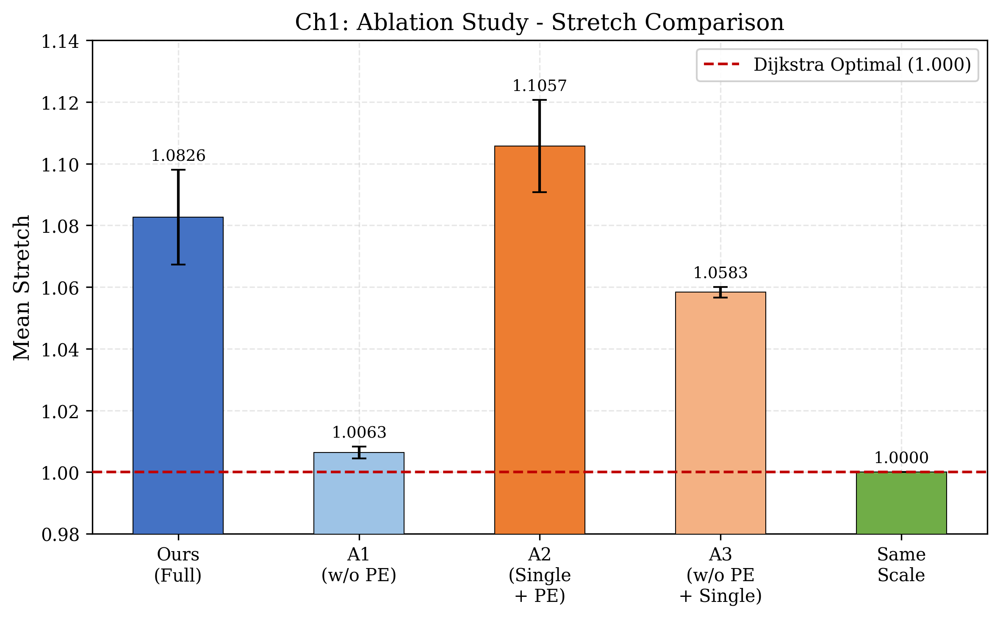
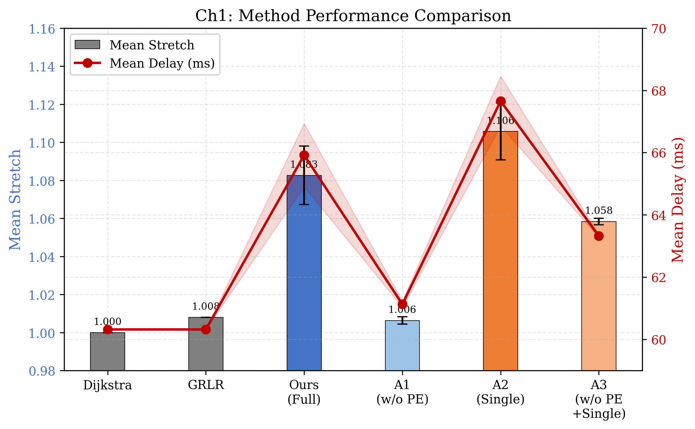
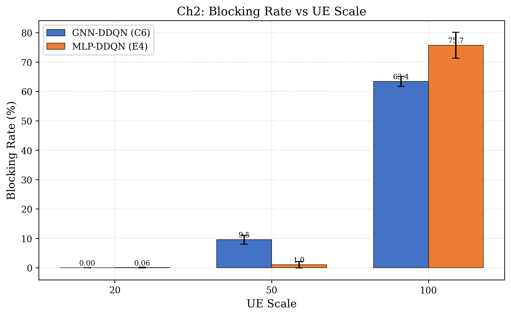
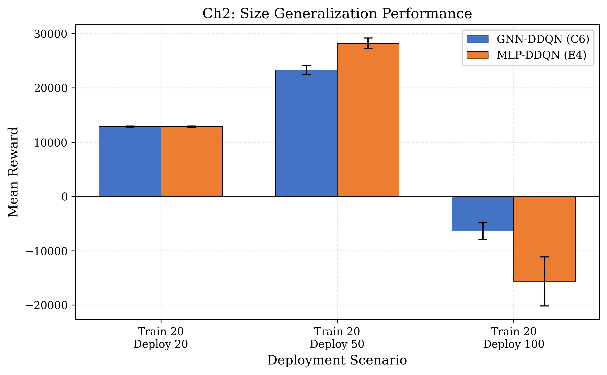
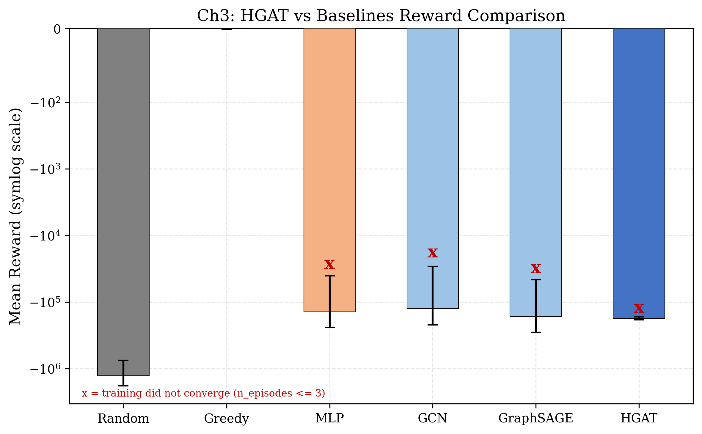

# 硕士学位论文开题报告

论文题目：基于图神经网络的LEO卫星网络路由与切换方法研究

---

## 一、选题依据

### 1.1 研究背景与意义

#### 1.1.1 LEO 卫星网络发展现状

传统地面通信网络在偏远地区、海洋和空中等场景的覆盖能力有限，基础设施建设和维护成本高昂。非地面网络作为实现全球无缝覆盖的补充方案，近年来获得快速发展。截至 2025 年，全球在轨卫星约 7560 颗，其中低地球轨道（Low Earth Orbit, LEO）卫星占 6768 颗，约占 89%[@cn-chen2022constellation]。LEO 卫星在 160--2000 km 轨道高度运行，相比地球静止轨道（Geostationary Earth Orbit, GEO）卫星具有更低传播时延和更小链路预算，单跳时延仅 5--30 ms 而 GEO 约 270 ms，是全球覆盖网络的重要基础设施。非地面网络（Non-Terrestrial Network, NTN）作为 LEO 卫星通信的标准化框架，已被纳入第三代合作伙伴计划（3GPP）Rel-17 及后续版本，是第六代（6th Generation, 6G）移动通信网络空基部分的核心组成[@cn-wang2023future]。

在巨型 LEO 星座的实际部署方面，SpaceX 的 Starlink 星座已发射 8502 颗卫星，规划总数达 42000 颗；OneWeb 完成 648 颗组网；Amazon Kuiper 计划发射 3236 颗[@cn-sun2024leo]。我国在 LEO 巨型星座建设方面进展迅速：2020 年 4 月卫星互联网被纳入国家"新基建"信息基础设施范畴。同年 9 月申请 GW-A59 和 GW-2 两个低轨宽带卫星星座计划，卫星总数达 12992 颗[@cn-chen2022constellation]；上海"千帆" G60 星座计划发射 12000 颗以上卫星；2021 年中国卫星网络集团成立，推进星网星座建设。

巨型星座的网络能力以星间链路为基础。巨型 LEO 星座由上千颗卫星通过星间链路（Inter-Satellite Link, ISL）构成天基骨干网，无需经过地面站即可实现星间数据转发。ISL 技术从早期的微波链路发展到 1550 nm 激光链路，单链路带宽可达 1 GHz[@cn-yan2024isl]。ISL 拓扑分为轨内链路和轨间链路两类：轨内链路是同一轨道面内前后卫星间的永久性链路，轨间链路连接相邻轨道面间的卫星。Walker-Delta 构型配合 +Grid 拓扑每颗卫星维持恒定 4 条 ISL，即 2 条轨内加 2 条轨间，在覆盖均匀性和 ISL 稳定性方面具有优势[@cn-ruan2022design]，成为 Starlink、星网等星座的首选拓扑结构。

尽管 Walker-Delta +Grid 拓扑在稳定性和均匀性上具有优势，巨型星座的网络管理仍面临三方面挑战。一是路由计算复杂度：720 颗卫星的全对最短路径计算涉及 $\sim$260,000 个节点对，传统 Dijkstra 算法的 $O(N^2 \log N)$ 复杂度在实时更新场景下开销过大。二是拓扑时变性：LEO 卫星以约 7.5 km/s 的速度运动，轨道周期约 90--120 分钟，ISL 长度随轨道位置持续变化，超过通常 4000--5000 km 的断链阈值时链路中断并重建。三是 ISL 可靠性：轨道力学扰动、硬件老化和空间碎片等因素导致经验故障率为 5--15%[@cn-yang2025resilience]。传统基于快照的路由方法在数千颗卫星的动态拓扑中面临计算开销和适应性瓶颈[@cn-li2025routing]。

#### 1.1.2 图神经网络在网络优化中的应用趋势

面对上述路由计算、拓扑时变和链路可靠性三方面的挑战，基于图结构的学习型方法近年来受到关注。图神经网络（Graph Neural Network, GNN）以图结构数据为输入，通过消息传递机制聚合邻居节点信息。该机制与卫星网络由卫星节点和 ISL 构成的拓扑直接对应，避免了将图结构展平为向量时的信息损失。常见 GNN 架构包括图卷积网络（Graph Convolutional Network, GCN）、图注意力网络（Graph Attention Network, GAT）和消息传递神经网络（Message Passing Neural Network, MPNN）等[@cn-wu2022gnn; @cn-ma2022gnn]。GNN 的核心特性在于置换不变性——聚合函数仅依赖局部邻居结构，与图的总节点数无关，GNN 因此在理论上具备跨规模泛化的潜力。GNN 可编码图结构化状态，而路由决策本身是一个序列优化问题，需要通过与环境的交互学习最优策略。深度强化学习（Deep Reinforcement Learning, DRL）恰好为此提供了决策框架，已在组合优化、游戏和机器人控制等领域取得突破[@cn-liu2018drl; @cn-li2021drlcombopt]。GNN 与 DRL 的结合为图结构化的状态和动作空间提供了学习型解决方案。Shen 等人从理论上证明了 GNN 的置换等变性是实现跨规模部署的关键机制[@ch2-shen2020twc]。Eisen 等人通过 REGNN 实现了无线电资源配置的规模无关性[@ch2-eisen2020tsp]。在卫星路由领域，Zhang 等人提出 GRLR 使用 GAT+Actor-Critic 进行分布式路由，在 720 星规模验证了可行性[@ch1-grlr2025]；Chen 等人在 6048 星规模上验证了 GCN+PPO 的可行性[@ch1-gdrlsfcr2025]。然而，现有 GNN 路由工作均在单一规模上训练和测试，跨规模部署能力未被验证。

#### 1.1.3 研究意义

综合以上分析，GNN 在 LEO 卫星网络中的应用已有初步成果，但其有效性条件——特别是在何种场景下 GNN 相比传统方法具有优势——尚无系统研究。理论研究表明 GNN 的跨规模泛化能力依赖于局部结构的统计不变性[@ch1-sizgen2025]，但这一结论在卫星网络的规则拓扑和时变场景下是否成立尚无实证。这一研究空白在工程上有紧迫需求。星座规模的渐进式部署是行业现实：Starlink 从 60 颗卫星起步扩展到规划 42000 颗，约 700 倍增长，我国星网星座同样面临从试验星到数千颗的逐步扩容。若每次规模变化都需重新训练路由模型，部署成本将随星座规模增长。训练计算量与节点数呈超线性关系，正比于 $N^{1.7}$，在 Starlink 规模的 42000 颗卫星上直接训练预计需约 80 天。GNN 的跨规模泛化能力若得到验证，可在小规模星座上训练后直接部署到大规模星座，将训练成本压缩到可接受范围内。此外，ISL 故障是 LEO 卫星网络的常态而非异常，5--15% 的经验故障率意味着在 720 颗卫星的网络中同时有 72--216 条链路处于中断状态。该数字基于理想 +Grid 拓扑估算，实际 ISL 总数因高纬度轨间断链可能低于理论上限。ECMP 和最短路径优先等静态路由协议依赖拓扑的规则性和等价路径的对称性，故障打破这些前提后性能急剧退化。GNN 的消息传递机制能否在拓扑结构发生漂移时动态感知并适应变化，是巨型星座网络可用性的关键。

在国家层面，卫星互联网已被列入国家"十四五"新型基础设施建设规划，是我国实现天地一体化信息网络的关键环节[@cn-peng20246g]。提升 LEO 卫星网络的智能化管理水平，对保障国家空间信息基础设施的可靠运行具有现实需求。因此，系统研究 GNN 在 LEO 卫星网络中的有效性条件，是推动智能化路由方法走向工程部署的必要步骤。

### 1.2 国内外研究现状

#### 1.2.1 LEO 卫星网络路由方法

以下从路由、切换、故障弹性和规模泛化四个维度梳理研究现状。LEO 卫星网络路由方法按技术路线可分为传统策略方法和基于 GNN+DRL 的学习方法两类。

传统策略方法的核心思路是利用 Walker-Delta 拓扑的周期性和规则性降低路由复杂度，但各方法在不同维度上牺牲了全局信息。最短路径优先（Shortest Path First, SPF）算法在每个拓扑快照上独立计算最短路径，是路由的基本范式，但丢弃了快照间的负载趋势信息。MCSR 和 CMCR 分别采用段路由域和纬度聚类实现分域路由，前者支持万颗卫星规模但域间协调增加开销，后者提供收敛保证但静态聚类无法适应动态负载[@ch1-mcsr2025; @ch1-cmcr2024]。GARS 利用地理位置辅助实现 $O(1)$ 复杂度路由，适合实时决策但牺牲了负载均衡能力[@ch1-gars2026]。这些方法的共同局限在于路由决策仅依赖当前快照的局部状态，无法从历史数据中学习负载模式和拥塞传播规律，朱立东等人和倪少杰等人的综述也确认了巨型星座场景下的瓶颈[@cn-zhu2021; @cn-ni2023]。

基于 GNN+DRL 的路由方法通过端到端学习实现自适应路由决策，可按 GNN 架构分为 GAT 和 GCN 两条技术路线。GAT 路线利用注意力机制实现邻居信息的差异化聚合，但现有工作均未探索跨规模部署。Zhang 等人提出 GRLR 使用 GAT 加 Actor-Critic 进行分布式路由，在 720 星规模验证了可行性，但仅聚合局部子图信息，缺乏全局负载感知[@ch1-grlr2025]；Zhou 等人结合非支配排序遗传算法 NSGA-II 域划分与 GAT 加近端策略优化 PPO 在线路由，域划分与规模泛化有互补潜力但未探索[@ch1-dtar2026]；GraphPR 采用 GAT 结合多智能体深度强化学习 MADRL 全分布式路由，DeepLADU 利用 GAT 改进版本 GATv2 输出逐链路拥塞信号，两者均未涉及跨规模部署[@ch1-graphpr2025; @ch1-deepladu2026]。GCN 路线在更大规模上验证了可行性，但 GNN 角色差异显著：Chen 等人在 6048 星规模部署 GCN 加 PPO 方案，是目前最大规模的 GNN 路由实验，但训练和测试使用相同配置[@ch1-gdrlsfcr2025]；Ju 等人结合 GCN 做流量预测后再用决斗双深度 Q 网络 D3QN 路由，GNN 不参与决策[@ch1-dlbr2025]。此外，GQN 在 108 星规模验证了时空泛化但未涉及规模泛化[@ch1-gqn2024]，FGRLR 引入联邦学习但各方训练同规模模型[@ch1-fgrlr2025]。

国内学者也从不同角度探索了 GNN 与 LEO 路由的结合。在可行性验证方面，已在 66 至 288 星规模上验证了消息传递神经网络、分层 DQN 和时空编码器等架构的有效性[@cn-wanghao2023gnn; @cn-tanghongjing2024ms; @cn-wangyuzhuo2025phd]。杨子健[@cn-yang2023phd]和董飞虎[@cn-dong2024phd]的系统性研究均指出 GNN 是提升路由性能的下一步方向。此外，国内多项研究在 DQN 路由[@cn-huyue2023ms]、GCN 流量预测与负载均衡[@cn-songjiaxin2024ms]、多层异构星座路由优化[@cn-zhao2025multilayer]和联邦 DRL 路由[@cn-li2025federated]等方向上进行了探索。

上述方法虽然在各自规模上取得了改进，但无一将训练与测试解耦到不同规模的星座。星座的渐进式部署要求路由策略在不重新训练的情况下适配新拓扑，这一需求在现有工作中尚未被回应，近期的综述也确认了这一判断[@cn-li2025routing]。当星座规模从训练时的数百颗扩展到部署时的数千颗，GNN 路由策略能否保持性能是工程部署面临的关键问题。

#### 1.2.2 LEO 卫星网络切换管理

除路由计算外，LEO 卫星的快速运动还引发频繁的用户切换问题。LEO 卫星以约 7.56 km/s 的速度运动，导致地面用户设备（User Equipment, UE）需频繁执行从当前服务卫星到新卫星的切换（Handover, HO）。3GPP 预测表明，在直径 1000 km 的卫星覆盖区内，即使在每平方公里仅 0.08 个 UE 的低用户密度下，每秒仍有约 495 个用户进行切换，切入切出总数达每秒 990 个[@cn-zhu2022handover]。随着巨型星座部署和用户密度增长，大量 UE 同时竞争有限卫星容量，多 UE 切换管理的规模远超地面网络。

现有 LEO 切换方法主要采用 DRL 框架。Chou 等人使用 Dueling 双重深度 Q 网络 DDQN 实现多目标自适应加权切换，吞吐量相比固定策略提升 238%，但采用展平式 flat 观测向量编码全部 UE-卫星对状态，1585 维输入中有效数据仅约 18 维，信息利用率约 1%。Sun 等人从多目标马尔可夫决策过程 MOMDP 框架[@ch2-sun2024jsac]逐步演进到引入 Transformer 编码器的动作分解方案[@ch2-sun2026tmc]，但两代工作均维持 flat 观测编码。这些 flat DRL 方法的共同问题是：当 UE 数量从 20 增长到 50 时，flat 动作空间从 396 维爆炸至超出 GPU 内存限制，即使采用 top-K 压缩也无法解决观测维度与 UE 数量的耦合问题。

在图结构化切换方面，Lee 和 Lim 将 UE-卫星切换建模为二部图，使用 GNN 全连接消息传递进行负载均衡切换决策，是当前最接近图结构化切换的方案，但采用监督学习而非 DRL，无切换惩罚和阻塞约束，且未验证跨 UE 数量的泛化[@ch2-lee2025ict]。Yu 等人使用边级 MPNN 加 DQN 做单用户切换[@ch2-yu2024]，Eydian 等人采用加权二部图 Kuhn-Munkres 算法做匹配[@ch2-eydian2025]，Xie 等人在用户-高空平台 HAP 接入场景中使用二部图结合 GNN 和强化学习 RL[@ch2-xie2023wcap]，这些工作在场景和架构上与本研究差异较大。国内学者在群组切换、多智能体 DRL、融合网络动态切换和 GAT 加多智能体近端策略优化 MAPPO 方案等方面进行了探索[@cn-wang2026handover; @cn-liuyinghai2025ms]，但均未采用图结构化观测，也未验证跨用户规模的泛化能力。

现有图结构化切换工作分别采用了监督学习、单用户场景或非学习型匹配，均未同时实现 DRL 决策框架、二部图建模和跨用户规模的泛化验证。将二部图建模与 GNN 编码相结合，并验证其在跨用户规模场景下的泛化能力，目前在 LEO 切换领域尚无先例。

#### 1.2.3 故障弹性路由

路由和切换问题关注网络正常运行状态下的优化，ISL 的可靠性则构成另一层面的挑战。LEO 卫星网络中 ISL 因轨道力学、硬件老化和空间天气等因素频繁中断，经验故障率为 5--15%[@cn-yang2025resilience]。故障导致拓扑偏离规则结构，使基于等价路径的静态路由协议——如等价多路径路由（Equal-Cost Multi-Path, ECMP）——失效，引发负载聚集和端到端时延恶化。杨华果等人对低轨巨型星座抗毁性的综述指出，故障场景下的路由弹性是星座网络可靠运行的关键需求[@cn-yang2025resilience]。

在全局流量工程（Traffic Engineering, TE）方法中，Zhou 等人提出 TELGEN，使用双循环 GCN 将 TE 线性规划转化为二部图消息传递，实现 20 倍规模泛化且最优性差距小于 3%[@ch1-telgen2025]。但 TELGEN 采用离线监督学习范式，每个拓扑快照需预计算内点法（Interior Point Method, IPM）最优解作为标签。在链路频繁故障的 LEO 场景中，每个故障事件都需重新求解线性规划，无法满足实时性要求。He 等人设计 GNN-ASSSP，使用时空 GNN Transformer 预测动态拓扑并学习拥塞感知边权重，在 20% 故障率下保持 100% 路径可达性，验证了 GNN 对故障拓扑的适应能力，但未测试跨规模泛化[@ch1-gnnasssp2026]。Liu 等人提出 FlexSATE，使用基于 Transformer 架构的分布式 GNN 模仿多商品流做逐流流量分割，是 LEO TE 与 GNN 结合的代表性工作[@ch3-liu2024globecom]。

在分布式逐跳和逐流方法中，DTAR 和 GMR 分别使用 GAT 加 PPO 和 MPNN 加深度确定性策略梯度 DDPG 实现路由，前者在 2% 故障率下通过 action masking 处理故障链路但仅测试 288 星单一规模[@ch1-dtar2026]，后者验证了跨星座泛化但规模跨度有限[@ch3-huang2024tvt]。Fan 等人和 Li 等人分别设计了多层卫星流量分配方案和多目标路由优化方案[@ch3-fan2026taes; @ch3-li2025iotj]。Du 等人从网络安全角度指出路由故障响应影响抗攻击韧性[@cn-du2024security]，王旭从算力网络角度论证了引入 GNN 编码星间资源竞争的必要性[@cn-wangxu2025ms]。

TELGEN 实现了 20 倍规模泛化但采用离线监督学习，每个故障事件需重新求解线性规划；GNN-ASSSP 在 20% 故障率下保持路径可达但未测试跨规模泛化；DTAR 处理故障链路但仅测试 288 星单一规模。故障弹性要求 DRL 范式的在线适应，跨规模泛化要求 GNN 范式的参数共享，二者结合的技术门槛因此尚无同时验证的研究。

#### 1.2.4 GNN 规模泛化

上述三个维度的研究空白共同指向 GNN 的规模泛化能力这一基础问题。GNN 规模泛化的理论框架基于 Graphon 理论——当图规模增长时，若局部结构的统计性质保持不变，GNN 的输出分布收敛[@ch1-sizgen2025]。Liu 等人在 ICML 2024 上提出解耦表示学习（DISGEN）方法提升跨规模泛化，其核心发现是恒定度数的规则图结构有利于表示解耦[@ch1-disgen2024]。Walker-Delta 星座的恒定 4 度+2D 球面流形结构满足这一条件，有利于实现规模泛化。肖国庆等人对大规模 GNN 的综述指出，现有规模泛化研究主要集中在节点分类和图分类任务，路由决策等离散优化任务的泛化性研究尚属空白[@cn-xiao2024largegnn]。

在经验验证方面，TELGEN 在 Erdos-Renyi、Waxman 和自治系统网络等通用图上实现 20 倍规模泛化，最优性差距小于 3%[@ch1-telgen2025]。该工作是当前规模泛化的标杆，但其离线监督学习 SL 范式限制了在故障场景下的适用性。Size Transferability 使用 Graph Transformer 加卷积位置编码实现跨规模迁移，验证了位置编码对规模泛化的关键作用[@ch1-sizetrans2026]。Scaling Swarm 在简单 2D 导航任务中实现 3 倍零样本迁移，表明 GAT 架构在简单场景下可泛化但倍数有限[@ch1-scalingswarm2025]。

上述验证集中在通用图和节点分类任务，LEO 卫星路由场景下的 GNN 规模泛化尚无实证。卫星路由的特殊性在于三方面：拓扑因卫星运动持续时变而非静态图；决策是离散路径选择而非连续值回归的节点分类；路由质量由全局端到端时延衡量而非局部节点指标。这些差异使通用图上的结论无法直接迁移。

### 1.3 现有研究存在的问题与挑战

综合以上分析，LEO 卫星网络中 GNN 的应用面临三个层面的研究空白。

路由层面：GNN+DRL 路由方法在单一规模上验证可行[@ch1-grlr2025; @ch1-gdrlsfcr2025]，但跨规模零样本泛化能力完全未被探索[@ch1-disgen2024]。星座渐进式部署的工程需求与现有方法的单一规模假设之间存在突出矛盾。Walker-Delta 星座的规则拓扑——恒定度数 4 和规则网格结构——理论上为 GNN 规模泛化提供了有利条件，但这一理论预期缺乏实验验证。

切换层面：多 UE 切换管理中 flat DRL 观测的信息利用率仅约 1%，图结构化方法仅有 Lee 和 Lim 的初步探索[@ch2-lee2025ict]且无 DRL 和规模验证。用户规模泛化在 LEO 切换领域完全空白——当 UE 数量从 20 增长到 50 甚至 100 时，路由和切换策略能否保持性能尚无答案。

故障层面：故障弹性与跨规模泛化在 GNN+LEO 路由中无同时验证的先例[@ch1-telgen2025; @ch1-gnnasssp2026; @ch1-dtar2026]。故障打破拓扑规则性后 GNN 的消息传递机制是否仍能保持优势——还是说故障恰好是触发 GNN 全局负载感知能力的前提条件——是一个缺乏实证的问题。

三个空白指向同一个核心问题[@ch2-shen2020twc; @ch2-eisen2020tsp]：GNN 在 LEO 卫星网络中的有效性取决于什么条件？在规则拓扑和周期性流量下，GNN 的规模不变性表征能力是否足以支持跨规模部署？当 UE 数量增长引入负载竞争时，置换等变性是否成为 GNN 的结构性优势？当故障打破拓扑规则性时，消息传递机制能否在故障场景下发挥关键作用？本课题围绕这一核心问题展开研究，提出"探索性分化"分析框架，认为 GNN 的有效性取决于架构复杂度与任务需求的匹配程度。在任务需求超越规则策略能力边界时，GNN 的表达能力才转化为性能优势。

---

## 二、研究内容

### 2.1 总体研究思路与框架

#### 2.1.1 "探索性分化"元分析框架

针对上述三个层面的研究空白，本课题围绕"LEO 卫星网络中 GNN 的有效性条件"这一核心问题，提出"探索性分化"元分析框架。该框架的核心假设是：GNN 的有效性因场景而异，取决于任务对表达能力的实际需求。当任务在规则拓扑、周期性流量、低竞争强度下进行时，GNN 的消息传递和置换等变性未必优于简单策略；当任务引入规模变化、多用户竞争或链路故障后，简单策略的不足以应对，GNN 的结构归纳偏置才转化为性能优势。

#### 2.1.2 三个方向的关系与共性基础

在这一框架下，三个方向形成"正常态→优化态→异常态"的递进关系，同时每个方向聚焦不同的 GNN 特性，结论可独立成立。跨规模路由方向在确定性拓扑和均匀流量下考察 GNN 的规模不变性，回答"GNN 能否跨规模部署"的基础问题。切换决策方向引入多 UE 切换场景，在用户数量增长带来的负载竞争下考察置换等变性的结构优势。故障弹性路由方向引入链路和节点故障，在拓扑规则性被打破后考察全局消息传递机制的弹性。

三个方向共用轨道高度 550 km 的 Walker-Delta 星座拓扑，其中跨规模路由和切换决策方向采用 53° 倾角均匀覆盖配置，故障弹性路由方向采用 86.4° 倾角以引入极地间隙效应。节点特征和边特征的设计原则保持一致，具体维度因任务需求而异。时延模型因研究侧重点不同存在差异：跨规模路由方向采用纯传播时延模型，聚焦拓扑结构和规模因素，排除排队效应的干扰；切换决策方向不显式建模端到端时延，以归一化速率、剩余容量、阻塞和切换惩罚构成复合奖励；故障弹性路由方向在传播时延基础上引入拥塞惩罚权重 $C_f = 1/(1-\text{util})$，高负载链路的路由代价非线性放大。统一符号体系将在论文附录中给出。整体研究框架如图 2-1 所示。

从训练范式看，三个方向分别采用不同的训练范式：跨规模路由使用监督学习，切换决策使用 DQN 系列的值函数方法，故障弹性路由使用策略梯度方法 PPO。这一差异反映了各自任务特性的不同需求：跨规模路由的 Dijkstra 标签提供稳定监督信号；切换决策的离散动作适合值函数估计；故障弹性路由的逐流路径选择在增量奖励下通过策略梯度优化更为稳定。

### 2.2 基于图神经网络编码器的 LEO 卫星跨规模路由方法

#### 2.2.1 研究问题与动机

现有 GNN+DRL 路由方法全部在单一规模上训练和测试，跨规模零样本部署在卫星路由领域完全空白[@cn-li2025routing]。Walker-Delta 星座的恒定度数 4 和规则网格结构理论上与全局规模无关，为跨规模泛化提供了结构基础。

该问题的工程背景是星座的渐进式部署——Starlink 从 60 颗卫星扩展到规划 42000 颗，星网星座同样面临逐步扩容。若每次扩容都需重新训练路由模型，训练计算量与节点数呈超线性关系，正比于 $N^{1.7}$，在大规模星座上直接训练的时间成本可能超出工程可接受范围。该方向的主要目标是验证 GNN 在小规模星座上训练后直接部署到大规模星座的路由质量。

#### 2.2.2 拟采用的技术路线

该方向设计 Orbital PE + 多尺度混合训练 + 加权 Dijkstra 推理的技术路线。

引入轨道位置编码 Orbital PE 的原因在于：GNN 的消息传递仅聚合局部邻居信息，无法区分卫星在星座中的全局位置。Orbital PE 基于归一化轨道坐标 $(p/P, k/S)$ 的 sin/cos 多频率编码，输出固定维度 16，归一化坐标取值 $[0, 1)$ 与星座规模无关，可泛化到任意 $(P, S)$ 组合[@cn-wu2022gnn; @cn-ma2022gnn]。消融仿真表明 Orbital PE 是学习有效路由方向的关键前提——移除 PE 后方向预测精度约 40%，接近 4 类随机基线 25%，说明 GNN 仅靠局部拓扑结构不足以学习有效的路由方向。

GNN 编码器采用 GAT 结构[@ch1-grlr2025]，层数和感受野的设计基于 Walker-Delta 网格拓扑中路由决策所需的中距离邻居范围。边特征——传播时延和几何距离——通过独立变换矩阵参与注意力计算，不同链路之间的质量差异反映在注意力权重中。训练范式选择监督学习而非 DRL，原因是 Dijkstra 最短路径方向标签，分为轨内前、轨内后、轨间左、轨间右共 4 类，提供了稳定且高精度的监督信号。

多尺度混合训练策略在 66+100+200 星三种配置上联合训练，目的是在训练阶段覆盖不同 $(P, S)$ 下的归一化位置分布[@ch1-telgen2025]。推理阶段 GNN 输出方向对数概率 logits 构造加性惩罚边权重，运行加权 Dijkstra 生成路由表——全局路径优化可修正单跳方向错误，路径成功率 100%。技术路线如图 2-2 所示。

#### 2.2.3 预期成果与初步进展

预期成果：在多尺度星座混合训练后，GNN 路由策略零样本部署到 10 倍以上规模星座，时延保留率不低于 80%，路径最优性比 stretch 不超过 1.2。同时通过消融仿真明确 Orbital PE、多尺度训练和加权 Dijkstra 各组件的贡献。

初步仿真表明方案可行：66+100+200 星混合训练后零样本部署到 720 星（10.9 倍），时延保留率 91.5%，路径成功率 100%。消融仿真表明 Orbital PE 是学习有效路由方向的关键前提。

### 2.3 基于二部图 GNN 的多用户卫星切换决策方法

#### 2.3.1 研究问题与动机

跨规模路由方向验证了 GNN 编码器的规模不变性，以下转向用户侧的切换决策问题。现有 LEO 切换方法主要采用 flat DRL 框架，其定长观测编码在 UE 数量增长时面临信息利用率和可扩展性双重瓶颈。Lee 和 Lim 将 UE-卫星建模为二部图并使用 GNN 进行负载均衡切换[@ch2-lee2025ict]，但采用监督学习而非 DRL，无跨 UE 数量的规模泛化验证。Shen 等人从理论上证明了 GNN 的置换等变性是实现跨规模部署的关键机制[@ch2-shen2020twc]，Eisen 等人通过 REGNN 在无线电资源配置中验证了规模无关性[@ch2-eisen2020tsp]。该方向将这一理论从资源配置迁移到切换决策场景，考察置换等变性在离散动作空间中的有效性。

该方向设计基于二部图 GNN 的切换架构，验证其在小规模训练后可跨 UE 数量零样本部署，同时在高负载条件下相比无结构方法保持性能优势。

#### 2.3.2 拟采用的技术路线

该方向将多 UE 切换建模为二部图上的联合优化问题[@ch2-lee2025ict; @ch2-shen2020twc]。二部图仅编码活跃的 UE 节点和卫星节点及其关联边，观测空间随 UE 数量线性增长而非展平式方法的固定 1585 维，可自动适配变规模输入。top-$K$ 候选选择按仰角降序保留若干可见卫星，将动作空间从 396 维大幅压缩。

GNN 编码器采用边特征消息传递网络 MPNN-E，选择该架构而非 GCN 或 GAT 的原因是：信号干扰噪声比 SINR、仰角以及是否为当前服务链路等边特征是切换决策的主要信息源，MPNN-E 原生支持边特征在消息函数中的显式编码[@cn-wu2022gnn; @cn-ma2022gnn]。UE 和卫星之间双向消息传递。分解式 Dueling Q 函数将 Q 值分解为状态价值和优势函数，参数量相比 flat Q 压缩约一个数量级。参数共享是置换等变性的实现基础——相同的网络权重处理不同 UE 的候选卫星，模型对输入排列的不变性自然支持变长候选集和跨规模部署。二部图结构如图 2-3 所示。

奖励函数由归一化速率、剩余容量奖励减去阻塞和切换惩罚构成，各分项归一化后加权组合，避免量纲失衡导致策略偏向单一指标[@ch2-sun2024jsac]。训练采用 $\varepsilon$-greedy 探索策略配合经验回放。技术路线如图 2-4 所示。

#### 2.3.3 预期成果与初步进展

预期成果：在 50 UE 以上规模下，GNN 方案在复合奖励和阻塞率上显著优于多层感知机 MLP 等无结构方法；20→50 UE 零样本部署性能不低于同规模训练的 80%；同时明确置换等变性优势激活的 UE 数量阈值。

初步仿真观察到置换等变性优势的阈值效应：50 UE 规模下 GNN 奖励相比 MLP 提升 21.2%，阻塞率降低 89.4%，20 UE 规模下两者持平，符合"探索性分化"框架预期。20→50 UE 零样本部署成功，100 UE 规模下两种方法均出现负载饱和。

### 2.4 面向链路故障的 GNN 弹性路由方法

#### 2.4.1 研究问题与动机

切换决策方向考察了 GNN 在用户竞争下的优势，故障弹性路由方向进一步引入链路中断这一异常因素。ISL 故障率 5--15% 是 LEO 卫星网络的常态。现有 GNN+LEO 路由工作中，TELGEN 实现了 20 倍规模泛化但采用离线监督学习，每个故障事件需重新求解线性规划[@ch1-telgen2025]；GNN-ASSSP 在 20% 故障率下保持路径可达性但未测试跨规模泛化[@ch1-gnnasssp2026]；DTAR 在 2% 故障率下处理故障链路但仅测试 288 星单一规模[@ch1-dtar2026]。故障弹性、跨规模泛化和在线决策三项能力在现有工作中无同时验证的先例。故障弹性要求 DRL 范式的在线适应，跨规模泛化要求 GNN 范式的参数共享，二者结合的技术门槛使这一空白持续存在。

该方向有双重目标：一是验证 GNN 的消息传递机制在故障打破拓扑规则性后是否体现出路由弹性优势，以及这一优势在故障率达到什么阈值时变得显著。二是考察故障弹性路由在 Walker-Delta 族内跨规模零样本部署的有效边界。

#### 2.4.2 拟采用的技术路线

该方向设计 GAT 编码器 + PPO + 广度优先搜索 BFS 候选路径的在线故障弹性路由框架。选择 GAT 而非 GCN 的原因是：注意力机制可学习降低故障链路的聚合权重，GCN 的等权聚合无法区分正常链路和中断链路[@ch1-gnnasssp2026]。

路由决策采用逐流 K 条候选路径离散选择范式——对每条到达的流量请求，BFS 在去掉故障边的无向图上生成 若干候选路径，路径评分头取候选路径上节点嵌入的均值后评分，分类分布选择路径。采用离散路径选择而非连续流量分割[@ch1-dtar2026]，原因在于：K 条候选路径固有保证路径可达性，故障发生时无需重算路径集；离散选择在训练中比连续分割更稳定。训练采用 PPO，增量奖励比绝对 MLU 更适合逐流路由——每步奖励直接反映该步决策对全局负载的影响。

星座模型采用倾角 86.4° 的 Walker-Delta 同相面因子 $F$=1 构型，物理仿真包含极地间隙效应——高纬度轨间 ISL 因几何距离过远而断开，与真实星座行为一致[@cn-ruan2022design]。采用 86.4° 而非 53° 倾角，是因为 86.4° 在高纬度区域产生极地间隙，打破拓扑均匀性，为故障弹性路由提供更有挑战性的测试环境。时延模型在传播时延基础上引入拥塞惩罚权重，高负载链路的路由代价非线性放大，路由决策因此倾向于避开拥塞区域。技术路线如图 2-5 所示。

#### 2.4.3 预期成果与初步进展

预期成果：在 8% 以上故障率下，GNN 路由在端到端时延和最大链路利用率（Maximum Link Utilization, MLU）上优于无状态方法 ECMP；在 Walker-Delta 族内实现 4 倍以上规模的零样本部署；通过故障率消融仿真明确 GNN 优势的故障率阈值。

初步仿真表明 GNN 的故障弹性优势随故障率增大而增强——8% 故障率下端到端时延降低约 20%，15% 故障率下 MLU 降低 13.4%，无故障时与 ECMP 性能相当。66→288 星零样本部署成功，66→720 星泛化退化标定了规模边界。

---

## 三、研究方案

### 3.1 研究方法概述

以上三个方向的研究方案需要统一的仿真评估体系。本课题采用仿真实验方法验证所提方案的有效性。LEO 星座规模大、部署成本高，实物测试在研究阶段不可行，基于轨道力学模型的仿真是该领域评估路由和切换方案的常规方法[@cn-zhu2021; @cn-ni2023]。仿真环境基于 Python + PyTorch Geometric 框架构建，拓扑生成基于轨道力学实时计算 ISL 距离，超过断链阈值时链路中断并重建。

星座模型以轨道高度 550 km 的 Walker-Delta 构型为基础，规模覆盖 $P$=4--18、$S$=11--40，即 48--720 颗卫星的参数空间，参数化生成确保不同规模的拓扑具有一致的局部结构特征。跨规模路由和切换决策方向采用 53° 倾角的均匀覆盖配置，故障弹性路由方向采用 86.4° 倾角以引入极地间隙效应（详见 2.1.2 节）。三个方向的时延模型设计详见 2.1.2 节，具体参数见各仿真方案小节。

评估遵循统一原则：每个配置至少 3 个独立随机种子，关键指标报告均值和标准差。主要结论需同时满足 Welch t 检验的统计显著性和 Cohen $d$ 效应量达 0.8 以上即视为大效应。三个方向仿真方案的汇总对比如表 3-1 所示。

表 3-1 三个方向仿真方案汇总

| 项目 | 跨规模路由 | 切换决策 | 故障弹性路由 |
|------|------------------|----------------|-------------------|
| 核心方法 | GAT+Orbital PE | MPNN-E+Dueling DDQN | GAT+PPO+BFS |
| GNN 架构 | GAT | MPNN-E | GAT |
| 训练范式 | 监督学习 | DQN 值函数 | PPO 策略梯度 |
| 训练规模 | 66+100+200 星 | 20+50 UE | 66 星 |
| 目标规模 | 720 星（10.9x） | 100 UE（5x） | 288+720 星 |
| 对比方法 | Dijkstra, GRLR, 贪心逐跳 | MLP, flat DDQN | ECMP, MLP |
| 评估指标 | stretch, 时延保留率 | 复合奖励, 阻塞率 | MLU, 端到端时延 |
| 星座倾角 | 53° | 53° | 86.4° |

### 3.2 跨规模路由仿真方案

#### 3.2.1 仿真环境与数据

星座参数采用 Walker-Delta 构型，轨道高度 550 km、倾角 53°。生成 $P$=6/$S$=11 的 66 星、$P$=10/$S$=10 的 100 星、$P$=10/$S$=20 的 200 星三种训练规模，以及 $P$=18/$S$=40 的 720 星目标规模。ISL 拓扑为 +Grid 结构，每颗卫星维持 2 条轨内链路和 2 条轨间链路，断链阈值 5000 km[@cn-ruan2022design]。流量模型采用全对均匀需求，每个拓扑快照预计算全对 Dijkstra 最短路径作为监督标签，分为轨内前、轨内后、轨间左、轨间右共 4 类方向。

训练采用交叉熵损失的监督学习范式，三种训练规模在每个 batch 中随机采样，确保模型在训练阶段接触不同 $(P, S)$ 下的位置分布。消融仿真拟包括：移除 Orbital PE、单尺度训练和双消融，分别评估各组件的贡献。

#### 3.2.2 对比方法与评估指标

对比方法选择三条。Dijkstra 最短路径在每个拓扑快照上计算全局最优路径，作为路由性能上界。GRLR 是当前同规模 GNN+DRL 路由的代表性工作，在 720 星规模验证了可行性[@ch1-grlr2025]，用于对比 GNN 编码器的架构差异。以方向 argmax 的贪心逐跳策略作为下界，代表无学习的纯局部决策，用于度量学习增益的量级。三者构成完整的性能参照系。

评估指标为路径最优性比 stretch——即跨规模路由时延与同规模最优时延的比值——和时延保留率，即同规模 Dijkstra 时延与跨规模 GNN 时延的比值。stretch 越接近 1 表示跨规模路由质量越接近最优，时延保留率越高表示规模扩展对路由质量的影响越小。

### 3.3 切换决策仿真方案

#### 3.3.1 仿真环境与数据

星座参数采用 Walker-Delta 构型，轨道高度 550 km，396 星，$P$=18、$S$=22。UE 随机分布在地面服务区内，每个时隙所有 UE 同时执行切换决策。卫星容量参数模拟每颗卫星可同时服务的 UE 上限。信道模型基于自由空间路径损耗计算 SINR，仰角低于 10° 的卫星不纳入候选集。仿真覆盖 20、50、100 三种 UE 规模，其中 20 和 50 用于同规模训练评估，100 用于跨规模零样本部署测试。

训练采用 Dueling DDQN，探索策略为 $\varepsilon$-greedy，GNN 编码器参数规模详见 2.3.2 节。消融仿真拟包括 top-K 候选数量、GNN 层数和经验回放缓冲区大小对训练稳定性的影响。

#### 3.3.2 对比方法与评估指标

对比方法选择 MLP 和 396 维动作空间的 flat DDQN。MLP 与 GNN 使用相同的输入特征但缺乏图结构编码和置换等变性，两者性能差异可直接归因于图结构归纳偏置的贡献。flat DDQN 作为工程基线，暴露 flat 编码在规模扩展时的崩溃行为——观测维度从 396 维爆炸至超出 GPU 内存限制。

评估指标为复合奖励和阻塞率。复合奖励由归一化速率与剩余容量之和减去阻塞惩罚与切换惩罚构成，综合反映切换决策在吞吐量、资源利用和服务质量三方面的权衡。阻塞率直接度量因卫星容量不足导致用户无法接入的比例，是切换方案的硬约束指标。

### 3.4 故障弹性路由仿真方案

#### 3.4.1 仿真环境与数据

星座参数采用轨道高度 550 km、倾角 86.4° 的 Walker-Delta $F$=1 构型（极地间隙效应见 2.1.2 节），训练规模为 $P$=6/$S$=11 的 66 星，零样本部署覆盖 0.7 倍缩减测试的 48 星、4.4 倍的 288 星和 10.9 倍的 720 星。

故障模型覆盖三种模式：随机故障指 ISL 独立以概率 $p_f$ 中断，区域故障指特定地理区域内的 ISL 集体中断，级联故障指相邻链路连锁失效。故障率梯度设置为 0%--15%。流量模型包含重型流和热点目的地，模拟非均匀负载条件，并设置突发因子测试极端负载下的路由鲁棒性。

训练采用近端策略优化 PPO，每个 episode 包含若干逐流路由步骤，每个配置 3 个独立种子。

#### 3.4.2 对比方法与评估指标

对比方法选择 ECMP 和 MLP。ECMP 是工业界广泛部署的无状态路由协议，在规则拓扑下因等价路径丰富而性能良好，GNN 路由需在故障场景下超越 ECMP 才有实际部署价值。MLP 与 GNN 使用相同的节点和边特征但缺乏消息传递机制，性能差异直接反映全局负载感知能力的贡献。

评估指标为 MLU 和端到端时延。MLU 衡量网络中最拥塞链路的负载水平，是负载均衡的直接度量；端到端时延从用户角度反映路由质量。

### 3.5 可行性分析

本课题的可行性从理论、方法与数据、初步验证和风险应对四个方面进行分析。

理论可行性方面。GNN 跨规模泛化具有 Graphon 理论基础：当图规模增长时，若局部结构的统计性质保持不变，GNN 的输出分布收敛[@ch1-sizgen2025]。Liu 等人的进一步研究表明，恒定度数的规则图结构有利于 GNN 的表示解耦[@ch1-disgen2024]，而 Walker-Delta +Grid 星座的恒定度数 4 和规则网格结构恰好满足这一条件。在置换等变性方面，Shen 等人从理论上证明了它是实现跨规模部署的关键机制[@ch2-shen2020twc]，Eisen 等人通过 REGNN 在无线电资源配置中验证了规模无关性[@ch2-eisen2020tsp]。在卫星路由领域，GRLR 在 720 星规模[@ch1-grlr2025]、GDRL-SFCR 在 6048 星规模[@ch1-gdrlsfcr2025]上分别验证了 GNN+DRL 路由的可行性，为本课题的技术路线提供了文献基础。

方法与数据可行性方面。基于轨道力学模型的仿真实验是 LEO 卫星网络路由和切换方案评估的常规方法[@cn-zhu2021; @cn-ni2023]。Walker-Delta 构型以轨道面数 $P$、每面卫星数 $S$ 和同相面因子 $F$ 三个参数进行参数化表示[@cn-ruan2022design]。该构型可直接生成不同规模的星座实例且拓扑的局部结构在不同规模下保持一致，不依赖外部数据集或实测数据。软件环境基于 Python + PyTorch Geometric 框架，硬件平台为 NVIDIA RTX 4070 GPU，全部初步实验的训练和推理时间均在可接受范围内。三个方向分别采用的监督学习、Dueling DDQN 和 PPO 三种训练范式在卫星网络优化领域均有成功先例。

已验证的初步结果方面。三个方向的关键技术假设均已获得初步实验支持，详细实验设置和完整数据见第七节。

风险分析与应对方面。本课题的主要技术风险在于跨规模泛化在超大规模下可能退化——10.9 倍已验证可行，更大倍数尚未测试。若退化明显，将缩减规模比标定有效边界，边界本身对工程部署具有参考价值。低负载低竞争场景下 GNN 可能不优于简单策略，但这正是"探索性分化"框架关注的核心问题：明确 GNN 的适用边界同样构成研究贡献。仿真方面，轨道力学模型未涵盖对流层闪烁等实际信道效应，但仿真是该领域公认的评估手段[@cn-zhu2021; @cn-ni2023]，后续可按需扩展。DRL 训练稳定性方面，每配置至少 3 个独立随机种子，主要结论需同时满足 Welch t 检验的统计显著性和 Cohen $d$ 效应量达 0.8 以上的大效应标准，确保实验结果可复现。

---

## 四、研究工作进度安排

| 阶段 | 时间 | 主要工作内容 |
|------|------|-------------|
| 文献调研与开题 | 2026.03--2026.06 | 完成三个方向的文献精读与综述，撰写并答辩开题报告 |
| 跨规模路由研究 | 2026.06--2026.09 | 完善 GNN 跨规模路由方案，扩展实验规模和流量模式，完成论文初稿 |
| 切换决策研究 | 2026.09--2026.12 | 完成二部图 GNN 切换方案的设计与实验，验证跨 UE 规模的泛化边界 |
| 故障弹性路由研究 | 2026.12--2027.03 | 完成故障弹性路由方案的设计与实验，进行故障率消融和跨规模验证 |
| 论文撰写与修改 | 2027.03--2027.05 | 整合三个方向实验结果，完成学位论文撰写与导师审阅修改 |
| 论文答辩 | 2027.05--2027.06 | 提交论文评阅，完成答辩准备与正式答辩 |

各阶段间设置检查点，确保前一个方向的实验结论通过后再启动下一方向研究。

---

## 五、预期研究成果

### 5.1 理论成果

拟通过"探索性分化"元分析框架，系统考察 GNN 在 LEO 卫星网络中的有效性条件与边界。预期在三个层面获得条件性结论：明确 GNN 跨规模部署的有效规模倍数范围及关键前提条件；确定置换等变性优势激活的 UE 数量阈值；标定 GNN 故障弹性优势显现的故障率条件。

### 5.2 方法成果

拟针对三个场景分别设计基于 GNN 的优化方案：实现 10 倍以上规模的零样本跨规模路由部署；在高 UE 数量场景下显著降低阻塞率；在中高故障率下实现时延和负载均衡的明显改善。

### 5.3 论文发表计划

拟将三个方向的研究成果整理后投稿至通信领域期刊和会议，预期发表 SCI/EI 检索论文 1--2 篇。

---

## 六、本课题创新之处

### 6.1 分析框架的创新

本课题提出"探索性分化"分析框架，将 GNN 在 LEO 卫星网络中的有效性问题从"是否有效"转化为"在什么条件下有效"。现有 GNN 路由工作普遍将 GNN 视为通用优化工具[@ch1-grlr2025; @ch1-gdrlsfcr2025]，本课题则聚焦其适用边界。该框架将三个方向研究统一在"规模不变性→规模适应性→故障弹性"的递进逻辑下，各方向结论相互独立，又可交叉印证。

### 6.2 跨规模路由方法的创新

针对 LEO 卫星路由场景，拟设计基于 GAT+Orbital PE 的跨规模路由方案。与现有 GNN 路由工作均在单一规模上训练和测试的做法不同[@ch1-grlr2025; @ch1-gdrlsfcr2025]，该方向通过多尺度混合训练和零样本部署验证 GNN 的跨规模泛化能力。Orbital PE 基于归一化轨道坐标设计，使位置编码与星座规模无关，初步消融实验表明其是 GNN 学习有效路由方向的关键前提。

### 6.3 切换决策方法的创新

拟将多 UE 切换建模为二部图上的联合优化问题，通过 GNN 参数共享实现置换等变性。与现有 flat DRL 方法将全部 UE-卫星对状态展平为固定维度向量的做法不同[@ch2-sun2024jsac]，二部图编码的观测空间随 UE 数量线性增长，自动支持变规模输入，GNN 编码器参数相比 flat DDQN 压缩约 19 倍。初步实验观察到，置换等变性的结构优势在 UE 数量超过阈值后才体现，与框架预期一致。

### 6.4 弹性路由方法的创新

拟设计面向链路故障的在线弹性路由方案，实验观察到 GNN 的优势条件。故障率达到 8% 以上时相比 ECMP 在时延和负载均衡上显著改善，而无故障时两者性能相当。这一发现初步支持了"GNN 有效性取决于任务场景"的框架假设。与现有工作仅关注单一维度不同[@ch1-telgen2025; @ch1-gnnasssp2026]，该方向拟同时考察故障弹性与跨规模泛化的结合。

---

## 七、研究基础

### 7.1 已有的研究工作积累

在文献调研方面，已完成三个方向的系统文献调研，建立了覆盖 GNN+DRL 在 LEO 卫星网络中应用全景的文献基础。据此设计了"探索性分化"元分析框架和跨方向符号方案。

在实验方面，三个方向均已完成初步仿真验证。跨规模路由方向的基本结果见 2.2.3 节，消融仿真进一步量化了各组件贡献：Orbital PE 移除后 stretch 从 1.083 退化至近似 Dijkstra 水平，多尺度训练额外贡献 2.3 个百分点。

切换决策方向的基本结果见 2.3.3 节，补充统计检验信息：50 UE 规模下 GNN 相比 MLP 的提升达到统计显著性。

故障弹性路由方向的基本结果见 2.4.3 节。消融仿真进一步标定了跨规模部署边界：66→288 星零样本部署时延仅为 ECMP 的 25%，排队模型放大了负载差异；66→720 星泛化退化标定了规模上限。

上述实验的关键结果如图 7-1 至图 7-5 所示。图 7-1 呈现了消融仿真结果，Orbital PE 对路由质量贡献最大，移除后 stretch 显著退化。图 7-2 对比了各方法在 66 至 720 星规模上的时延表现，GNN 路由在零样本部署到 10.9 倍规模时仍接近最优。

图 7-3 呈现了 GNN 与 MLP 在不同 UE 数量下的阻塞率。50 UE 以上 GNN 阻塞率大幅低于 MLP，20 UE 时两者持平，印证了置换等变性优势的阈值效应。图 7-4 展示了 20→50 UE 零样本部署结果，GNN 泛化性能接近同规模训练水平。

图 7-5 呈现了不同故障率下 GNN 与 ECMP 的奖励对比。故障率 8% 以上 GNN 奖励持续高于 ECMP，故障率越高优势越明显，无故障时两者性能相当。

### 7.2 已具备的实验条件

目前全部实验均在 NVIDIA RTX 4070 GPU 上完成，训练和推理时间在可接受范围内。软件环境为 Python + PyTorch Geometric。LEO 星座拓扑通过轨道力学模型参数化生成，仿真输入完全可控、可复现，不依赖外部数据集。
