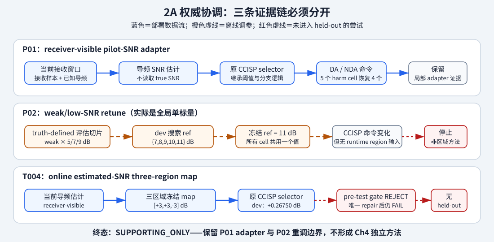

# Region-calibrated CCISP authority package（Ch4 不升格包）

> authority: D037 / T009 | terminal: `SUPPORTING_ONLY` | 本文件不是论文正文或可直接宣称的方法包

## 一句话裁决

现有证据不能支撑一个 Ch4 “region-calibrated CCISP extension”。可保留的只有两个相互独立的 supporting
asset：P01 receiver-visible pilot-SNR adapter 的局部鲁棒性事实，以及 P02 `ref=11` 全局单标量 retune
在冻结 weak/low-SNR 评估切片上的常规调优边界。T004 online map 仍在 held-out 前 `REJECT`。

## 实际流程与停止点

可编辑源图：`projects/simulation/figures/ccisp_region_calibration_authority_reconciliation.svg`。

P01 的部署链是：当前窗接收样本与已知导频 → pilot-SNR estimate → 原 selector → DA/NDA branch command。
P02 的实际链是：truth-defined 目标切片 → dev 搜索 `{7,8,9,10,11}` → 对所有 cell 冻结同一 `ref=11`
→ 原 selector command。后者不含 runtime region observation，因此不能改写成“区域规则”。T004 才尝试
current-pilot estimate → three-region map，但它没有通过 immutable pre-test evidence gate。

## Original / global / region 主表

下表来自 T004 commit 的 dev raw rows，由 seed 作为 cluster 重新聚合。它用于公平展示 action ladder，不是
held-out confirmation；T004 不存在合法 held-out 表。

| 方法 | 动作 | dev mean (dB) | seed-cluster 95% CI | n |
|---|---|---:|---:|---:|
| B0 original CCISP | nominal receiver configuration | 0.00000 | [0.00000, 0.00000] | 6 |
| B1 single global calibration | global `+3 dB` | +0.13688 | [+0.05117, +0.22258] | 6 |
| B2 nominal-region retune | nominal-SNR regions `<7 / 7–11 / ≥11` → `+3 / -3 / -3 dB` | +0.30846 | [+0.17455, +0.44236] | 6 |
| M online estimated-region map | pilot-estimated regions `<7 / 7–11 / ≥11` → `+3 / +3 / -3 dB` | +0.26750 | [+0.13719, +0.39781] | 6 |

`M-B2=-0.04096 dB`（dev-only）。CSV：
`projects/simulation/results/2a_region_calibration_authority_reconciliation/original-global-region-table.csv`。

## P01/P02 可保留数字

| 证据 | paired mean | 合法统计说明 |
|---|---:|---|
| P01 harm recovery | 4/5 cells | `weak@9,-3 dB` 未恢复：`-0.32285 dB`，CI `[-0.35679,-0.28891]` |
| P01 nominal-safety | 14/15 cells 未达 material-degradation 门 | `weak@9` 是唯一退化 cell：`-0.32285 dB`，CI `[-0.35679,-0.28891]` |
| P02 weakretune-adapter | +0.45387 dB | seed-cluster CI `[+0.43404,+0.47370]`; 历史展平 CI `[+0.43330,+0.47444]` |
| P02 cand_rank-weakretune | -0.09609 dB | seed-cluster CI `[-0.10275,-0.08942]`; 历史展平 CI `[-0.10597,-0.08620]` |
| P02 branch occupancy | 207/210 非零变化 | 只有聚合 DA/NDA count；没有逐窗 command trace |

P02 的 30-seed 汇总含一次事后 seed-count deterministic repair：首批 20 seeds 结果被观察后才追加 `90–99`。
它可作历史 supporting evidence，不可写成 pristine one-shot confirmation。

## Ch4 贡献身份与适用边界

- Ch4 独立方法：无。
- 允许身份：`SUPPORTING_MATERIAL`；P01 可在 robustness/discussion 中作为 receiver-visible adapter，P02
  可作为 conventional single-parameter tuning boundary。
- 不允许身份：`THESIS_MAIN_METHOD`、`THESIS_ENGINEERING_COMPONENT_READY`、`METHOD_SIGNAL`、第二主算法，
  或“工作点失配下的 region-calibrated robust CCISP extension 已就绪”。
- 场景边界：历史 P01/P02 的有限 weak/moderate/strong、5–13 dB diagnostic cells；P01 仍有一个
  `weak@9` harm/safety failure；不外推到未冻结场景、通用
  turbulence region 或真实硬件部署。
- 信息边界：P02 weak region 由评估 truth labels 定义；禁止为包装补造 classifier。T004 新 dev caller 虽是
  truth-isolated，但 gate FAIL 只否决其证据合法性，不构成 online 方法的科学 held-out null。

唯一 terminal：`SUPPORTING_ONLY`。已有 Ch5 scheduling-only 工程方法 authority（D036）与本终态分账，
不受本次降级连带影响。
