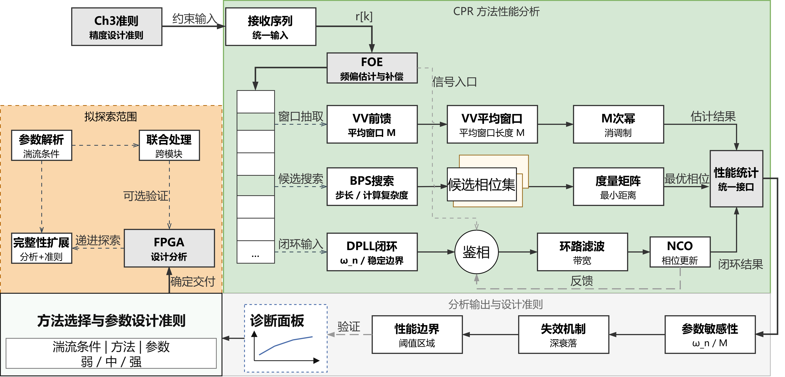
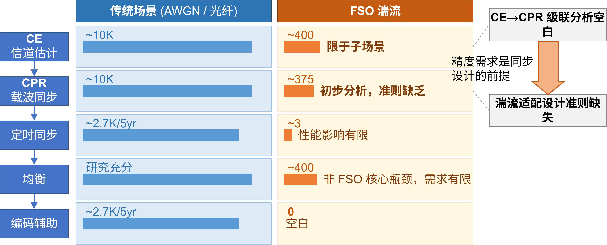

# 字号对比测试

以下正文为小四号（12pt），用于与图中文字对比。

VV算法通过对信号进行M次幂运算消除调制信息，其中M为调制阶数。BPS通过在相位空间中穷举搜索最佳匹配角度避免M次幂噪声放大。DPLL采用闭环反馈结构跟踪载波相位，对相位噪声和残余频偏具有内在鲁棒性。

## 小图（846×346px，字号9-10pt）

## 大图（4140×2408px，字号9-13pt）

## 宽矮图（2063×757px，字号未查）

## 宽扁图（2266×446px，字号未查）

---

以上四张图中，观察图中文字与正文字号的相对大小是否一致。理想情况下所有图内文字应与正文12pt视觉接近。
