title: "星地激光通信信号处理关键技术研究 — 开题报告"
author: "作者"
date: "2026 年 6 月"
bibliography: ../写作材料/references.bib
link-citations: true

# 选题依据

简述该选题的研究意义、国内外研究现状和发展趋势。

## 研究意义

随着低轨卫星星座的大规模部署与全球宽带通信需求的持续增长，星地链路面临传输速率从 Gbps 向 Tbps 量级跨越的迫切需求[@khalighi2014]。以 Starlink、OneWeb 及中国星网为代表的低轨宽带星座，在轨卫星数量已达数千颗，单星每日产生的观测与中继数据可达 TB 量级[@chan2026jstqe]，对星地链路总传输容量提出了前所未有的需求。传统微波射频链路受限于 Ku、Ka 及 Q/V 频段日益拥挤的频谱资源和有限的瞬时带宽，在提升传输速率方面遭遇物理瓶颈[@kaushal2016]。自由空间光通信（Free Space Optical Communication, FSO）以激光为载波，利用 800 nm 至 1550 nm 波段的光束传输信息，其可用带宽资源远超射频通信，无需申请频率使用许可[@khalighi2014]。同时，FSO 具备抗电磁干扰能力强、波束发散角小带来的天然保密性以及收发天线口径大幅缩小等优势，已成为解决星地高速数据传输瓶颈最具前景的技术途径。国际上，NASA 的激光通信中继演示验证（Laser Communications Relay Demonstration, LCRD）项目已成功在轨运行并完成双向星地链路试验，ESA 的欧洲数据中继系统（European Data Relay System, EDRS）也在卫星间与星地间实现了激光通信业务化运行[@israel2023lcrd-early; @heine2023tesat]；我国实践二十号卫星亦成功完成星地激光通信试验[@wang2020progress]，标志着星地激光通信正从实验室研究走向工程应用阶段。

在激光通信接收体制方面，基于强度调制/直接探测（Intensity Modulation/Direct Detection, IM-DD）的系统由于实现简单而得到早期应用，但其接收灵敏度受限于探测器噪声，且仅能恢复光强信息，无法利用信号的相位维度[@guiomar2022coherent]。当链路距离延伸至数万公里的同步轨道或经大气信道严重衰减的低仰角场景时，IM-DD 体制的功率裕量已近极限。相干探测利用本振光与信号光的混频效应，相比 IM-DD 具有约 20 dB 的接收灵敏度优势[@zhu2009diversity]，这一增益可直接转化为链路距离的大幅延伸或发射功率与天线口径的降低。相干探测还保留了信号光场的完整幅度与相位信息，使得正交相移键控（Quadrature Phase Shift Keying, QPSK）、16 阶正交幅度调制（Quadrature Amplitude Modulation, QAM）等高阶调制格式以及波分复用技术的应用成为可能。在工程实现层面，内差探测结合高速模数转换器和数字信号处理（Digital Signal Processing, DSP）平台，使相干接收机无需本振光与信号载波的严格相位锁定，即可通过后端数字域算法完成频偏补偿和载波相位恢复[@savory2008]，降低光学锁相系统的复杂度。

然而，相干检测对信号光与本振光之间的相位一致性高度敏感，这使得大气湍流成为星地相干激光通信的核心制约因素。星地链路中信号光需穿过大气层，大气湍流效应导致折射率随机起伏，使接收信号同时产生幅度衰落和相位扰动[@andrews2005; @xu2025]。湍流引起的相位噪声导致载波同步精度下降，使误码率上升，成为制约星地相干激光通信工程化应用的核心瓶颈。

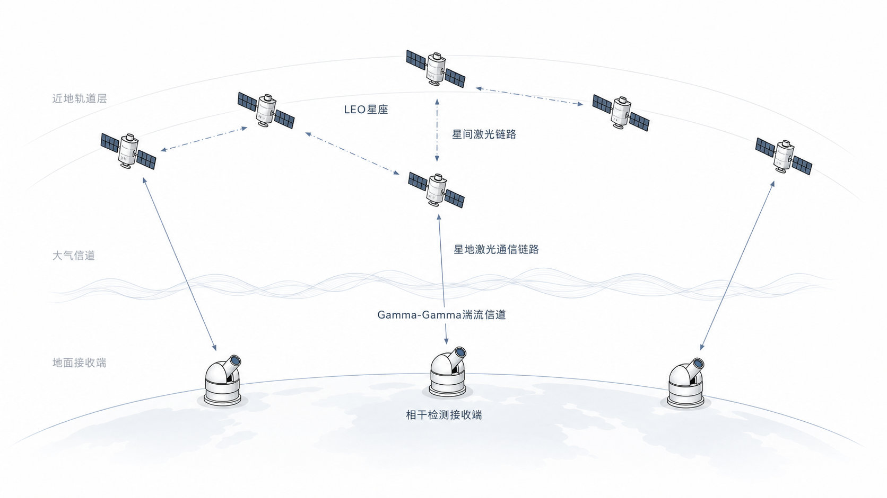

为有效缓解该瓶颈，需要在信号处理链的多个环节协同推进，具体面临以下四个层次的技术挑战。

首先，必须建立准确的大气湍流信道模型以描述传输损伤的统计特性。Gamma-Gamma（GG）分布模型能够刻画弱到强湍流条件下的光强起伏[@alhabash2001]，其模型参数 α、β 取决于天顶角、链路距离等几何参数以及折射率结构常数等气象条件。在此基础上，需要从含噪接收信号中恢复湍流信道状态信息，为后续性能分析提供可靠的输入。

其次，需分析信道估计误差对接收性能的影响。现有研究通常以归一化均方误差（Normalized Mean Square Error, NMSE）为核心评价指标，关注估计器本身的精度极限[@gong2015]，但 NMSE 与载波同步等后续信号处理模块之间的定量映射关系尚不清晰。当 GG 参数 β<1 时，归一化辐照度倒数期望 E[1/h] 发散，前馈类方法基于统计平均的最优性前提不再成立；不同调制格式对相位误差的灵敏度差异使得同一估计误差导致的性能退化幅度截然不同。因此，需要建立信道估计误差对接收性能影响的分析框架，分析估计误差在不同湍流条件和调制格式下的影响机制，导出面向同步的精度设计准则，为信道估计器的精度设计提供面向系统级性能的目标约束。

进而，为实现上述精度准则，需研究载波同步方法在湍流信道下的性能表现。传统载波同步架构采用载波频偏估计（Frequency Offset Estimation, FOE）与载波相位恢复（Carrier Phase Recovery, CPR）级联处理[@valjus2025dsp]，各级参数需针对特定信道条件手工调节，在湍流时变信道下难以保持较好的跟踪性能：弱湍流时环路带宽过窄导致跟踪滞后，强湍流时带宽过宽引入过多相位噪声，严重时甚至导致数字锁相环（Digital Phase-Locked Loop, DPLL）失锁并产生误码率平底效应。因此，需要系统分析不同载波同步方法在湍流场景下的性能边界与参数配置规律，建立分湍流条件的方法选择与参数设计准则。在工程实现层面，上述算法最终需在以现场可编程门阵列（Field Programmable Gate Array, FPGA）为核心的接收机硬件平台上实时运行[@valjus2025dsp]，算法复杂度须与有限的硬件资源和严格的处理时延约束相兼容，因此 FPGA 实现分析是验证算法工程可行性的必要环节。

为解决上述问题，本文围绕星地相干激光通信信号处理的关键技术，开展如下研究工作：

1. 建立星地相干激光通信系统模型，分析大气衰减和湍流效应对信号传输的影响。采用 Gamma-Gamma 分布建模湍流信道，研究基于导频的最小二乘（Least Squares, LS）、最小均方误差（Minimum Mean Square Error, MMSE）和 Kalman 滤波信道估计方法，完成星地链路预算分析。

2. 研究信道估计误差对接收性能的影响。分析 LS、MMSE、Kalman 滤波等估计方法在不同湍流条件下的精度特性，分析信道估计误差在不同湍流条件和调制格式下对接收机误码率的影响机制，给出方法可用性边界和面向同步的精度设计准则。

3. 研究湍流下相干接收端信号处理方法。分析 Viterbi-Viterbi（VV）算法、盲相位搜索（Blind Phase Search, BPS）和 DPLL 等典型载波同步方法在 Gamma-Gamma 湍流下的性能边界与失效机制，给出分湍流条件的方法选择与参数设计准则。在此基础上，研究面向湍流条件的参数解析设计方法，并探索跨模块信号处理联合方案，包括多源相位噪声联合建模、编码辅助载波恢复等方向。

4. 对接收端数字信号处理链进行 FPGA 设计与分析。包括频偏估计与补偿、载波相位恢复等关键模块，分析算法在硬件平台上的可实现性和资源开销。

## 国内外研究现状

围绕大气湍流与高动态多普勒对接收机信号处理的挑战，国内外学者在信道估计和信号处理两个核心方向开展了大量研究。信道估计从含噪接收信号中恢复湍流信道状态信息，为相干检测提供解调参数；信号处理则恢复接收信号的载波频率和相位，并针对湍流信道特性进行算法分析与参数设计。两者构成接收机信号处理链的关键环节：信道估计的精度决定信号处理的输入质量，信号处理算法的性能直接影响系统误码率。

### 大气湍流信道估计研究现状

大气湍流信道估计的核心任务是从含噪接收信号中恢复归一化辐照度 h，为后续信号检测和载波同步提供信道参数[@zhang2024jlt]。在自由空间光通信系统中，导频辅助方案构成信道估计的主流框架：在发送数据帧中周期性插入已知符号作为导频，接收端利用导频位置的接收信号估计信道状态[@gong2015]。经典的导频辅助 LS 和 MMSE 估计方法已在多种 FSO 场景中得到系统验证[@zhang2018]。然而，导频序列占用传输资源，导频密度越高则估计精度越好但有效数据速率越低，两者之间存在固有矛盾。此外，FSO 信道受大气湍流影响呈现出与无线射频信道截然不同的统计特性，湍流致信噪比波动使得传统估计方法的适用边界需重新审视。各类估计方法按演进脉络分析如下。

LS 估计器结构简洁、无需信道先验知识，但其估计过程将观测噪声等比例放大至估计结果中，在低信噪比（Signal-to-Noise Ratio, SNR）条件下精度严重受限[@gong2015]。在 Gamma-Gamma 湍流信道下，LS 估计精度随湍流强度增大而持续恶化，弱到中等湍流条件下 NMSE 通常在 -20 至 -15 dB 范围内。为抑制 LS 的噪声放大效应，MMSE 估计引入信道的二阶统计量对 LS 估计结果进行加权滤波，在先验信息准确时估计精度优于 LS[@zhang2018]。然而，MMSE 的性能对信道统计先验知识高度敏感：当先验模型参数与实际信道失配时，加权矩阵偏离最优值，估计精度反而劣于 LS。上述问题在 GG 湍流信道中尤为突出：模型参数 α、β 的推导依赖于链路几何参数和气象条件，参数估计本身引入的误差会传播至 MMSE 估计结果。此外，MMSE 涉及矩阵求逆运算，计算复杂度随导频数量增加呈立方增长，限制了其在高维系统中的扩展性。

在联合导频辅助信道估计与信号检测方面，689 Gbps 模分复用-多输入多输出自由空间光通信的导频辅助联合相位与信道估计已在实验室强湍流条件下得到验证[@li2024jlt]。上述两类方法均为单次估计，无法跟踪信道的时变衰落特性。

为克服 LS 和 MMSE 静态估计的局限，卡尔曼（Kalman）滤波通过自回归（AutoRegressive, AR）模型刻画信道的时变衰落特性，以递推方式实现信道状态的动态跟踪，在时变信道场景下具有理论优势。自适应 Kalman 方案通过在线调整过程噪声协方差以适应信道环境变化，在相干光通信相位同步与盲均衡中展示了可行性[@zhang2023kf]；自适应过程噪声协方差优化在宽范围信噪比下亦优于固定参数配置[@xiang2018]。此外，平方根无迹卡尔曼滤波（Square Root Unscented Kalman Filter, SR-UKF）已应用于星地链路载波恢复场景，为 Kalman 类方法在 FSO 信号处理中的应用提供了参考[@sun2020]。然而，自回归模型阶数的选择构成新的设计难题：阶数过低无法捕捉信道的动态变化，过高则对噪声敏感且计算开销增大。更关键的是，上述三类方法尽管在精度和跟踪能力上逐层改进，但共享一个固有局限：依赖导频序列。导频开销通常为 5% 至 10%，等效 SNR 损失约 0.5 至 1 dB，在高吞吐量星地链路中这一代价不容忽视。

深度学习（Deep Learning, DL）方法的核心优势在于无需导频序列即可实现信道估计，有望有效缓解传统方法的导频开销限制。基于神经网络的无导频信道估计方案已在 FSO 湍流场景中得到验证，估计性能接近理想信道状态信息（Channel State Information, CSI），展现了深度学习逼近最优估计的潜力[@chen2023dl]。将神经网络与自编码器结合的方案已在空间光通信湍流信道中实现符号检测与信道估计的联合优化，估计均方误差与最优 MMSE 持平而计算复杂度有所降低[@elfiky2024]。混合辅助数据与深度学习的两阶段方案在低轨正交频分复用（Orthogonal Frequency Division Multiplexing, OFDM）系统中实现了较优的信道估计精度，表明 DL 与导频辅助并非互斥关系，两者融合可进一步提升估计性能[@rustum2026iet]。导频辅助自相干检测 FSO 系统的综述工作亦对导频辅助框架下的湍流补偿技术进行了系统梳理[@zhang2024jlt]。然而，深度学习方法的泛化性边界尚未得到充分验证。当 SNR 超出训练数据范围时，估计误差可增长一个数量级以上。跨湍流强度的泛化能力和训练数据与实际信道的分布偏移问题，仍是深度学习信道估计走向实际部署前需回答的关键问题。

上述研究表明，无导频信道估计在精度层面已取得重要进展，但精度提升本身并非最终目标。信道估计的最终目的是为后续信号处理模块提供可靠的输入，估计误差将沿信号处理链传播并影响系统整体性能。信道估计误差与指向误差对 FSO 系统中断概率的联合影响已被定量分析，给出了估计误差到链路性能的显式关系[@han2022jlt]，Brandao 等人的 100 Gbps FSO 外场试验验证了发射端功率自适应方案的有效性[@brandao2024]。该工作将估计误差纳入中断概率的闭合表达式，给出了估计精度与链路可靠性之间的数学联系，但未进一步分析估计误差如何沿信号处理链的中间环节如载波同步环路传播和放大。Safi 等人的理论框架虽将信道状态信息纳入系统性能建模，但未区分不同信号处理方法对估计误差的灵敏度差异[@safi2019]。尽管上述工作分析了估计误差对链路性能的影响，但现有研究聚焦于 NMSE 的最小化，NMSE 与载波同步等后续信号处理模块之间的定量映射关系尚不完善，系统设计缺乏面向精度的指导准则。

综合以上分析，LS、MMSE、Kalman 三类导频辅助方法在估计精度上逐层改进但共享导频开销矛盾，深度学习方法有效缓解了导频依赖但泛化边界待验证。上述进展共同指向一个尚未解决的关键问题：信道估计精度与后续信号处理模块的性能需求之间缺乏定量桥接。这一缺口的成因在于现有研究以 NMSE 为核心评价指标，关注估计器本身的精度极限，但 NMSE 与载波同步等后续模块性能之间的映射关系尚不清晰。上述方法大多在软件仿真环境中验证，硬件实时实现的可行性讨论仍较为有限。

表 大气湍流信道估计方法对比

| 方法类别 | 核心思路 | 关键技术特点 | 适用条件与局限 | 本文选择依据 |
|---------|---------|-------------|---------------|-------------|
| 导频辅助 LS 估计[@gong2015; @zhang2018] | 导频位置接收符号与已知符号相除，直接解算信道响应 | 结构简洁，无需信道先验知识；GG 弱到中等湍流下 NMSE 约 -20 至 -15 dB | 适用：高 SNR、弱至中等湍流；局限：低 SNR 下噪声放大严重，精度受限 | 作为基准方法，提供估计精度的下界参考 |
| 导频辅助 MMSE 估计[@liu2022twc; @zhang2018] | 引入信道二阶统计量对 LS 结果加权滤波 | 利用先验协方差矩阵抑制噪声；涉及矩阵求逆运算 | 适用：信道统计先验可获取；局限：对先验模型参数高度敏感，GG 模型参数传播误差，复杂度随导频数量立方增长 | 作为精度上界参考，分析先验失配的影响 |
| Kalman 滤波[@yanxu2022; @zhang2023kf] | 自回归模型递推跟踪信道时变衰落 | 在线递推更新，自适应调整过程噪声协方差 | 适用：信道具备时变相关性；局限：AR 模型阶数敏感，仍依赖导频序列，开销 5%–10% | 评估时变跟踪能力，分析导频开销约束下的性能 |
| 深度学习[@chen2023dl; @elfiky2024; @rustum2026iet] | 端到端学习信道映射，无需导频序列 | 卷积神经网络（Convolutional Neural Network, CNN）+BiLSTM 提取空间-时间特征；混合方案可与导频辅助融合 | 适用：训练数据覆盖目标场景；局限：泛化性边界未验证，训练-实际分布偏移 | 不纳入仿真实验，作为技术趋势在综述中覆盖 |

上述四类方法在估计精度、先验依赖和导频开销三个维度上呈现递进关系：LS 依赖最少但精度受限，MMSE 精度最优但对先验敏感，Kalman 适应时变但导频开销持续存在，深度学习缓解了导频限制但泛化边界待验证。本文实验（1）选取 LS、MMSE 和 Kalman 滤波作为仿真对象，建立三档湍流下的 NMSE 基线；深度学习方法因训练数据与泛化验证条件尚不成熟，暂不纳入仿真实验。

### 湍流下相干接收端信号处理研究现状

相干光卫星接收机的信号处理可划分为定时恢复、载波同步和自适应均衡三个关键子系统[@valjus2025dsp]。本文聚焦载波同步子系统，其核心任务包括 FOE 和 CPR。FOE 消除接收信号中由收发本振频率差和相对运动引入的载波频率偏移，CPR 在残余频偏基础上恢复载波相位，两者共同保证相干解调的正确性。在光纤通信中，VV 算法、BPS 及导频辅助等 CPR 方法已高度成熟[@neves2023]，经典综述给出了载波相位估计的理论框架[@taylor2009]。然而，低轨卫星激光通信链路引入了高动态多普勒频偏和大气湍流相位扰动两个光纤场景中不存在的挑战，使得上述方法难以直接迁移。研究进展从载波同步方法、性能分析与设计方法、信号处理改进方向三个层面展开。

低轨卫星的高速运动引入大多普勒频偏。以轨道高度 500 km 为例，频偏可达 ±5 GHz，变化率约 40–150 MHz/s[@fernandes2023]。研究形成了发射端预补偿与接收端数字跟踪两条技术路径：预补偿方案利用卫星轨道参数在发射信号中预叠加补偿相位[@almonacil2020]；数字补偿方案在符号率 2.5 Gsps 条件下将残余频偏降至 CPR 可处理范围[@fernandes2023]。联合多普勒与相位噪声补偿方案已实现小于 0.5 dB 的性能损失[@zhao2025]，FPGA 平台上的实时跟踪亦验证了工程可行性[@wang2025a]。综合上述研究，多普勒频偏通过预补偿与数字跟踪的联合处理已基本解决，残余频偏通常在 CPR 算法的容忍范围内。

在残余频偏得到抑制后，CPR 成为保证相干解调性能的关键环节。VV 算法通过对信号进行 M 次幂运算消除调制信息，其中 M 为调制阶数，凭借结构简洁的优势成为 QPSK 系统的主流前馈方法，但该运算引入相位噪声放大效应，平均窗口长度的选择面临噪声平滑与跟踪灵敏度的折中[@guanhaijun2019; @taylor2009]。BPS 通过在相位空间中穷举搜索最佳匹配角度避免 M 次幂噪声放大，对高阶调制格式适应性更好，但复杂度随调制阶数上升[@yang2025]。导频辅助 CPR 利用周期性插入的已知符号消除相位模糊，在光纤系统中已有成熟应用[@magarini2012pilot]。DPLL 采用闭环反馈结构跟踪载波相位，对相位噪声和残余频偏具有内在鲁棒性[@paillier2020]。Paillier 等人在星地相干光链路中采用 DPLL 结合自适应光学（Adaptive Optics, AO）方案，发现湍流导致约 2.3 dB 的误码率惩罚[@paillier2020]。这是为数不多的同时涉及大气湍流与载波相位恢复的实验文献之一，但该工作的重心在于 AO 系统评估，对载波相位恢复算法本身在湍流下的行为未做系统性分析。Wang 等人在湍流场景下实现了帧同步与载波恢复的联合设计[@wang2024oe]，但未进行不同算法间的横向比较。深度学习方面，基于循环神经网络（Recurrent Neural Network, RNN）的自适应 CPR 在光纤场景展现了潜力，但在非高斯信道中的鲁棒性仍缺乏验证[@neves2024]。综合上述分析，VV、BPS、DPLL 三类算法在光纤和白噪声场景已有充分研究，部分方案已向星地链路迁移，但不同湍流强度下的系统性能对比和参数设计准则仍不完善。

上述载波同步方法的研究主要集中在算法设计与改进，面向湍流信道的系统性性能分析和参数设计方法相对薄弱。在分析框架方面，Petković 等人在 Málaga 湍流下给出了，Málaga 分布可退化为 Gamma-Gamma 分布 M 元相移键控（M-ary Phase Shift Keying, PSK）结合相位噪声的符号错误概率解析框架[@petkovic2022]。该框架分析了调制阶数和湍流参数对可容忍相位噪声标准差的影响，并给出了从可容忍相位噪声标准差到 DPLL 环路参数的映射准则，为"分析框架→设计准则"模式提供了参考。然而，该框架仅研究 DPLL 一种载波恢复方法，未考虑信道估计误差对载波恢复性能的影响。在 FSO 场景中，Paillier 等人在星地相干链路中沿用白噪声信道公式设计 DPLL 参数[@paillier2020]，未将 Gamma-Gamma 湍流参数纳入性能模型。上述工作表明，湍流下的性能分析框架已有初步探索，但在将湍流参数纳入性能模型并进行面向信道的参数设计方面，相关研究仍不完善。

在参数设计理论方面，白噪声信道下已有较为成熟的设计方法。经典锁相环（Phase-Locked Loop, PLL）设计理论分析了 DPLL 环路带宽与跟踪误差的最优折中关系[@gardner1979]，Moeneclaey 等人给出了白噪声下 VV 最优平均窗口的闭合公式[@moeneclaey1994]，Schmogrow 等人进一步建立了误差向量幅度（Error Vector Magnitude, EVM）与调制格式性能之间的定量关系，为从接收信号质量指标评估系统误码性能提供了量化工具[@schmogrow2012]。然而，上述设计方法均以白噪声信道为前提。在湍流条件下，VV 算法的平均窗口长度选择面临精度与跟踪能力的严重折中，高相位噪声下性能退化[@li2019]；BPS 的搜索块长度同样需要根据湍流强度调整[@xiang2015]。这些观察表明，白噪声下成熟的参数设计公式在 Gamma-Gamma 湍流下不再直接适用，需要发展面向湍流信道的参数设计方法。

除上述面向具体算法的性能分析外，信号处理优化还涉及接收架构创新和噪声建模细化两个方向。在编码辅助载波恢复方向上，利用前向纠错（Forward Error Correction, FEC）解码器软信息反馈至载波相位估计的迭代接收架构在射频场景已有坚实基础。Oh 和 Cheun 给出了 Turbo 码联合解码与载波相位恢复的奠基框架[@oh2001]，Lottici 和 Luise 基于期望最大化算法给出了完整的理论框架[@lottici2004]，Wu 等人进一步分析了迭代载波相位恢复的收敛条件和性能边界[@wu2012]。在光通信领域，Castrillon 等人在光纤相干系统中验证了联合迭代检测与解码对激光相位噪声的补偿效果[@castrillon2015]，Yuan 和 Igarashi 进一步在光纤相干通信中展示了迭代载波恢复与 FEC 结合的可行性[@yuan2017]。然而，上述工作均在光纤或白噪声信道条件下完成。FSO 湍流场景中，湍流导致的块衰落型相位噪声与现有编码辅助框架假设的噪声模型不匹配，该方向的适配性尚未被研究。

在多源相位噪声建模方向上，实际 FSO 系统的载波相位误差通常由多个独立噪声源共同贡献：激光器线宽引入的维纳型相位噪声、多普勒频偏残余引入的确定性相位漂移、以及大气湍流引入的随机相位扰动。Ozbilgin 和 Uysal 分析了可见光通信中单源相位噪声对错误概率的影响[@ozbilgin2025]，但未涉及多源噪声的联合建模。Gappmair 等人分析了 Gamma-Gamma 湍流信道中相位噪声与指向误差对 FSO 系统性能的综合影响[@gappmair2017]，Li 等人进一步给出了激光线宽容限与指向误差的联合闭合表达式[@li2022]，暗示不同噪声源对系统性能的影响机制各异。Zhang 等人在大气湍流 FSO 中实现了频偏与相位噪声的联合补偿[@zhang2024jfso]，但仅考虑了单一湍流强度。上述分析表明，FSO 湍流下多源相位噪声的联合建模和精细化分析仍有待展开。

综合以上三个层面的分析，FOE、CPR、DPLL 等载波同步方法在光纤和白噪声场景已有充分研究，多普勒频偏问题已基本解决。然而，上述研究在三个层面存在不足：现有分析框架未将信道估计误差和 Gamma-Gamma 湍流参数纳入性能模型，白噪声下成熟的参数设计方法在湍流条件下缺乏对应方案，编码辅助载波恢复等优化方案在 FSO 湍流场景中的适配性亦未被充分研究。

表 载波同步方法对比

| 方法类别 | 核心思路 | 关键技术特点 | 适用条件与局限 | 本文选择依据 |
|---------|---------|-------------|---------------|-------------|
| VV 算法[@guanhaijun2019; @taylor2009] | M-次幂非线性运算消除调制，算术平均估计相位 | QPSK 系统主流前馈 CPR；平均窗口长度控制噪声平滑与跟踪灵敏度折中 | 适用：QPSK 调制、弱至中等湍流；局限：M 次幂运算引入噪声放大，湍流下平均窗口缺乏优化依据 | 作为前馈方法代表，纳入实验（5）~（8） |
| BPS[@pfau2009; @yang2025] | 相位空间穷举搜索最佳匹配角度 | 对每个符号测试多个候选相位旋转，取最小距离对应角度 | 适用：高阶调制如 16-QAM 等；局限：复杂度随调制阶数与搜索精度增加 | 作为高阶调制兼容方法，与 VV 构成前馈方法对比 |
| 导频辅助 CPR[@magarini2012pilot] | 周期性导频符号消除相位模糊 | 利用已知导频符号直接估计相位偏移 | 适用：可接受导频开销的系统；局限：导频开销与有效数据速率矛盾 | 不纳入仿真实验，作为相位模糊消除参考方案 |
| DPLL[@paillier2020] | 闭环反馈跟踪载波相位 | 鉴相器→环路滤波器→数控振荡器；可结合 AO 前级校正 | 适用：相位噪声和频偏需同时跟踪的场景；局限：环路带宽需与信道动态匹配，湍流下参数设计缺乏依据 | 作为反馈方法代表，与 VV/BPS 构成前馈-反馈对比 |
| DL 辅助[@neves2024] | 数据驱动自动适配信道变化 | RNN 等网络隐式学习信道特性；无需显式建模物理过程 | 适用：信道模型复杂或不可精确建模的场景；局限：非高斯信道中鲁棒性未验证，FSO 湍流场景适用性空白 | 不纳入仿真实验，作为发展趋势在综述中覆盖 |

上述五类方法中，VV、BPS 和 DPLL 分别代表前馈 QPSK 专用、前馈高阶调制兼容和反馈三种载波同步范式，其失效机制和参数设计逻辑存在本质差异，是本文载波同步实验的核心对比对象。导频辅助 CPR 因与信道估计的导频开销矛盾叠加而不纳入独立实验。深度学习方法在 FSO 湍流场景的适用性有待探索，作为发展趋势保留在综述中。

## 现状总结与启示
信道估计与载波同步在接收端信号处理链中前后衔接，估计精度直接影响同步模块的输入质量。当前研究在以下两个方面存在不足。

在信道估计方向，现有方法的精度评价以 NMSE 为核心指标，与后续信号处理模块的实际需求脱节。这一脱节在 Gamma-Gamma 湍流下进一步加剧：当参数 β<1 时，归一化辐照度 h 的倒数期望 E[1/h] 发散，前馈类方法基于统计平均的最优性前提不再成立。此外，QPSK 的四重对称性使其对相位误差具有天然容忍度，而 16-QAM 同等估计误差导致的性能退化幅度更大，两者灵敏度差异尚未纳入精度设计。

在信号处理方向，面向 Gamma-Gamma 湍流信道的载波同步研究存在逐层依赖的缺口。分析框架尚不完整：Petković 等人虽在 Málaga 湍流下给出了面向 DPLL 的设计准则[@petkovic2022]，但仅涉及单一方法且未纳入信道估计误差的影响；Paillier 等人直接沿用白噪声信道公式设计星地链路 DPLL 参数[@paillier2020]，未将湍流参数纳入性能模型。分析框架的局限使得参数设计缺乏依据：白噪声信道下环路带宽与跟踪误差的最优折中[@gardner1979]、VV 最优平均窗口的闭合公式[@moeneclaey1994]均无法直接推广至 Gamma-Gamma 模型。参数设计准则的缺位进一步导致信号处理改进方向缺乏评估基础，编码辅助载波恢复[@oh2001; @lottici2004; @castrillon2015]和多源相位噪声联合建模[@ozbilgin2025; @gappmair2017]等方案在 FSO 湍流场景中的适配性有待验证。

本文以 Gamma-Gamma 湍流信道为统一模型，从上述缺口切入，开展两方面的研究：一是研究信道估计误差对接收性能的影响，导出面向同步的精度设计准则；二是研究湍流下相干接收端信号处理方法，给出分湍流条件的方法选择与参数设计准则，并探索跨模块信号处理联合方案。

# 研究内容

本文围绕星地相干激光通信接收端信号处理的关键技术，以 Gamma-Gamma 湍流信道为统一模型展开研究。研究方案以系统与信道建模为起点，在明确的参数体系下分析信道估计误差对接收性能的影响，导出面向同步的精度设计准则；进而利用该准则研究湍流下载波同步方法，给出分湍流条件的方法选择与参数设计准则，并探索面向湍流条件的信号处理方法；最终将算法方案映射到 FPGA 硬件平台进行分析。

（1）星地相干激光通信系统建模与信道分析：介绍基于相干检测的星地激光通信系统架构，阐述接收端信号模型和 QPSK 调制格式下的符号表示，给出噪声模型和信噪比定义。分析大气衰减和大气湍流效应对激光信号传输的影响，介绍 Gamma-Gamma 湍流模型的概率密度函数及其统计参数，明确弱、中、强三档湍流强度的划分依据和参数范围。完成星地链路预算分析，给出接收端信噪比的典型工作范围。该部分为后续研究提供系统参数和信道模型基础。

（2）信道估计与接收性能分析：针对信道估计误差对接收性能的量化影响尚不明确的问题，分析导频辅助 LS 估计、MMSE 估计和 Kalman 滤波三类方法的原理与适用边界，通过仿真对比各方法在不同湍流强度和信噪比条件下的估计精度和跟踪能力。分析信道估计误差沿信号处理链传播的机制，研究估计误差在不同湍流条件和调制格式下对接收性能的影响，重点分析载波同步等后续模块对估计误差的灵敏度差异，给出方法可用性边界和面向同步的精度设计准则。该部分为信号处理方法的参数选择提供参考依据。

（3）湍流下载波同步与信号处理方法：针对湍流下载波同步方法缺乏系统性分析与设计指导的问题，分析载波频偏估计方法，讨论基于星历的多普勒预补偿与接收端数字频偏跟踪的联合补偿方案。分析 VV 算法、BPS 和 DPLL 三类载波相位恢复方法的工作原理和关键设计参数，在 Gamma-Gamma 湍流弱、中、强三档强度下进行仿真对比，分析各方法的性能特点与失效机制，给出分湍流条件的方法选择与参数设计准则。在此基础上，研究面向湍流条件的参数解析设计方法，并探索跨模块信号处理联合方案，包括多源相位噪声联合建模、编码辅助载波恢复等方向。

（4）接收端信号处理链的 FPGA 设计与分析：针对算法在硬件平台上的可实现性和资源开销问题，将第（3）部分研究的信号处理方案映射到 FPGA 硬件平台，给出接收端数字信号处理链的总体架构，包括频偏估计与补偿、载波相位恢复等关键模块的寄存器传输级（Register Transfer Level, RTL）设计。分析定点量化效应对算法精度的影响，讨论资源占用与处理时序之间的折中关系。搭建验证平台，在湍流条件下分析硬件实现的功能正确性和性能一致性，给出资源利用率的分析结果。上述四部分研究内容的逻辑关系如图所示。

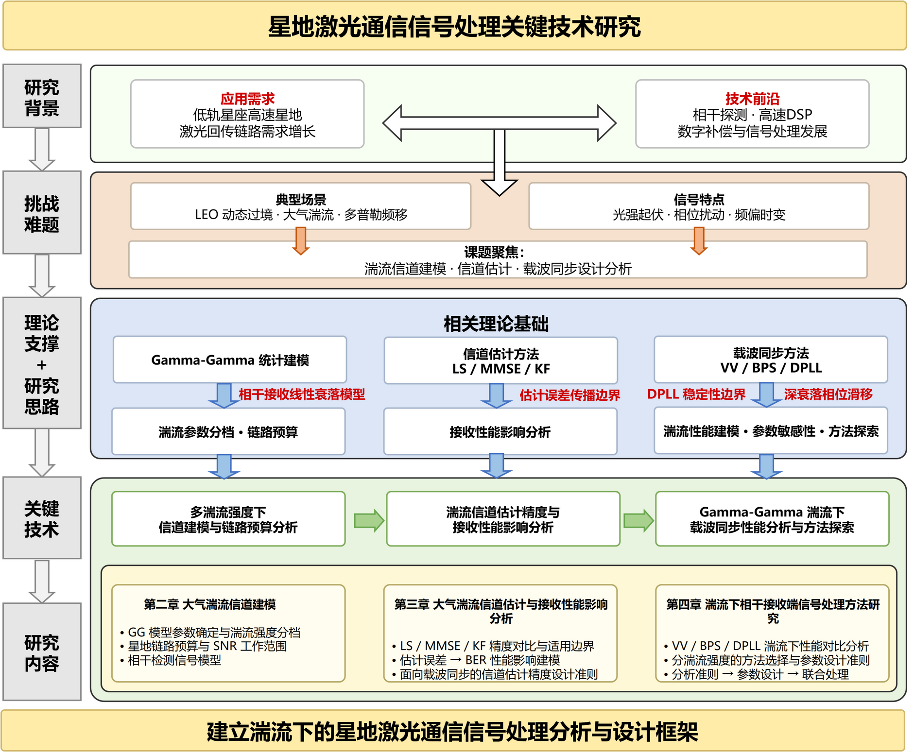

# 研究方案

## 研究方法与技术路线概述

本课题采用理论分析与蒙特卡洛仿真相结合的研究方法。理论分析介绍信号模型、信道模型和算法模型，给出关键性能指标的表达式；蒙特卡洛仿真在受控条件下系统遍历参数空间，分析各方法在不同工作条件下的性能差异。全文研究的技术路线如图所示。

在研究方法的选择上，本课题以蒙特卡洛仿真为主要性能评估手段，而非硬件实验平台验证。这一选择的理由在于：星地激光通信系统的硬件实验平台成本高昂，且难以在受控条件下精确调节大气湍流强度等关键参数。蒙特卡洛仿真可在参数完全可控的条件下系统遍历设计空间，是自由空间光通信领域通用的性能评估方法，已被 [@khalighi2014; @kaushal2016] 等综述文献所采用。

为确保全文仿真结果的可比性和一致性，本课题在研究方案中采用统一的参数体系，如表 3-1 所示。后续所有仿真实验均基于该参数体系，不同实验之间仅改变待研究的变量。

表 仿真参数体系

| 参数               | 数值                    | 说明                       | 选择依据 |
| ------------------ | ----------------------- | -------------------------- | -------- |
| 调制格式           | QPSK                    | 相干检测主流格式           | 卫星光通信主流选择；实验（3）、（4）扩展至 16-QAM |
| 载波波长 $\lambda$ | 1550 nm                 | C 波段，与光纤通信系统兼容 | 低损窗口，与地面光纤终端兼容 |
| 符号率 $R_s$       | 2.5 Gsps                | Gbps 级传输速率            | 低轨（Low Earth Orbit, LEO）星地链路典型值 |
| 轨道高度           | 500 km                  | LEO 典型轨道高度           | 主流 LEO 星座高度 |
| 弱湍流条件         | $\alpha=4.0, \beta=3.0$ | 高仰角、晴朗天气           | 取自[@andrews2005]，高仰角晴朗天气 |
| 中等湍流条件       | $\alpha=2.5, \beta=1.8$ | 中等仰角                   | 取自[@andrews2005]，中等仰角 |
| 强湍流条件         | $\alpha=1.5, \beta=0.8$ | 低仰角或强湍流环境         | 取自[@andrews2005]，$\beta<1$ 导致 $E[1/h]$ 发散 |

三档湍流参数取自 [@andrews2005]，分别对应星地链路在不同仰角和大气条件下的典型工作场景。弱湍流条件适用于高仰角晴朗天气，此时接收光强起伏较小；强湍流条件适用于低仰角或强湍流环境，此时接收光强可能出现深衰落。

上述参数体系贯穿后续各节，实验方案集中在 3.6 节统一给出。

## 星地激光通信系统与信道模型

### 系统模型

本课题考虑基于 QPSK 调制的内差相干检测系统。在相干检测方案中，接收信号光与本振光在光电探测器上进行混频，本振光提供足够的增益以使探测器噪声在系统噪声中居于次要地位，从而实现接近量子极限的接收灵敏度。内差检测方案的中频接近零，信号处理在基带完成。

经过光电检测、匹配滤波和符号定时同步后，第 $k$ 个符号间隔内的离散基带接收信号可以表示为

$$r[k] = \sqrt{h} \cdot s[k] \cdot e^{j\varphi[k]} + n[k]$$

其中 $s[k]$ 为发射的 QPSK 符号，取值集合为 $\{(1\pm j)/\sqrt{2}\}$，满足 $s^4[k] = -1$；$h$ 为归一化辐照度，定义为 $h = I/\mathbb{E}[I]$，满足 $h \geq 0$ 和 $\mathbb{E}[h] = 1$，其物理含义为接收光强相对于统计平均值的归一化起伏；$\sqrt{h}$ 为电场幅度调制系数，反映湍流对信号幅度的调制效应；$\varphi[k]$ 为载波相位偏移，包含残余频偏、多普勒变化率和激光相位噪声三个分量；$n[k]$ 为复高斯白噪声，服从 $\mathcal{CN}(0, \sigma_n^2)$ 分布。

在该模型下，瞬时信噪比定义为

$$\gamma = \bar{\gamma} \cdot h$$

其中 $\bar{\gamma}$ 为平均信噪比，取决于发射功率、链路损耗和噪声功率。该线性关系可由以下推导链说明。$h$ 定义为归一化辐照度，即光功率比 $I/\mathbb{E}[I]$，相干检测的输出信号与光场振幅成正比，因此幅度衰减系数为 $\sqrt{h}$。接收信号的有用功率分量为 $\mathbb{E}[|\sqrt{h} \cdot s[k]|^2] = h \cdot |s[k]|^2 = h$，其中 QPSK 符号满足 $|s[k]|^2 = 1$，在噪声功率 $\sigma_n^2$ 恒定的条件下，瞬时信噪比为 $\gamma = h / \sigma_n^2 = \bar{\gamma} \cdot h$。这一线性关系是相干检测系统中本振光提供光域增益的直接结果，与射频通信中 $\gamma \propto |h|^2$ 的平方关系有本质区别。

系统噪声主要包含两个来源。一是光电探测过程中的散粒噪声和热噪声，在足够强的本振光条件下可建模为加性白高斯噪声（Additive White Gaussian Noise, AWGN）。二是发射端和本振端激光器的相位噪声，通常建模为维纳过程，即 $\theta_L[k] = \theta_L[k-1] + \Delta\theta$，其中 $\Delta\theta$ 服从零均值高斯分布，方差为 $2\pi \Delta\nu_L T_s$，$\Delta\nu_L$ 为激光线宽，$T_s = 1/R_s$ 为符号周期。对于典型的窄线宽激光器，$\Delta\nu_L \sim 10$ kHz 量级，在 Gbps 级符号率下，激光相位噪声在单个符号间隔内的增量很小，但在多个符号间隔上的累积效应不可忽略。上述信号处理流程的总体架构如图所示。

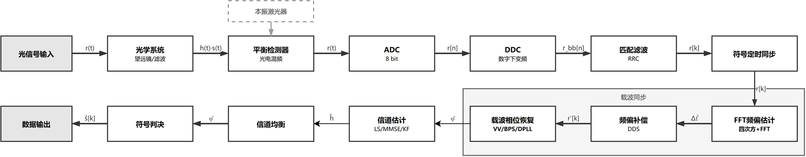

### Gamma-Gamma 湍流信道模型

星地激光通信信号在穿越大气层传播时，大气湍流引起折射率的随机起伏，导致接收端光强出现随机波动，这一现象称为光强起伏（scintillation）。光强起伏是星地激光链路的主要损伤之一，在弱湍流条件下表现为轻微的功率波动，在强湍流条件下则可能导致接收光强出现深度衰落，严重恶化系统误码性能。因此，准确建模湍流信道的光强统计特性是后续性能分析的基础。

Gamma-Gamma 湍流衰落模型将归一化辐照度 $h$ 分解为大尺度衰落分量 $X$ 和小尺度衰落分量 $Y$ 的乘积：

$$h = X \cdot Y$$

其中 $X$ 和 $Y$ 分别服从 Gamma 分布：$X \sim \text{Gamma}(\alpha, 1/\alpha)$，$Y \sim \text{Gamma}(\beta, 1/\beta)$。参数 $\alpha$ 和 $\beta$ 分别与大尺度和小尺度湍流效应相关，其取值取决于折射率结构常数 $C_n^2$、传播距离、接收孔径尺寸等物理量。在归一化参数化条件下，$\mathbb{E}[h] = 1$ 成立。

归一化辐照度 $h$ 的概率密度函数为

$$
\begin{aligned}
f_{\text{GG}}(h) &= \frac{2(\alpha\beta)^{(\alpha+\beta)/2}}{\Gamma(\alpha)\Gamma(\beta)} \\
  &\times h^{(\alpha+\beta)/2 - 1}\, K_{\alpha-\beta}\!\left(2\sqrt{\alpha\beta h}\right),
  \quad h > 0
\end{aligned}
$$

其中 $\Gamma(\cdot)$ 为 Gamma 函数，$K_\nu(\cdot)$ 为第二类修正 Bessel 函数。参数 $\alpha$ 和 $\beta$ 与 Rytov 方差 $\sigma_R^2$ 有关。Rytov 方差是表征湍流强度的常用指标，定义为

$$\sigma_R^2 = 1.23 \, C_n^2 \, k^{7/6} \, d_{\text{link}}^{11/6}$$

其中 $k = 2\pi/\lambda$ 为光波数，$d_{\text{link}}$ 为传播距离。$\sigma_R^2 < 1$ 对应弱湍流，$\sigma_R^2 \approx 1$ 对应中等湍流，$\sigma_R^2 > 1$ 对应强湍流。

本课题采用如表 3-1 所列的三档湍流参数覆盖弱到强湍流范围。Gamma-Gamma 模型的一个关键性质是：当小尺度参数 $\beta < 1$ 时，概率密度函数在 $h \to 0$ 处具有较高的概率密度值，意味着深衰落事件的发生概率增加。在强湍流条件 $\alpha=1.5$、$\beta=0.8$ 下，瞬时 SNR 可能出现较大幅度跌落，对载波同步等信号处理模块的正常工作构成挑战。三档湍流条件下的概率密度函数如图所示。

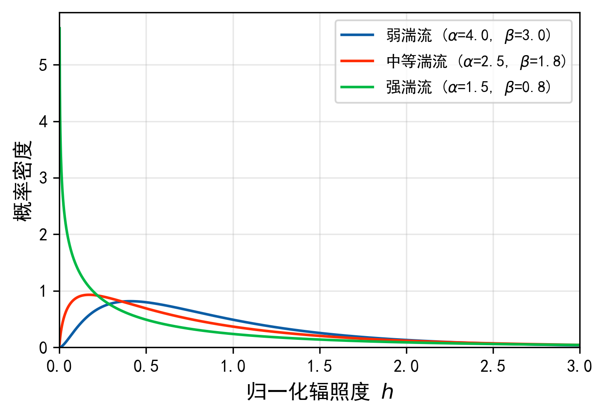

块衰落信道的时域波形可以更直观地展示深衰落事件的影响。图示为中等湍流条件下归一化辐照度的时域演化，深衰落事件以红色标出。

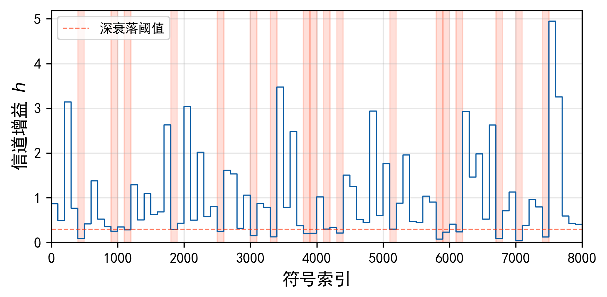

### 星地链路预算

在上述系统模型和信道模型的基础上，还需要考虑星地链路的总体损耗和频率偏移。自由空间光通信链路的接收信号功率可以表示为

$$
\begin{aligned}
P_r &= P_t \cdot G_t \cdot G_r \cdot L_{\text{fs}} \cdot L_{\text{atm}} \cdot h
\end{aligned}
$$

其中 $P_t$ 为发射光功率，$G_t$ 和 $G_r$ 分别为发射天线和接收天线的增益，$L_{\text{fs}}$ 为自由空间损耗，$L_{\text{atm}}$ 为大气衰减因子，包括大气吸收和散射损耗，$h$ 为湍流致归一化辐照度起伏。

对于 LEO 星地链路，表 3-2 列出了典型参数取值。

表 LEO 星地链路典型参数

| 参数                         | 典型值            | 说明                    | 本文取值与依据 |
| ---------------------------- | ----------------- | ----------------------- | -------------- |
| 轨道高度                     | 500 km            | LEO 典型值              | 与表 3-1 一致 |
| 载波波长 $\lambda$           | 1550 nm           | C 波段                  | 与表 3-1 一致 |
| 发射光功率 $P_t$             | 数 W 量级         | 光放大器输出            | 用于链路预算计算 |
| 接收孔径直径 $D$             | 0.2--1.0 m        | 地面望远镜              | 用于链路预算计算 |
| 自由空间损耗 $L_{\text{fs}}$ | $\sim$250--280 dB | 取决于仰角和链路距离    | 由轨道高度和仰角计算 |
| 大气衰减 $L_{\text{atm}}$    | 晴朗数 dB     | 恶劣天气可达 10 dB 以上 | 晴朗天气假设，与湍流参数匹配 |

LEO 卫星相对地面站的径向运动产生大的多普勒频偏。对于 1550 nm 波长、500 km 轨道高度的 LEO 链路，多普勒频偏可达 $\pm$5 GHz 量级。实际系统中通常利用星历信息进行多普勒预补偿，残余频偏约为 1 MHz 量级。残余频偏和激光相位噪声共同构成载波相位偏移的主要来源。

综合考虑链路预算参数和湍流信道模型，接收端的电域平均信噪比可以表示为

$$
\begin{aligned}
\bar{\gamma} &= \frac{P_r}{P_n}
  = \frac{P_t \cdot G_t \cdot G_r \cdot L_{\text{fs}} \cdot L_{\text{atm}}}{P_n}
\end{aligned}
$$

其中 $P_n$ 为噪声功率。

上述系统与信道模型中，归一化辐照度 $h$ 是随时间随机变化的量，接收端需要通过信道估计获取其估计值，进而完成信号均衡和载波同步。$h$ 的估计质量直接影响后续信号处理模块的性能。

## 大气湍流信道估计与接收性能分析
湍流信道的随机起伏使得接收端需要通过信道估计获取归一化辐照度 $h$ 的估计值 $\hat{h}$，进而完成信号均衡和载波同步。然而，信道估计不可避免地存在误差，该误差如何通过级联结构影响后续载波同步性能，目前缺乏系统分析。

### 信道估计方法

在导频辅助方案中，发射端在数据帧中插入已知的导频符号，接收端利用导频位置的接收信号估计信道状态信息。导频符号的插入位置和密度构成导频图案，导频图案的设计需要在估计精度和频谱效率之间取得折中。本课题考察的信道估计方法按湍流场景适用性介绍如下。

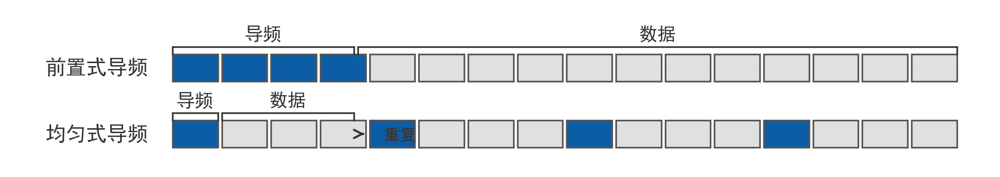

LS 方法直接利用导频位置接收信号与已知导频符号的比值作为信道估计值。设导频位置 $k \in \mathcal{P}$，导频符号为 $x_p$，导频位置接收信号为 $y_p[k]$，则 LS 信道估计为

$$\hat{h}_{\text{LS}}[k] = \frac{y_p[k]}{x_p} = h[k] + \frac{n[k]}{x_p \sqrt{h[k]}}$$

LS 方法无需信道的统计先验知识，在工作 SNR 较高、弱到中等湍流条件下具有较高的估计精度。当湍流信道的统计量难以准确获取时，LS 方法因其简单性和鲁棒性而具有实用价值。

线性最小均方误差（Linear Minimum Mean Square Error, LMMSE）方法在 LS 估计的基础上利用信道的二阶统计量抑制噪声，其估计器形式为

$$\hat{h}_{\text{MMSE}}[k] = \frac{\sigma_h^2}{\sigma_h^2 + \sigma_n^2} \cdot \hat{h}_{\text{LS}}[k]$$

其中 $\sigma_h^2 = \text{Var}(h)$ 为信道方差，$\sigma_n^2$ 为噪声方差。LMMSE 方法理论上可获得更低的估计误差，但需要已知信道的二阶统计量，且涉及矩阵求逆运算，在多导频联合估计场景下复杂度较高。在湍流信道条件下，$\sigma_h^2$ 取决于 Gamma-Gamma 参数 $\alpha$ 和 $\beta$，需要准确获取。

基于卡尔曼滤波的方法将湍流信道建模为一阶自回归 AR(1) 过程，通过递推估计跟踪信道随时间的变化。该方法利用了湍流信道的准静态特性：信道的相干时间通常在毫秒量级，远大于亚纳秒量级的符号周期，因此相邻符号之间的信道值高度相关。卡尔曼滤波方法适合利用这种时间相关性进行递推估计，在中等湍流条件下可有效降低估计误差。

近年来，深度学习方法也被引入湍流信道估计领域。Elfiky 等人在 IM/DD 体制下给出了双输入神经网络结构[@elfiky2024]，Chen 等人提出了基于深度学习的 FSO 信道建模方法[@chen2023dl]。然而，深度学习方法的跨场景泛化性有待进一步分析，且其训练数据需要与仿真参数匹配，增加了仿真设计的复杂度。本课题的仿真对比聚焦于 LS、LMMSE 和卡尔曼滤波三类传统方法，深度学习方法的研究不在本课题的对比范围内。

本课题拟通过蒙特卡洛仿真系统对比上述三类方法在三档湍流条件下的 NMSE 性能，为后续级联影响分析提供精度基线。NMSE 定义为

$$\text{NMSE} = \frac{\mathbb{E}\left[(h - \hat{h})^2\right]}{\mathbb{E}\left[h^2\right]}$$

其中 $h$ 为真实归一化辐照度，取值非负实值，$\hat{h}$ 为其估计值。NMSE 越小，估计精度越高。

### 估计误差对载波同步性能的影响

信道估计误差 $\Delta h = \hat{h} - h$ 通过接收端的信号处理链级联传播至载波同步模块，最终影响系统误码率。接收端的信号处理链可以概括为"信道估计—载波同步—符号判决"三级级联结构：信道估计模块输出归一化辐照度估计值 $\hat{h}$，该估计值被用于对接收信号进行均衡，即除以 $\sqrt{\hat{h}}$，均衡后的信号送入载波相位恢复模块进行载波同步，最终由判决模块输出比特估计。在这一级联结构中，信道估计误差通过均衡操作传播至载波同步模块，可能导致载波相位估计偏差增大，进而恶化误码性能。

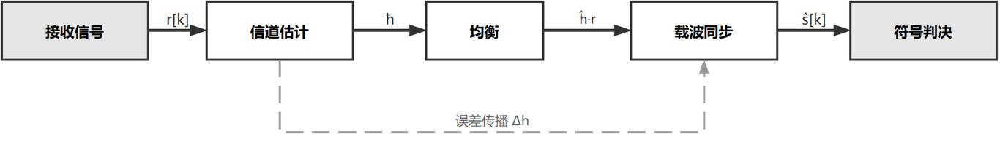

拟采用受控仿真实验的方法分析该级联影响。具体而言，在仿真中人为注入不同 NMSE 水平的估计误差，观察载波同步模块的误码率退化情况。参数空间覆盖 NMSE 从 0 dB 到 $-20$ dB 共 7 个水平、三档湍流条件、多个工作 SNR 点，以及 VV 和 DPLL 两种载波相位恢复方法。

通过该仿真实验，拟获得以下预期产出：一是误码率（Bit Error Rate, BER）对 NMSE 的灵敏度曲线，反映估计精度对系统性能的定量影响；二是不同载波相位恢复方法对信道估计误差的灵敏度差异，为方法选择提供依据。该灵敏度分析将回答"估计精度需要达到多少"这一工程问题。

初步仿真已获得中等湍流条件下的误码率灵敏度曲线，如图 3-1 所示。

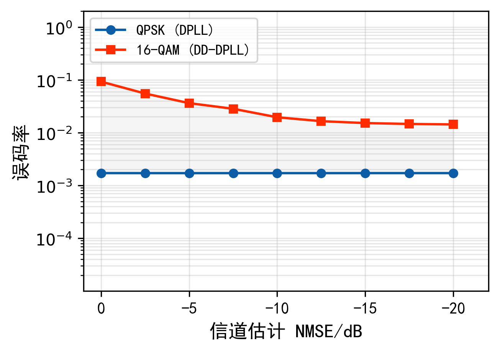

QPSK 对估计误差具有更高的容忍度，而 16-QAM 对估计精度高度敏感，验证了上述灵敏度分析方向的可行性。

### 调制格式依赖的灵敏度差异

不同调制格式的判决机制存在本质差异，这意味着信道估计误差对不同调制格式的影响程度可能不同。QPSK 的判决仅基于同相分量和正交分量的符号，即 $\text{sign}(\text{Re}(\cdot))$ 和 $\text{sign}(\text{Im}(\cdot))$，对幅度误差具有天然的容忍度。而 16-QAM 等高阶调制格式的判决同时依赖幅度和相位信息，对信道估计精度和载波相位误差更为敏感。

这一灵敏度差异在载波相位恢复方法的选择上也产生影响。VV 算法采用四次方鉴相器消除 QPSK 调制信息，其设计仅适用于 $M$-PSK 类调制格式。对于 16-QAM 等幅度-相位联合调制的信号，四次方鉴相器将引入判决噪声，VV 算法不再直接适用。BPS 算法虽然对高阶调制格式具有更好的兼容性，但其计算复杂度高于 VV 算法。

本课题拟对比 QPSK 和 16-QAM 在相同信道估计误差条件下的 BER 灵敏度差异，并分析 VV 算法和 BPS 算法对 16-QAM 的兼容性问题。预期产出为调制阶数到可用载波相位恢复方法的映射关系，为系统设计中的调制格式选择提供参考。

### 面向同步的信道估计精度设计准则

在上述分析的基础上，本节综合接收性能影响分析和调制格式的灵敏度差异，给出面向载波同步的信道估计精度设计准则。

精度需求的分析目标是：将目标 BER 约束转化为对 NMSE 的定量要求。为此，拟通过级联误差传播模型建立 BER 退化量与 NMSE 的映射关系，再由可接受的 BER 退化裕度反推 NMSE 上界，最终按湍流条件和调制格式分组形成需求表。在载波相位恢复层面，BER 下界由载波相位误差标准差 $\sigma_\varphi$ 决定：

$$P_{b,\text{floor}} \approx Q\!\left(\frac{\pi}{4\sigma_\varphi}\right)$$

因此，信道估计精度需求的分析需要将目标 BER 约束转化为 $\sigma_\varphi$ 的设计目标，再通过级联模型进一步转化为对 NMSE 的约束。

具体而言，拟按以下维度组织精度需求：

在弱湍流 $\alpha=4.0$、$\beta=3.0$ 下，前馈与反馈方法均可用，精度需求主要由目标 BER 和退化裕度决定。当湍流增强至中等水平 $\alpha=2.5$、$\beta=1.8$ 时，前馈方法仍然可用，但深衰落事件频率上升导致对估计精度的要求相应提高。更极端地，在强湍流 $\alpha=1.5$、$\beta=0.8$ 条件下，$\beta<1$，E[1/h] 发散使得前馈方法的可用性受到根本性挑战，精度需求此时不仅取决于 BER 退化约束，还受限于方法本身的可用性边界。

前置式导频将导频帧首集中放置，均匀式导频则在帧内等间隔插入导频，两者在不同湍流条件下的估计性能差异需要对比分析。前置式导频结构简单，但在信道快变时跟踪能力有限；均匀式导频可以更好地跟踪信道变化，但导频开销更大。湍流信道的相干时间远大于帧长，具有准静态特性，两种方案的估计性能差异需要通过仿真量化。

上述分析将产出面向载波同步的信道估计精度设计准则，包括按湍流条件和调制格式分组的 NMSE 需求阈值以及导频方案的初步建议。

## 湍流下相干接收端信号处理方法研究

载波同步是相干接收端信号处理链的核心环节，其任务是从含噪接收信号中恢复发射载波的频率和相位，使后续符号判决正确进行。在星地激光通信场景中，低轨卫星的高速运动引入大多普勒频偏，大气湍流导致接收光强随机起伏，收发激光器的有限线宽产生维纳相位噪声。三重损伤的叠加使得载波同步面临比光纤通信更为严峻的挑战。与光纤信道不同，Gamma-Gamma 湍流信道的归一化辐照度 $h$ 为实值随机变量，深衰落事件可导致瞬时信噪比跌落，这对载波同步方法的深衰落容忍能力提出了更高要求。

### 载波同步方法

载波同步链的整体架构为：接收信号经过基于星历的多普勒预补偿后，先由快速傅里叶变换（Fast Fourier Transform, FFT）频偏估计模块估计并补偿残余频偏，再由载波相位恢复模块跟踪残余相位偏移，最后进行符号判决。该级联结构将频偏估计和相位恢复分两步完成，在相干光通信系统中已有成熟的工程应用。本课题假设符号定时同步已由前端模块完成，聚焦于载波同步环节。

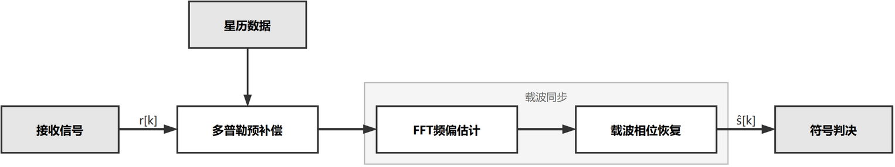

接收信号中的总载波相位偏移 $\phi[k]$ 由三个物理来源叠加而成：

$$
\begin{aligned}
\phi[k] &= 2\pi f_{\text{res}} \cdot kT_s + \pi \dot{f}_D \cdot (kT_s)^2 + \theta_L[k]
\end{aligned}
$$

其中第一项为残余频偏引起的线性相位增长，$f_{\text{res}}$ 为基于星历的多普勒预补偿后残余频偏，典型值约 1 MHz；第二项为多普勒变化率引起的二次相位漂移，$\dot{f}_D$ 在低仰角时约 150 MHz/s，在高仰角时约 30 MHz/s；第三项为激光相位噪声。激光相位噪声建模为离散时间维纳过程：

$$
\begin{aligned}
\theta_L[k] &= \theta_L[k-1] + w[k], \\
w[k] &\sim \mathcal{N}(0, 2\pi \Delta\nu_L T_s)
\end{aligned}
$$

其中 $\Delta\nu_L$ 为收发激光器联合线宽，典型值 10 kHz，$T_s$ 为符号周期。三项相位噪声在时间尺度上具有不同特征：残余频偏引起线性相位增长，多普勒变化率引起二次相位漂移，激光相位噪声为随机游走。载波同步方法需要在抑制噪声的同时跟踪这些不同特征的相位变化，而湍流致深衰落事件导致的瞬时信噪比跌落进一步增加了这一任务的难度。

载波相位恢复方法按处理结构可分为前馈方法和反馈方法两大类，两者在 Gamma-Gamma 湍流信道下的行为存在本质差异。前馈方法在滑动窗口内独立完成相位估计，每个窗口的估计结果仅取决于该窗口内的接收信号，结构简单、延迟确定，但估计错误不可恢复：一旦某个窗口的相位解卷绕判决错误，将产生不可逆的相位滑移，该窗口之后的所有符号判决均受影响，直到下一次正确的解卷绕事件才能恢复。反馈方法通过闭环结构持续跟踪相位变化，环路滤波器具有低通特性和记忆效应，当前估计值不仅取决于当前输入还依赖于历史状态，这使得单个符号的估计偏差可以被后续符号逐步修正。在深衰落频发的湍流场景下，反馈方法的这种记忆平滑效应赋予其对深衰落事件的天然容忍能力。

VV 算法利用 QPSK 发送符号满足 $s^4 = -1$ 的代数性质消除调制信息[@viterbi1983]，对窗口内接收信号做四次方运算后取滑动平均提取载波相位估计：

$$
\begin{aligned}
\hat{\phi}_{\text{raw}}[k] = \frac{1}{4}\left[\arg\left(\frac{1}{M}\sum_{i=k-M/2}^{k+M/2} r^4[i]\right) - \pi\right]
\end{aligned}
$$

其中 $M$ 为平均窗口长度，减去 $\pi$ 修正 $s^4 = -1$ 引入的常数相位偏移。窗口 $M$ 是 VV 算法最核心的设计参数，决定了噪声抑制与相位跟踪能力之间的折中：$M$ 越大噪声抑制越强，但窗口越长相位漂移累积越大，跟踪快速相位变化的能力越弱。四次方运算将相位估计的有效范围缩减至 $(-\pi/4, \pi/4]$，需要相位解卷绕机制消除 $\pi/2$ 整数倍跳变。在弱湍流和中等湍流条件下，VV 算法在适当窗口长度下可以获得良好的相位恢复性能。

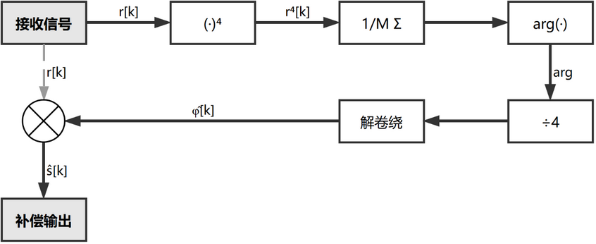

BPS 算法采用穷举搜索策略，在预设的 $B$ 个测试相位上，均匀分布于 $(-\pi/4, \pi/4]$，逐一评估每个候选相位的匹配程度[@pfau2009]，取最小距离度量对应的测试相位作为粗估计，再用最大似然精估计细化：

$$\hat{\varphi}_{\text{ML}} = \arg\left(\sum_{k} r[k] \cdot \hat{s}_k^*\right)$$

BPS 不依赖 $M$ 次幂消除调制的解析结构，对 16-QAM 等高阶调制格式具有更好的兼容性，但计算复杂度与测试相位数 $B$ 成正比。与 VV 类似，BPS 同样属于前馈方法，在湍流深衰落中面临相同的相位解卷绕失败风险。

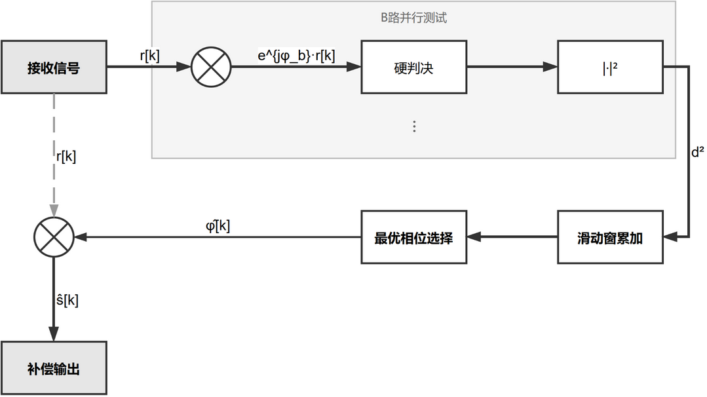

二阶 DPLL 采用闭环跟踪结构，由鉴相器、环路滤波器和数控振荡器（Numerically Controlled Oscillator, NCO）三个功能单元组成，形成闭环反馈系统[@gardner1979]。鉴相器利用 QPSK 四次方性质提取当前相位误差：

$$e[k] = \frac{1}{4}\angle\left((r[k] \cdot e^{-j\hat{\phi}[k-1]})^4\right)$$

其中 $\hat{\phi}[k-1]$ 为上一时刻的相位估计值，将接收信号旋转至估计相位坐标系后做四次方取角度，得到当前估计与实际相位之间的偏差。鉴相器的线性工作范围为 $(-\pi/4, \pi/4]$，超出此范围时环路进入非线性牵引区。环路滤波器采用比例-积分（Proportional-Integral, PI）结构：

$$
\begin{aligned}
\nu[k] &= c_1 \cdot e[k] + \Sigma[k], \\
\Sigma[k] &= \Sigma[k-1] + c_2 \cdot e[k]
\end{aligned}
$$

其中 $\nu[k]$ 为环路滤波器输出，即 NCO 的频率控制字，$\Sigma[k]$ 为积分器状态。比例支路系数 $c_1$ 提供即时跟踪响应，积分支路系数 $c_2$ 消除频率阶跃的稳态误差。NCO 根据环路滤波器输出更新相位估计：

$$\hat{\phi}[k] = \hat{\phi}[k-1] + \nu[k]$$

环路滤波器系数由自然频率 $\omega_n$ 和阻尼系数 $\zeta$ 确定：

$$c_1 = 2\zeta\omega_n T_s, \quad c_2 = (\omega_n T_s)^2$$

阻尼系数 $\zeta$ 取 $\sqrt{2}/2$ 为临界阻尼，这是工程实践中的标准设计点，在暂态响应速度和过冲之间取得良好平衡。$\omega_n$ 是 DPLL 最核心的设计参数，它决定了环路的动态特性。$\omega_n$ 与噪声带宽 $B_L$ 的关系为：

$$B_L \approx 0.53\omega_n \quad (\zeta = \sqrt{2}/2 \text{ 时})$$

$\omega_n$ 越大环路带宽越宽，跟踪多普勒变化率引入的二次相位漂移等快速相位变化的能力越强，但同时通过环路的噪声也越多，稳态相位抖动越大；$\omega_n$ 越小噪声抑制越好，稳态抖动越小，但对快速相位变化的跟踪能力下降。DPLL 对频率斜升输入的稳态相位误差为：

$$\theta_e(\infty) = \frac{2\pi\dot{f}_D}{\omega_n^2}$$

该误差反比于 $\omega_n^2$，当 $\omega_n$ 过小时稳态误差可能超过 QPSK 判决裕量 $\pi/4$，导致性能恶化。因此 $\omega_n$ 的选择需要在噪声带宽和跟踪速度之间寻找合理折中，而该合理折中点在 Gamma-Gamma 湍流信道下受到湍流参数 $\alpha, \beta$ 的影响。

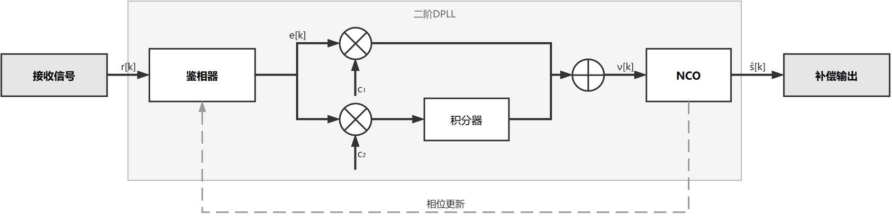

### 湍流下载波同步性能分析

Gamma-Gamma 湍流信道下 VV、BPS 和 DPLL 三种载波相位恢复方法的失效机制存在本质区别。性能评估采用蒙特卡洛仿真框架，参数空间覆盖弱 $\alpha=4.0$/$\beta=3.0$、中 $\alpha=2.5$/$\beta=1.8$、强 $\alpha=1.5$/$\beta=0.8$ 三档湍流条件，多个信噪比工作点和多种算法参数配置，使用多个独立随机种子以获取统计可靠的性能估计。QPSK 在 AWGN 和三档湍流条件下的误码率曲线如图所示，湍流导致 BER 相对 AWGN 大幅退化。

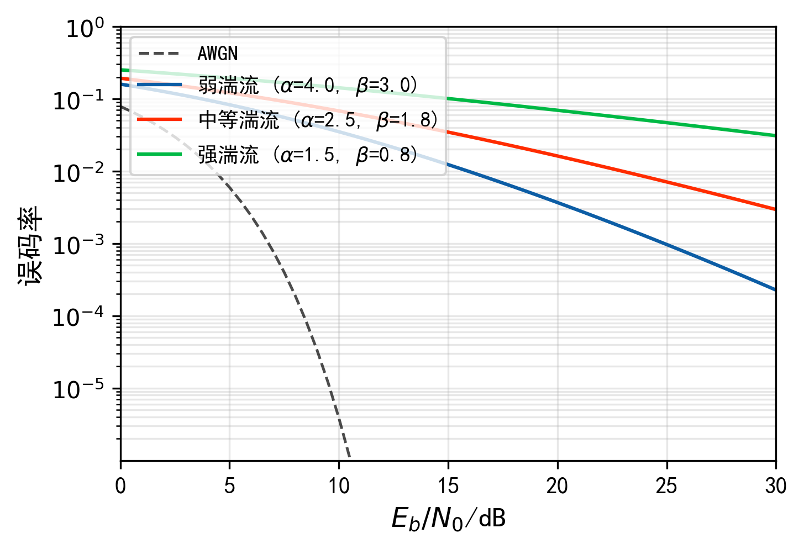

VV、BPS 等前馈方法的失效链可从 Gamma-Gamma 分布的统计特性出发统一理解。$\mathbb{E}[1/h]$ 的收敛性取决于参数 $\alpha$ 和 $\beta$：当 $\alpha > 1$ 且 $\beta > 1$ 时对应弱到中等湍流，$\mathbb{E}[1/h]$ 为有限值，前馈方法可以正常工作；当 $\beta < 1$ 时对应强湍流，$\mathbb{E}[1/h]$ 发散。在 Gamma-Gamma 模型中，$\beta$ 控制小尺度湍流效应，$\beta < 1$ 意味着归一化辐照度 $h$ 接近零的事件具有不可忽略的概率。在这些深衰落块中，接收信号信噪比极低，前馈方法执行载波相位估计时所需的除法运算除以 $\sqrt{\hat{h}}$ 产生数值问题，相位估计方差急剧增大。VV 和 BPS 的核心失效模式为相位解卷绕失败。四次方操作将相位估计的有效范围缩减至 $(-\pi/4, \pi/4]$，实际载波相位超出此范围时需要通过相邻窗口相位差检测进行 $\pi/2$ 整数倍补偿。在正常工作条件下，解卷绕机制可以可靠工作；但在深衰落事件中，瞬时信噪比急剧下降导致相位估计方差增大，估计值可能偏离真实值超过 $\pi/4$ 阈值，触发错误的解卷绕判决。错误解卷绕的后果是灾难性的：以 VV 算法为例，一次错误的 $\pi/2$ 跳变补偿意味着后续所有符号的载波相位估计值与真实值之间存在 $\pi/2$ 的固定偏移。由于 QPSK 的调制相位间距为 $\pi/2$，该偏移将导致所有受影响符号的判决错误，等效于 BER 从正常水平跃升至约 50%。由于前馈方法各窗口独立估计，错误的相位偏移无法自动恢复，只能等待下一次偶然正确的解卷绕事件才能纠正。深衰落事件越频繁，即 $\beta$ 越小，此类不可逆错误的累积概率越高，这解释了 VV/BPS 在强湍流下 BER 性能急剧恶化的现象。

DPLL 的核心失效模式为锁相失效，其机制与前馈方法有本质区别。当 $\omega_n$ 过大时，环路噪声带宽增加，鉴相器输出中的噪声分量通过环路滤波器后在 NCO 输出端产生较大的稳态相位抖动。当稳态抖动超过鉴相器的线性工作范围时，环路进入非线性区域，鉴相增益下降导致环路有效带宽收缩，形成正反馈最终导致环路失锁。失锁后环路进入随机游走状态，相位估计值与真实值之间失去关联，BER 趋近于随机猜测水平。

另一方面，当 $\omega_n$ 过小时，环路对多普勒变化率 $\dot{f}_D$ 引入的二次相位漂移跟踪不足。稳态相位误差 $\theta_e(\infty) = 2\pi\dot{f}_D/\omega_n^2$ 反比于 $\omega_n^2$，当该误差超过 QPSK 判决裕量 $\pi/4$ 时系统性能恶化。在湍流信道下，深衰落事件导致的瞬时 SNR 跌落进一步加剧了小 $\omega_n$ 配置的跟踪困难：深衰落期间鉴相器输出信噪比极低，环路更新量几乎完全由噪声主导，相位估计在多个符号期间无法有效跟踪真实相位变化。

因此，DPLL 在湍流信道下的 $\omega_n$ 设计需要在三个相互制约的因素之间寻找平衡：噪声带宽需要 $\omega_n$ 小以抑制噪声、跟踪速度需要 $\omega_n$ 大以跟踪相位漂移和深衰落容忍性即环路在深衰落期间维持锁定的能力。这一合理平衡点受到湍流参数 $(\alpha, \beta)$ 的调制，不存在单一的通用推荐值。

初步仿真已获得三类方法在三档湍流条件下的系统性性能对比，如图 4-1 所示。

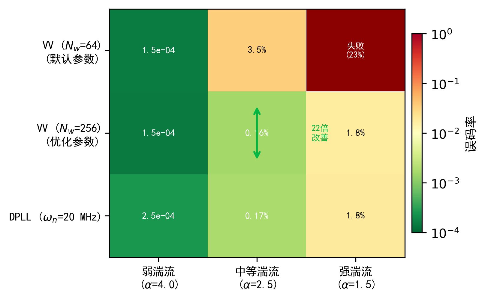

VV 算法在中等湍流下窗口参数从 $N_w$=64 调整至 $N_w$=256 可使误码率降低约一个数量级，DPLL 在强湍流下表现最优，表明方法选择和参数设计均需系统性准则。

载波同步方法的性能受若干关键设计参数的影响，这些参数的取值需要在湍流条件下仔细设计。

VV 平均窗口长度 $M$：$M$ 的选择面临噪声抑制与相位跟踪之间的经典折中。从噪声抑制角度，$M$ 越大窗口内平均的样本越多，AWGN 引起的相位估计方差越小，估计精度越高。从相位跟踪角度，窗口越长覆盖的时间跨度越大，在此期间载波相位的漂移累积越大，滑动平均将不同时刻的相位值混叠导致估计偏差增大。在弱湍流下接收信号幅度稳定，瞬时 SNR 波动小，较大 $M$ 可获得更好的噪声抑制而不引入明显的相位跟踪误差。在强湍流下深衰落事件频发，大窗口可能跨越深衰落块的边界，将深衰落期间信噪比极低的样本纳入平均，反而恶化估计质量；同时深衰落期间的快速相位跳变也要求较短的窗口以保持跟踪能力。因此，$M$ 的推荐取值预期随湍流强度变化。

DPLL 环路自然频率 $\omega_n$：拟在 $[2, 50] \times 10^6$ rad/s 范围内系统扫描 $\omega_n$，分析不同湍流条件下 BER 随 $\omega_n$ 的变化规律。扫描范围的下界 $2 \times 10^6$ rad/s 对应窄带环路，$B_L \approx 1.06$ MHz，具有强噪声抑制但跟踪能力有限；上界 $50 \times 10^6$ rad/s 对应宽带环路，$B_L \approx 26.5$ MHz，跟踪能力强但噪声通过量大。通过该扫描分析 BER 曲线随 $\omega_n$ 的变化趋势，确定各湍流条件下的推荐 $\omega_n$ 区间及其对湍流参数的依赖关系。

初步仿真已获得 DPLL 环路自然频率的设计曲线，如图 4-2 所示。

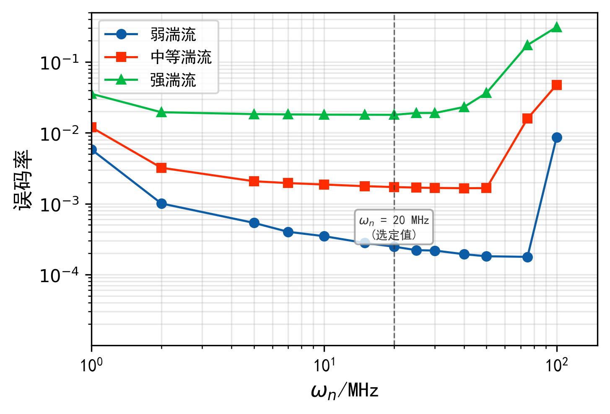

不同湍流条件下最优 $\omega_n$ 区间存在显著差异，初步验证了参数解析设计方向的可行性。

FFT 频偏估计窗口 $N_{\text{fft}}$：$N_{\text{fft}}$ 决定频偏估计的频率分辨率 $\Delta f = 1/(N_{\text{fft}} T_s)$ 和观测时间长度。窗口越长频率分辨率越高，FFT 峰值检测的频偏估计越精确。但在强湍流条件下，长窗口可能跨越多个深衰落块，四次方信号在深衰落期间的信噪比极低，将其纳入 FFT 运算引入额外噪声，可能导致峰值检测失败。$N_{\text{fft}}$ 的选择需要平衡频率分辨率需求和湍流信道的时间非平稳性。

### 方法选择与参数设计准则

载波同步方法的选择需要定量的性能边界支撑。前馈方法的解卷绕失败具有不可逆性，反馈方法的闭环记忆效应则赋予其对瞬时干扰的容忍能力，两类方法性能交叉点随湍流参数的移动规律构成方法选择准则的定量基础。$\beta$ 的临界值和接收 SNR 工作点对该交叉边界的影响需要在连续参数空间中通过受控仿真确定。

DPLL 在 AWGN 信道下的稳态跟踪误差 $\theta_e(\infty) = 2\pi\dot{f}_D/\omega_n^2$ 提供了环路设计的解析起点，但该表达式未纳入 Gamma-Gamma 湍流的深衰落事件。$\omega_n$ 的设计需要在噪声带宽、跟踪速度和深衰落容忍性三者之间折中，折中点受湍流参数 $(\alpha, \beta)$ 调制。一个可能的分析路径是将环路失锁概率建模为帧级失效概率 $P_{\text{frame}}(\omega_n, \alpha, \beta)$，通过求解 $P_{\text{frame}} = P_{\text{target}}$ 获得推荐 $\omega_n$。该建模需要处理的关键问题是深衰落事件持续时间与环路暂态响应的交互。深衰落期间鉴相器输出信噪比极低，环路更新量由噪声主导，衰落结束后环路能否依靠积分器中的历史信息恢复正确跟踪取决于 $\omega_n$ 的取值。

为回答上述问题，本课题设计了四组关联实验。核心实验在 Gamma-Gamma 弱、中、强三档湍流条件下系统对比 VV、BPS 和 DPLL 的 BER-SNR 曲线，标定性能交叉点及其随湍流参数的移动规律，由此确定方法选择的定量边界。在交叉边界确定后，对 $M$、$\omega_n$、$N_{\text{fft}}$ 进行参数扫描并结合噪声源解耦分析，为每个湍流区间给出推荐参数及物理解释。进而将 DPLL 的 $\omega_n$ 解析设计公式推导结果与数值扫描获得的推荐值对比，评估解析方法的适用范围。最终在端到端链路条件下进行验证，并从仿真数据中提取 DPLL 失锁恢复的统计特征。

各组实验引入帧级失败率 $P_{\text{frame}}$ 作为辅助指标，定义为单帧内 BER 超过阈值的帧占总帧数的比例，对前馈方法的解卷绕失败概率和反馈方法的失锁概率均具有区分能力。

按湍流条件划分的方法选择边界和参数推荐值由上述四组实验分析给出。

### 面向湍流条件的信号处理方法探索

接收端信号处理链中，符号定时恢复和信道均衡在本课题的系统参数下不构成独立瓶颈。Gardner 定时误差检测器的误差信号仅利用采样点之间的幅度关系，与载波相位无关，Valjus 和 Wolf 的仿真表明其在包含强湍流的所有测试场景下 SNR 惩罚不超过 0.2 dB[@valjus2025dsp]。信道均衡在块衰落下退化为单抽头乘性补偿，FSO 链路不存在色度色散和偏振模色散引起的时延扩展，不产生多径。载波同步因此成为接收端信号处理链中需要针对湍流条件深入研究的核心环节。

载波同步的研究仍面临两个理论问题。一方面，DPLL 环路参数 $\omega_n$ 的解析设计缺乏帧级失效概率的理论模型；另一方面，编码辅助迭代载波恢复在 FSO 块衰落下的适用性分析仍不充分。DPLL 二阶环，$\zeta = 1/\sqrt{2}$，的单边噪声带宽为 $B_L \approx 0.53\omega_n$，帧级失效概率 $P_{\text{frame}}(\omega_n, \alpha, \beta)$ 可分解为三个物理分量。

稳态相位抖动在 Gamma-Gamma 块衰落下条件于归一化辐照度 $h$ 的线性化表达为

$$\sigma_\theta^2(h) = \frac{B_L T_s}{2\bar\gamma h}$$

该分量随 $h$ 降低而增长，当 $\beta < 1$ 时 $E[1/h]$ 发散，强湍流下平均抖动方差趋于无穷，但条件分析仍对每个具体衰落块有效。多普勒跟踪误差来自二阶 Type-2 环对频率斜升的稳态响应 $\theta_e(\infty) = 2\pi\dot{f}_D/\omega_n^2$，该关系在湍流信道下仍然适用，因为信道不改变多普勒的物理机制。但 $\omega_n$ 的较优值受湍流参数调制。深衰落冲击分量最为复杂：当瞬时 SNR 降至临界值以下时，四次方鉴相器输出信噪比 $\gamma_4 = \bar\gamma h/8$ 不足以维持有效的相位误差提取，环路更新量由噪声主导，相位估计在衰落持续期间发生随机游走，方差近似为

$$\sigma_{\text{fade}}^2(h) \approx (\omega_n T_s)^2 \cdot B_s \cdot \frac{4}{\bar\gamma h}$$

其中 $B_s = 100$ 为块内符号数。三个分量组合后的块级失效概率为

$$
\begin{aligned}
P_{\text{block}}(h) = P\!\left(\sqrt{\sigma_\theta^2(h) + \sigma_e^2(h) + \sigma_{\text{fade}}^2(h)} > \frac{\pi}{4}\right)
\end{aligned}
$$

帧级失效概率 $P_{\text{frame}} = 1 - (1 - P_{\text{block}})^{N_b}$，$N_b$ 为每帧块数，通过求解 $P_{\text{frame}} = P_{\text{target}}$ 即可获得推荐 $\omega_n$。现有 PLL 理论，包括 Gardner 的稳态分析、Paillier 的星地 DPLL 设计、Petković 的 GG 信道 BER 平均，未将帧级失效概率纳入统一建模框架，该建模框架的准确性有待后续仿真验证。

$P_{\text{frame}}$ 建模框架拟服务于 DPLL 参数设计，提升帧级性能预测能力。在环路优化之外，一种互补的思路是将载波恢复与信道译码进行迭代联合处理，利用译码器输出的软符号估计降低相位估计方差。Lottici 和 Luise 通过期望最大化（Expectation-Maximization, EM）算法将载波相位恢复嵌入迭代译码循环[@lottici2004]，在第 $i$ 次迭代中利用译码器输出的符号后验概率更新相位估计：

$$
\begin{aligned}
\hat{\theta}^{(i+1)} = \arg\left(\sum_{k=1}^{N} E[s_k^* \mid r_k, \hat{\theta}^{(i)}] \cdot r_k\right)
\end{aligned}
$$

其中 $E[s_k^* \mid r_k, \hat{\theta}^{(i)}]$ 为译码器外信息提供的软符号估计。每次迭代后相位估计方差近似为 $\text{var}(\hat{\theta}^{(i)}) \approx 1/(2N\bar\gamma_s\bar\eta^{(i)})$，$\bar\eta^{(i)}$ 为平均符号可靠性，随迭代收敛至 1。Yuan 和 Igarashi 将该框架应用于光纤相干系统[@yuan2017]，低密度奇偶校验（Low-Density Parity-Check, LDPC）译码器输出的软信息反馈至前馈载波恢复模块，在维纳相位噪声下达到了接近数据辅助估计质量的性能。

光纤维纳相位噪声与 FSO 块衰落存在结构性差异，turbo 同步框架在 FSO 场景中的适用性面临一系列相互关联的挑战。最根本的差异在于相位的时间演化特性：光纤中相位按维纳过程连续演化，上一窗口的估计值自然成为下一窗口的初始值；FSO 块衰落中相邻块的相位独立跳变，EM 算法缺少可靠的初始估计。这一不连续性进一步限制了可用估计窗口：turbo 同步需要足够多的数据符号提供 Fisher 信息，FSO 块衰落将每个独立相位块限制为约 90 个数据符号，扣除导频开销后，远小于光纤系统中的数千个符号。此外，turbo 译码需要交织器创建近似独立的比特，但块衰落交织使同一码字的符号分散到不同相位块中，turbo 接收机必须逐块估计相位，交织与相位块边界产生冲突。在这些条件约束下，强湍流进一步恶化了估计质量：深衰落期间块内有效 SNR $\bar\gamma h$ 极低，即使译码器提供可靠外信息，相位估计精度仍受限于原始观测的信噪比。

上述因素构成了 turbo 同步在 FSO 块衰落下的理论性能界。本课题拟在 Gamma-Gamma 三档湍流下测量 LDPC 编码增益基线，评估交织深度对深衰落突发错误的缓解效果，并在此基础上引入 DPLL 与 LDPC 译码器的迭代反馈，通过参数扫描量化各因素对迭代性能的独立影响，评估 turbo 同步框架在块衰落下的适用边界。

$P_{\text{frame}}$ 解析建模从理论层面为 DPLL 参数设计准则提供支撑，编码辅助载波恢复的适用边界分析拟从方法层面评估跨模块联合处理的可行性。两个方向的探索深度取决于各自的仿真验证结果。DPLL 与 LDPC 译码器迭代反馈的 turbo 同步结构如图所示。

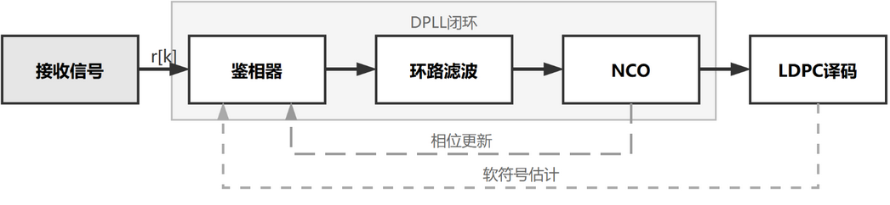

## 接收端信号处理链 FPGA 设计与分析
接收端信号处理链的 FPGA 设计分析将浮点仿真中的载波同步算法映射到定点硬件实现，评估量化效应对算法精度的影响和硬件资源开销。本节的工作定位为工程验证而非算法创新，目的是验证算法研究成果在硬件平台上具备实现的可行性。

### 接收端信号处理链总体架构

接收端数字信号处理链的总体架构按照信号流向依次为：

模数转换器（Analog-to-Digital Converter, ADC）采样 $\to$ 数字下变频（Digital Down Conversion, DDC）$\to$ 匹配滤波 $\to$ 符号定时同步 $\to$ FFT 频偏估计与补偿 $\to$ DPLL 载波相位恢复 $\to$ 判决

各模块的功能分工如下。ADC 模块完成模拟电信号到数字信号的转换，采样率需满足 Nyquist 定理对符号率 2.5 GSps 的要求。DDC 模块将中频信号搬移至基带，输出复数基带信号。匹配滤波模块实现发送端脉冲成形的匹配滤波器，通常为根升余弦滤波器，消除码间干扰。符号定时同步模块从采样信号中恢复最佳判决时刻。上述四个前端模块的信号处理方法已较为成熟，本课题假设它们由前端硬件完成，聚焦于载波同步部分的 FPGA 设计。

FPGA 设计范围确定为 FFT 频偏估计模块和 DPLL 载波相位恢复模块两个核心模块。FFT 频偏估计模块拟设计基于四次方的频偏检测和补偿功能，DPLL 载波相位恢复模块拟设计二阶锁相环的闭环跟踪功能。两个模块的级联构成完整的载波同步链路。

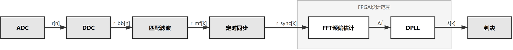

目标平台选用 Xilinx Kintex-7 系列 FPGA，如 XC7K325T，该系列在高速数字信号处理领域应用广泛，具备充足的 DSP slice、块存储资源（Block RAM, BRAM）和逻辑资源。Kintex-7 系列的最高工作频率可达 500 MHz 以上，通过并行处理架构可满足 Gsps 级信号处理的吞吐量需求。闫佳欣在同类 Kintex-7 平台上实现了 QPSK 1.25 GS/s 的实时相干光接收端信号处理链[@yanjiaxin2024]，Ju 等人在 FPGA 平台上实现了双孔径自适应均衡的实时信号处理[@ju2024realtime]，这些工作为本设计的可行性和资源估算提供了参考基线。

### 频偏估计与补偿模块设计

频偏估计模块采用基于四次方的 FFT 频偏估计方法。模块的RTL 架构包含以下功能单元。

四次方运算单元接收频偏补偿前的复数信号 $r[k]$，通过复数乘法完成四次方运算 $r^4[k]$。在 FPGA 实现中，四次方运算可分解为两次复数乘法，先平方再平方，每次复数乘法需要 4 个实数乘法器和 2 个实数加法器，或使用优化结构减少至 3 个乘法器。输入数据位宽由 ADC 精度决定，典型值 8 bit，四次方运算后有效位宽增长，需要根据仿真确定的精度需求截断至适当位宽。

FFT IP 核采用 Xilinx Vivado 提供的 FFT IP 核实现频谱分析。FFT 窗口长度 $N_{\text{fft}}$ 根据前述设计准则推荐的参数确定，通常为 2 的幂次，如 1024、2048 等。为提高频率分辨率，可对 FFT 输入做零填充至 8192 点。FFT IP 核配置为流水线结构，以支持连续数据流的实时处理。窗函数采用 Hanning 窗，其最高旁瓣为 $-31.5$ dB，可有效抑制频谱泄漏对峰值检测的干扰。

峰值检测逻辑在 FFT 输出频谱中搜索幅度最大值及其对应的频率 bin 索引。为进一步提高频率分辨率，采用抛物线插值方法在峰值 bin 的相邻三个 bin 之间拟合抛物线，以亚 bin 精度定位真实峰值位置。抛物线插值的频率修正量为：

$$\delta = \frac{1}{2} \cdot \frac{S_{m-} - S_{m+}}{S_{m-} - 2S_m + S_{m+}}, \quad \delta \in [-1/2, +1/2]$$

其中 $S_m$ 为峰值 bin 的幅度，$S_{m-}$ 和 $S_{m+}$ 为相邻两个 bin 的幅度。最终的频偏估计为 $\hat{\Delta f} = (m_{\max} + \delta) \cdot \Delta f_{\text{grid}} / 4$，除以 4 恢复四次方引入的倍频。

频偏补偿单元利用直接数字频率合成（Direct Digital Synthesis, DDS）生成与估计频偏对应的补偿相位，与接收信号做复数乘法完成频偏消除。DDS 由相位累加器和正余弦查找表组成，相位累加器的步进量由频偏估计值决定。

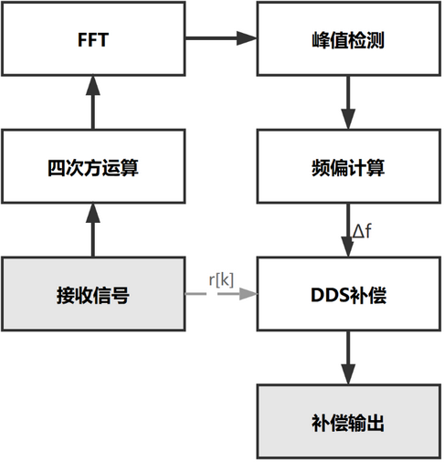

### 载波相位恢复模块设计

载波相位恢复模块实现二阶 DPLL 的 RTL 设计，包含三个功能单元。

四次方鉴相器将频偏补偿后的复数信号 $r'[k]$ 与上一时刻相位估计值 $e^{-j\hat{\phi}[k-1]}$ 相乘后做四次方运算，通过坐标旋转数字计算（Coordinate Rotation Digital Computer, CORDIC）算法提取相位角，除以 4 后输出相位误差 $e[k]$。CORDIC 算法通过迭代旋转逐步逼近目标角度，仅需要移位和加减运算即可实现，适合 FPGA 实现。迭代次数与角度提取精度直接相关，典型配置为 16 次迭代，对应约 11 bit 角度精度，误差小于 $2^{-11}$ rad。

环路滤波器采用二阶无限冲激响应（Infinite Impulse Response, IIR）结构实现比例-积分滤波。比例支路系数 $c_1 = 2\zeta\omega_n T_s$ 和积分支路系数 $c_2 = (\omega_n T_s)^2$ 均为定点小数，其具体数值由前述设计准则确定的 $\omega_n$ 值计算得到。系数的定点化位宽需要精心设计：若位宽过小，系数量化误差将引入额外的环路抖动，降低相位跟踪精度；若位宽过大，则增加乘法器资源消耗。拟通过定点仿真确定最小可接受的系数位宽。

NCO 由相位累加器和查找表构成。相位累加器将环路滤波器输出 $\nu[k]$ 累加得到当前相位估计 $\hat{\phi}[k]$，查找表存储 $\cos$ 和 $\sin$ 值，将相位映射为复数旋转因子 $e^{-j\hat{\phi}[k]}$。查找表的深度和位宽由所需的相位分辨率和输出精度决定，也可用 CORDIC 替代查找表以节省存储资源。

定点化精度分析涉及三个层面。ADC 量化位宽决定输入信号精度，典型值为 8 bit。鉴相器输出截位位宽影响相位误差的量化噪声，截位过激进将导致鉴相增益下降和环路性能退化。环路滤波器系数位宽影响环路参数的实现精度，系数量化误差等效于 $\omega_n$ 和 $\zeta$ 的微小偏移。量化噪声的方差为：

$$\sigma_q^2 = \frac{\Delta^2}{12}$$

其中 $\Delta = 2^{-W}$ 为量化步长，$W$ 为有效位宽。信号量化噪声比（Signal-to-Quantization-Noise Ratio, SQNR）为：

$$\text{SQNR} = 10\log_{10}\frac{\sigma_x^2}{\sigma_q^2} \approx 6.02W + 1.76 \text{ (dB)}$$

拟通过定点仿真将浮点算法中各运算节点的精度逐级降低，观察 BER 性能退化量，确定各功能单元的最小位宽需求，在满足算法精度要求的前提下最小化资源消耗。

### 设计分析与验证方案

FPGA 设计分析拟从功能正确性、资源开销和时序可行性三个维度展开。

功能验证采用对比仿真方案：使用 Vivado 仿真器加载 RTL 设计，输入与 MATLAB 浮点仿真相同的测试向量，含湍流信道下的接收信号序列，逐模块比对 FPGA 定点输出与 MATLAB 浮点输出的差异，确认功能正确性。重点验证三个方面：FFT 频偏估计模块的频偏估计精度是否在可接受范围内、DPLL 模块的锁定时间和稳态抖动是否与浮点仿真一致、以及级联后的判决输出 BER 是否与浮点仿真吻合。测试向量覆盖弱、中、强三档湍流条件和多个信噪比工作点，以验证设计在不同工作条件下的功能正确性与性能一致性。

资源利用率评估涵盖四个维度。查找表（Look-Up Table, LUT）主要用于实现组合逻辑，包括峰值检测逻辑、鉴相器中的 CORDIC 迭代运算和控制状态机。触发器（Flip-Flop, FF）用于流水线寄存器和状态存储，包括 FFT IP 核内部流水线、环路滤波器的积分器状态和 NCO 相位累加器。DSP 用于复数乘法，包括四次方运算、频偏补偿和相位旋转，以及 CORDIC 中的移位累加运算。BRAM 用于 FFT IP 核的内部数据存储、正余弦查找表和数据缓存。将各模块的资源占用逐一估计，汇总后与目标 FPGA 的总资源进行对比，评估资源裕度。

时序可行性验证关注目标时钟频率下的约束满足情况。符号率 2.5 GSps 对 FPGA 内部处理吞吐量提出了较高要求：单个时钟周期内需要完成一个符号的全部载波同步处理。在 Kintex-7 系列上，实际可实现的时钟频率通常不超过 300~400 MHz，因此需要采用并行处理架构：将串行数据流通过串并转换分为 $P$ 路并行处理，其中 $P$ 的选取需满足 $P \cdot f_{\text{clk}} \geq 2.5$ GSps，例如 $P = 8$ 对应 $f_{\text{clk}} = 312.5$ MHz、$P = 10$ 对应 $f_{\text{clk}} = 250$ MHz，每路在降低后的时钟频率下独立运行。并行化引入的主要挑战是跨路数据交换：DPLL 的闭环结构要求当前符号的相位估计结果反馈至下一个符号，在并行架构中相邻符号可能分属不同路，需要设计跨路数据传递机制。分析关键路径的延迟，确认在目标时钟频率和选定并行度下时序约束可满足。

## 实验方案

三组实验围绕信道估计误差如何影响载波同步性能这一核心问题展开：从信道估计精度基线出发，分析估计误差对载波同步性能的影响，最终延伸到载波同步方法的性能边界、参数设计准则及编码辅助扩展。三组呈递进关系：第一组建立的 NMSE 基线与灵敏度阈值为第二组提供输入参数和设计约束，第二组的未编码 BER 曲线为第三组的编码增益评估提供对照基准。每组实验均以 Gamma-Gamma 湍流条件为核心变量，目标是为系统设计者提供按湍流条件划分的算法选择与参数配置依据。

蒙特卡洛仿真统一采用 3.1 节声明的参数体系，包括 1550 nm 载波波长、QPSK/16-QAM 调制格式、2.5 Gsps 符号率、500 km 轨道高度，以及弱湍流 α=4.0/β=3.0、中等湍流 α=2.5/β=1.8 和强湍流 α=1.5/β=0.8 三档湍流参数。所有实验使用 10 个独立随机种子，每个种子含 $10^5$ 量级符号，以获取统计可靠的性能估计。FEC 相关实验采用规则 LDPC 码，码率 1/2\~3/4，块长 64800，编码方案和参数范围见组 C 说明。

### 信道估计精度与接收性能影响

信道估计研究的核心问题在于：现有工作以归一化均方误差为评价指标，却缺乏与后续信号处理模块性能的定量关联：Han 等人仅分析估计误差对中断概率的影响[@han2022jlt]，Safi 等人采用简化误差建模[@safi2019]，均未建立估计精度与载波同步性能之间的定量映射。本组四个实验围绕这一问题展开，从精度基线、误差传播灵敏度、调制格式依赖三个维度建立适用于载波同步的估计精度设计准则。

（1）信道估计方法 NMSE 基线对比。建立 LS、MMSE、Kalman 滤波三类经典估计方法在 Gamma-Gamma 湍流弱、中、强三档下的精度基线。假设：若三类方法的 NMSE 曲线存在随湍流强度漂移的性能交叉点，则估计方法的选择具有湍流条件依赖性。仿真在平均 SNR 0~30 dB、步进 2 dB 下进行，采用前置导频，长度候选范围 16~128 符号，作为估计架构，绘制各湍流条件下的 NMSE-SNR 曲线。判据：交叉点对应的湍流强度和 SNR 范围是否形成可区分的方法选择边界。

（2）NMSE-BER 灵敏度与闭环验证。在实验（1）获得的 NMSE 基线基础上，量化信道估计误差向载波同步模块的传播效应，并验证实际估计器是否满足闭环要求。仿真分为两部分：灵敏度标定部分在固定工作 SNR 下注入 -20 至 0 dB 共七个 NMSE 水平的估计误差，分别绘制 VV 算法和 DPLL 两种同步方法的 BER-NMSE 灵敏度曲线，重点标定 BER 从线性退化区进入急剧恶化区的 NMSE 临界阈值；闭环验证部分用实验（1）中各估计器的实际 NMSE 代替注入误差，检查实际 NMSE 是否落在临界阈值的安全侧。判据：三类估计器在各湍流条件下的实际 NMSE 是否均低于标定的临界阈值。

（3）调制格式灵敏度差异。实验（1）和（2）以 QPSK 为基准，将调制格式纳入对比，对比 QPSK 和 16-QAM 对信道估计误差的灵敏度差异。假设：若 16-QAM 的 NMSE 临界阈值高于 QPSK，则调制格式是影响估计精度需求的独立因素，需为不同调制格式给出差异化精度要求。仿真在实验（2）的注入误差方案基础上引入 16-QAM 调制格式，载波同步方法分别采用 QPSK 四次方鉴相的 VV 算法和兼容 16-QAM 的 BPS 算法。判据：16-QAM 的临界阈值偏移量是否足以改变实验（2）标定的设计准则。

（4）16-QAM 下载波同步方法性能对比。实验（3）分析了调制格式对估计精度的灵敏度差异，本实验进一步在 16-QAM 调制格式下对比 DD-DPLL、BPS 和 Kalman 滤波在已知信道条件下的性能，为分离估计误差与同步方法各自的贡献提供方法选择基线。假设：在 16-QAM 的更高相位精度需求下，DPLL 的环路参数敏感性增大，BPS 的计算复杂度增长可接受，而已知信道下的 Kalman 滤波作为性能上界，其与实际方法的 BER 差距反映信道估计精度的边际价值。仿真在平均 SNR 0~25 dB、弱/中/强三档湍流条件下，绘制三类方法的 BER-SNR 曲线。判据：方法性能排序是否与 QPSK 下一致，以及已知信道上界与实际方法之间的 BER 差距是否随湍流增强而扩大。

### 载波同步性能分析与设计准则

载波同步方法在光纤和白噪声场景已有充分研究，但面向 Gamma-Gamma 湍流信道的系统性分析仍不完善：Petković 等人仅研究 DPLL 在 Málaga 湍流下的性能框架[@petkovic2022]，Paillier 等人在星地链路中沿用白噪声信道公式设计 DPLL 参数[@paillier2020]，均未将 Gamma-Gamma 湍流参数纳入性能模型。本组四个实验按性能边界标定、参数空间探索、解析准则验证、端到端联合验证的顺序逐步展开，建立按湍流条件划分的载波同步方法选择与参数设计准则。

（1）载波同步方法 BER-SNR 完整曲线。系统对比 VV、BPS、DPLL 三类方法在三档湍流强度、多 SNR 工作点下的 BER 性能和帧失败率，作为载波同步研究的基线。假设：前馈方法 VV 和 BPS 在弱湍流下因相位滑移概率低而占优，DPLL 在强湍流下因环路记忆平滑效应而维持更低的误码率，两类方法的性能交叉点随湍流强度偏移。仿真在平均 SNR 0~30 dB、三档湍流条件下，绘制各湍流条件下的 BER-SNR 曲线并统计帧失败率。判据：前馈与反馈方法的性能交叉点是否在中等湍流附近形成可辨识的决策边界。

（2）参数扫描与噪声源解耦。在实验（1）标定的性能基线上，对各方法关键设计参数进行系统扫描，并定量分离湍流致相位噪声、本振线宽噪声和残余频偏噪声各自的贡献。参数扫描范围：VV 平均窗口 $M_{vv}$ 为 8~512 符号、DPLL 自然频率 $\omega_n$ 为 $2\times10^6$\~$50\times10^6$ rad/s、FFT 频偏估计窗口 $N_{fft}$ 为 256~4096。噪声解耦部分通过逐一排除各噪声源，即分别将线宽设为零、频偏设为零、湍流归一化辐照度设为单位值，绘制各噪声源的 BER 贡献占比。假设：若各参数较优区间随湍流强度漂移，则固定参数配置无法覆盖全湍流范围，需分场景设计。判据：三档湍流下较优参数的重叠区间宽度是否低于参数总扫描范围的 30%。

（3）DPLL 解析设计准则验证。验证从湍流参数 $\alpha$、$\beta$ 到推荐 DPLL 自然频率 $\omega_n$ 的解析公式是否与数值扫描结果吻合。假设：由环路噪声带宽与湍流相位噪声功率谱的解析关系可导出 $\omega_n$ 的解析公式。该公式在弱到中等湍流下与数值扫描最优 $\omega_n$ 的偏差不超过 3 dB；强湍流下偏差可能增大，但公式仍可提供合理的初始设计点。仿真在实验（2）标定的数值最优 $\omega_n$ 基础上，与解析公式预测值进行对比，绘制偏差随湍流强度的变化曲线。判据：解析预测值与数值扫描基准值的 BER 差异是否在 0.5 dB SNR 等效范围内。

（4）联合设计空间验证与失锁恢复统计。将信道估计与载波同步作为联合系统进行端到端验证，并提取 DPLL 失锁恢复的统计特性。端到端验证部分用组 A 实验（1）中各估计器的实际输出而非注入误差驱动载波同步模块，检查组 A 实验（2）标定的 NMSE 临界阈值和本组实验（3）验证的 $\omega_n$ 解析公式在闭环条件下的有效性。失锁恢复部分在强湍流下统计 DPLL 失锁后的重锁时间分布，为系统设计提供恢复时间预算依据。判据：端到端 BER 与分组预测值的偏差是否在 1 dB SNR 等效范围内；失锁恢复时间的中位数和 95% 分位数是否在可接受范围内。

### 扩展验证与系统级实验

关于湍流下信道编码对相干 FSO 系统性能的影响，相关研究仍不充分：现有 FSO 编码研究几乎全部基于 IM-DD 体制而无需处理相位噪声，而编码辅助载波恢复在射频（Radio Frequency, RF）领域已有成熟研究[@oh2001; @lottici2004]并在光纤通信中得到初步验证[@castrillon2015; @yuan2017]，但在 FSO 湍流信道下相关工作仍较为有限。本组两个实验分别建立 LDPC 码在 Gamma-Gamma 湍流下的编码增益基线，并验证编码辅助迭代载波恢复的可行性，为后续研究方向提供初步依据。

（1）LDPC 编码增益基线。量化 LDPC 码在 Gamma-Gamma 湍流下的编码增益，并评估交织深度对湍流致突发错误的缓解效果。假设：LDPC 在弱到中等湍流下可提供 6~8 dB 编码增益，与 AWGN 信道相近，但在强湍流下因块衰落导致突发错误，增益下降；块间交织可将增益恢复到接近 AWGN 信道时的水平。仿真采用规则 LDPC 码，码率 1/2\~3/4，块长 64800，在组 B 实验（1）的未编码 BER 曲线基础上绘制编码后 BER-SNR 曲线，交织深度范围为无交织至 10 倍块衰落周期。判据：强湍流下交织前后的编码增益差异是否超过 2 dB。

（2）编码辅助迭代载波恢复。验证 DPLL 与 LDPC 译码器软信息反馈的迭代载波恢复方案在 Gamma-Gamma 湍流下的可行性。假设：利用译码器输出的比特对数似然比（Log-Likelihood Ratio, LLR）重构比无反馈方案更准确的相位估计，经 2\~3 次迭代后可降低载波相位估计方差，使 DPLL 在强湍流下的 BER 相比无反馈方案改善 0.5\~1 dB。仿真在实验（1）的 LDPC 基础上，将 DPLL 的相位估计结果送入 LDPC 译码器，译码器输出 LLR 反馈至相位估计模块形成迭代环路，迭代次数 1\~5 次。判据：迭代方案相比无反馈方案的 BER 改善是否随湍流增强而增大，即编码辅助的价值随湍流增强而增大。

## 可行性分析

（1）理论可行性。Gamma-Gamma 湍流衰落模型的数学推导由 Andrews 和 Phillips 系统给出[@andrews2005]，QPSK 相干检测的接收信号模型和瞬时 SNR 模型为数字通信领域的标准框架。载波同步方法的理论依据明确：FFT 频偏估计基于周期信号频谱分析，VV 算法基于 M-PSK 信号的 M 次幂消除调制信息原理，DPLL 基于经典锁相环理论。将上述方法从 AWGN 信道扩展到 Gamma-Gamma 湍流信道是本课题的主要理论工作。

（2）方法与数据可行性。本课题采用蒙特卡洛仿真作为主要研究方法，可在受控条件下系统遍历参数空间，无需外部数据集。仿真参数均有明确的文献来源，三档湍流参数基于 Andrews 和 Phillips 的 Rytov 方差理论[@andrews2005]，LEO 链路参数来自 Paillier 等人[@paillier2020]和 Zhao 等人[@zhao2025]的系统参数设定。

MATLAB 仿真代码已在课题组完成开发和初步验证，已实现的核心模块包括 Gamma-Gamma 信道生成、VV 载波相位恢复、DPLL 环路仿真和 QPSK 调制解调。FPGA 开发平台为实验室已有的 Xilinx Vivado 工具链，已有闫佳欣的 QPSK 1.25 GSps 实现[@yanjiaxin2024]和 Ju 等人的双孔径自适应均衡实时实现[@ju2024realtime]等参考实现可供借鉴。

（3）初步验证结果。课题组已完成部分关键方向的初步仿真。信道估计方面：QPSK 与 16-QAM 对估计误差的灵敏度差异已在中等湍流下得到初步验证，见图 3-1，Gamma-Gamma 参数 β<1 时基于 $E[1/h]$ 发散的前馈方法失效判据已完成解析推导。载波同步方面：VV、BPS、DPLL 三类方法的性能对比已完成，DPLL 在强湍流下性能最为稳健，VV 算法窗口参数 $N_w$ 从 64 调至 256 可使误码率降低约一个数量级，见图 4-1；DPLL 自然频率 $\omega_n$ 的扫参分析初步验证了参数解析设计方向的可行性，见图 4-2。详细结果见研究方案各节。

（4）风险分析与应对。

| 风险                                                          | 可能性 | 影响 | 应对策略                                                                                                                      |
| ------------------------------------------------------------- | ------ | ---- | ----------------------------------------------------------------------------------------------------------------------------- |
| VV/BPS 在强湍流下失效，导致 IP1 分析结论缺乏区分度 | 中     | 低   | DPLL 作为备选方案已在初步仿真中表现出对强湍流条件的适应能力；若前馈方法全面失效，该结论本身可明确方法选择边界 |
| FPGA 资源开销超出目标平台容量                                 | 低     | 中   | 可降低 FFT 窗口长度、采用时分复用结构共享计算资源，或选择更高规格的 FPGA 平台                                                 |
| 方法探索未产生优于已有方法的增益 | 中 | 低 | 研究方案未绑定单一方法方向，核心产出即系统性分析框架和设计准则已有初步数据支撑，方法探索为增量贡献 |
| 仿真参数空间覆盖不全，遗漏关键工作点                          | 低     | 中   | 已有单点初步数据覆盖典型工作区域，开题后拟完成全参数范围的系统性扫描                                                          |

信道估计误差对接收性能影响的分析框架和载波同步设计准则两项核心产出均有理论推导和初步仿真结果支撑，详见图 3-1 至图 4-2，，构成研究方案的基本目标。

# 研究工作进度安排

本课题研究工作拟从 2026 年 6 月至 2027 年 5 月进行。各阶段工作安排如下。

2026.06~2026.07：在开题调研基础上，继续从 IEEE、OSA、CNKI 等数据库中检索与星地激光通信信道建模、湍流统计特性、相干检测信号处理等方向的文献与资料，经整理分析后补充关键技术细节和参数依据；完成 QPSK 相干检测系统模型、Gamma-Gamma 湍流信道模型和星地链路预算的理论推导与数值计算；搭建基于 MATLAB 的蒙特卡洛仿真环境，实现 Gamma-Gamma 信道仿真器，建立统一参数体系。期间按照节点撰写周志。

2026.08~2026.09：围绕信道估计与接收性能分析，设计并执行信道估计类仿真实验，系统分析导频辅助信道估计方法在不同湍流条件和 SNR 下的估计精度；分析估计误差对 VV 和 DPLL 两种载波同步方法的级联影响，建立从估计精度到系统误码率的定量映射关系；分析湍流特性对前馈方法可用性的影响和调制格式依赖的灵敏度差异，总结面向载波同步的信道估计精度设计准则。期间按照节点撰写周志，完成中期报告。

2026.10~2026.11：围绕载波同步与信号处理方法探索，在 Gamma-Gamma 湍流弱、中、强三档条件下执行载波同步类仿真实验，对比 VV、BPS 和 DPLL 的性能特点和失效机制，总结分湍流条件的方法选择与参数设计准则；开展面向湍流条件的信号处理方法探索，包括同步方法分析与设计准则、参数设计方法、跨模块联合处理方法探索等方向。期间按照节点撰写周志。

2026.12~2027.03：对选定的 FOE+DPLL 级联方案进行 FPGA 设计分析，给出频偏估计模块和载波相位恢复模块的 RTL 架构，分析定点量化对算法精度的影响，完成功能仿真与 MATLAB 仿真的一致性验证，评估硬件资源开销。期间按照节点撰写周志。

2027.04~2027.05：按照节点撰写周志和学位论文，整理仿真代码与实验数据，根据导师审阅意见修改完善论文；制作答辩 PPT，完成预答辩和毕业答辩。

# 预期研究成果

详细说明预期研究取得的成果，包括但不限于新理论、新方法、新技术以及新装置、新方案等，以及预期发表的论文、申请的专利、参加的学术会议等。

本课题围绕星地相干激光通信信号处理的关键技术开展研究，预期在理论、方法、工程和学术产出四个层面取得以下成果。

（一）理论成果

（1）信道估计误差对接收性能影响的分析框架。拟建立 Gamma-Gamma 湍流信道下信道估计误差沿信号处理链传播的分析模型，分析估计误差在不同湍流条件和调制格式下对误码率的影响机制。具体包括：估计误差对载波同步等后续模块的灵敏度分析方法，QPSK 与 16-QAM 调制格式的灵敏度差异及其物理成因，以及 Gamma-Gamma 参数 $\beta<1$ 时基于 $E[1/h]$ 发散的前馈方法理论失效判据。该框架将信道估计的评价视角从估计器本身的归一化均方误差指标扩展至系统级接收性能，为信道估计器的精度设计提供面向系统级性能的定量参考。

（2）面向同步的信道估计精度设计准则。综合灵敏度分析、方法可用性判据和调制格式依赖性，拟给出分湍流条件和调制格式的信道估计精度需求，包括 NMSE 需求阈值、前馈方法的可用性判据以及导频方案的初步建议。该准则回答"需要多少估计精度才能满足后续载波同步的要求"这一设计问题，为系统设计者在估计精度与实现复杂度之间的折中提供依据。

（二）方法与技术成果

（3）湍流下载波同步方法的系统性性能分析框架与设计准则。拟建立 VV、BPS、DPLL 三类典型载波同步方法在 Gamma-Gamma 湍流弱、中、强三档条件下的性能分析框架，分析各方法的性能边界与失效机制。具体包括：各方法的适用湍流范围与失效条件，关键参数与湍流条件的关联规律，以及分湍流条件的方法选择与参数设计准则。该成果将为系统设计者提供离线设计指导，帮助其在不同湍流条件下选择合适的载波同步方法并配置相应参数。

（4）面向湍流条件的参数解析设计方法。拟建立基于 Gamma-Gamma 湍流参数的载波同步参数解析设计方法。以 DPLL 为例，推导环路自然频率 $\omega_n$ 与湍流参数 $\alpha$、$\beta$ 和目标帧级失锁概率之间的解析关系，使系统设计者可根据链路湍流条件直接确定关键参数值，而无需依赖逐参数扫描的仿真搜索。

（5）跨模块信号处理联合方案的探索方向。拟探索跨模块信号处理联合方案，包括多源相位噪声联合建模与编码辅助载波恢复等方向。该部分为研究方向级承诺，具体方案将根据研究进展选择深入方向。

（三）工程成果

（6）接收端数字信号处理链 FPGA 设计方案。拟完成接收端频偏估计与补偿、载波相位恢复等关键模块的 FPGA 寄存器传输级架构设计，分析定点量化效应对算法精度的影响，评估资源占用与处理时序之间的折中，给出资源利用率分析结果。

（四）学术产出

（7）硕士学位论文一篇，题目为"星地激光通信信号处理关键技术研究"。

（8）综述论文一篇，对湍流 FSO 相干接收端信号处理方法的研究现状与关键问题进行系统梳理。

（9）会议论文一篇，围绕湍流下载波同步分析与设计准则等核心研究内容展开。

# 本课题创新之处

论证说明研究内容、拟采用的研究方法、技术路线或预期成果中有哪些创新之处。

本文的主要创新点如下：

（1）针对信道估计研究以归一化均方误差为核心评价指标而缺乏与后续模块性能定量关联的问题，拟建立信道估计误差对接收性能影响的分析框架，并给出面向同步的精度设计准则。分析信道估计误差在不同湍流条件和调制格式下对误码率的影响机制，给出方法可用性边界和分湍流条件的精度需求。该框架为信道估计器的精度设计提供了面向系统级性能的定量参考，为系统设计者在估计精度与实现复杂度之间的折中提供了依据。与 Han 等人仅分析估计误差对中断概率的影响[@han2022jlt]和 Safi 等人采用简化误差建模的方法[@safi2019]相比，本文将分析范围从链路级指标扩展至信号处理模块级性能。

（2）针对湍流下载波同步方法缺乏系统性分析与设计指导的问题，拟建立湍流下载波同步方法的系统性性能分析框架，从三个层次展开研究：首先，分析 VV、BPS、DPLL 等典型载波同步方法在不同湍流条件下的性能边界与失效机制，给出分湍流条件的方法选择与参数设计准则；其次，研究面向湍流条件的参数解析设计方法，给出分湍流强度的参数配置方案；最后，探索跨模块信号处理联合方案，包括多源相位噪声联合建模与编码辅助载波恢复等方向。与 Petković 等人仅研究 DPLL 的 Málaga 湍流分析框架[@petkovic2022]和 Paillier 等人沿用白噪声公式的星地 DPLL 方案[@paillier2020]相比，本文将信道估计误差纳入性能模型并将 Gamma-Gamma 湍流参数引入设计准则。

# 研究基础

1. 与本项目有关的研究工作积累和已取得的研究工作成绩。

围绕本课题的研究方向，已在以下方面积累了工作基础。

在文献调研方面，系统梳理了大气湍流信道估计和湍流下载波同步两个方向的国内外研究进展，明确了现有研究在信道估计精度与系统级性能对接、湍流下信号处理方法的系统性分析两方面的不足。

在初步分析方面，针对信道估计与接收性能分析，完成了信道估计误差对不同调制格式误码率影响的初步仿真，结果表明 QPSK 对估计误差具有更高的容忍度，而 16-QAM 对估计精度高度敏感，见图 3-1，验证了调制格式灵敏度差异这一分析方向的可行性。此外，还完成了 Gamma-Gamma 参数 $\beta<1$ 时前馈方法理论失效判据的解析推导，初步建立了方法可用性与湍流参数之间的理论联系。

针对湍流下载波同步方法，完成了 VV、BPS、DPLL 三类方法在 Gamma-Gamma 湍流下的系统性性能对比，见图 4-1，初步结果表明参数配置对方法可用性有重要影响。DPLL 自然频率 $\omega_n$ 的扫参分析初步验证了参数解析设计方向的可行性，见图 4-2。上述初步结果均已纳入研究方案各节的分析框架中。

<!-- TODO: 用户补充——课题组研究基础（导师在光通信/卫星通信方向的研究积累、实验室已承担的相关项目等） -->

2. 已具备的实验条件，尚缺少的实验条件和解决的途径（包括利用国家重点实验室和部门开放实验室的计划与落实情况）。

已具备的实验条件：配备图形处理器（Graphics Processing Unit, GPU）的工作站一台，可完成湍流信道建模与蒙特卡洛仿真；FPGA 开发环境<!-- TODO: 用户补充——开发板型号、Vivado 版本 -->。

尚缺少的实验条件及解决途径：本课题以仿真验证为主，FPGA 设计部分侧重于架构设计和资源分析，暂不要求端到端链路实测。<!-- TODO: 用户补充——实验室光通信测试设备（如有）、尚缺条件和解决途径 -->

3. 研究经费预算计划和落实情况。

<!-- TODO: 用户补充——以下经费预算表格需根据实际情况填写 -->

| 序号 | 经费开支项目 | 金额（元） | 计算依据及理由 |
|------|------------|-----------|--------------|
| 1 | 计算资源费 | <!-- TODO --> | 仿真计算、GPU 资源 |
| 2 | FPGA 开发板及配件 | <!-- TODO --> | 接收端信号处理链验证 |
| 3 | 论文版面费 | <!-- TODO --> | 学术论文发表 |
| 4 | 差旅费 | <!-- TODO --> | 学术会议、调研 |
| 5 | 其他 | <!-- TODO --> | 资料费、打印费等 |
| | 合计 | <!-- TODO --> | |
