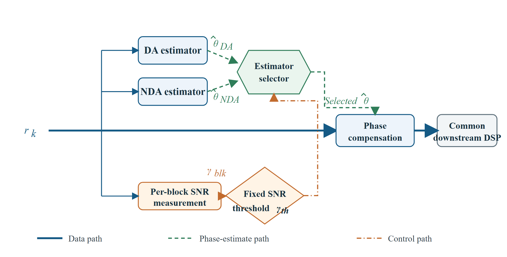
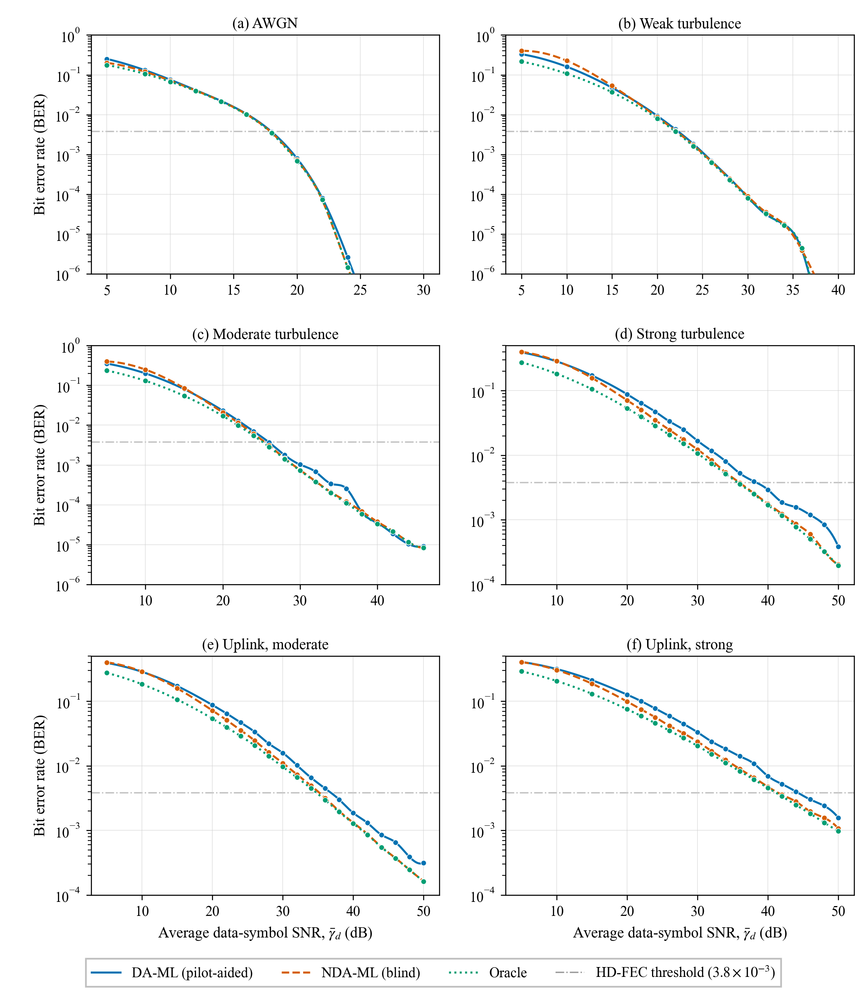
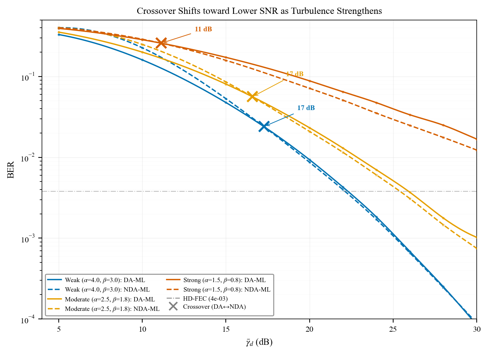
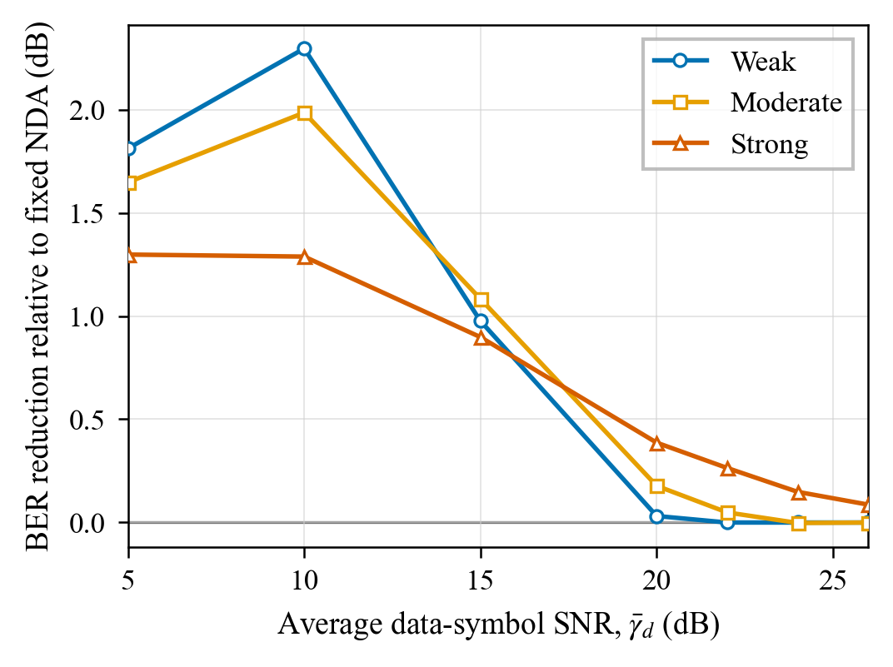

# 第三章 基于接收功率感知的自适应载波相位恢复方法

## 3.1 引言

在星地相干激光通信系统中，接收端需要从受大气信道和本振共同影响的复基带信号中恢复载波频率与相位，才能保证接收星座与判决区域正确对齐。与强度调制直接检测相比，相干接收保留信号的幅度与相位信息，因而具有较高接收灵敏度，并可支持频谱效率较高的多阶调制格式。数字接收机相应地需要显式补偿残余频偏、激光相位噪声，并处理大气湍流引起的功率起伏。尤其对于星地下行链路，瞬时接收功率会随湍流状态和处理时刻发生变化，使同一载波恢复算法在不同数据窗口中面临不同的有效信噪比。载波相位恢复的稳定性因此不仅决定星座能否完成正确旋转，也直接影响后续解映射与误码判决，是相干接收数字信号处理链中的关键环节[@valjus2025dsp; @paillier2020; @taylor2009]。

然而，现有载波相位恢复方法通常在给定观测方式后采用固定处理分支。数据辅助方法利用已知导频构造直接的相位观测，在噪声较强时仍可借助先验符号建立载波参考，但需要付出导频占用；非数据辅助方法则通过消除调制对称性估计频率与相位，不占用数据位置，却会引入高阶统计量的噪声响应与固有相位模糊[@magarini2012pilot; @viterbi1983; @du2025nda]。两类方法的信息来源不同，其误码率随信噪比变化的规律也不相同，因而在不同接收功率条件下，两类方法的相对优势会发生变化。因此，本章所要解决的问题不是重新设计某一固定载波估计器，而是根据当前窗口的接收功率特征，在两类固定载波参考方式之间进行选择；性能评价以固定 NDA 为主要比较对象。

为此，本章提出一种基于接收功率感知的两阶段自适应载波相位恢复方法。该方法以 256 符号原始接收窗口的功率统计量和名义数据符号信噪比为控制输入：第一阶段利用功率变异系数识别功率相对稳定的窗口，第二阶段在功率离散程度较高时利用功率代理构造有效信噪比，并在数据辅助与非数据辅助分支之间完成判决。控制器在载波恢复执行前确定唯一分支，使两个分支以相同长度、相同时序的复数序列作为输出接口。本章以偏振解复用后的单路复符号为输入，对载波恢复方法进行独立评价。下文首先给出接收信号模型、数据帧结构与处理窗口划分，载波相位过程沿用第二章建模；随后说明两类固定载波恢复分支；在此基础上给出功率感知的两阶段判决、输入边界和完整流程；最后通过加性高斯白噪声参考场景及三档 Gamma–Gamma 湍流场景分析固定分支的工作区与自适应方法的适用范围。

## 3.2 载波相位恢复信号模型与数据帧结构

本节在第二章统一接收模型的基础上，进一步给出载波相位恢复所需的离散时间观测、数据帧结构与处理窗口划分。为突出载波恢复与功率感知控制之间的关系，将偏振解复用后的单路复基带序列作为本章输入。设第 $k$ 个发送符号为 $s_k$，星座采用 $(8,8)$-16APSK 调制，即两个幅度环上分别分布 8 个等间隔相位点，并将星座归一化为平均符号能量 $E_s=1$[@du2025nda]。接收序列可表示为

$$
r_k=\sqrt{h_{b(k)}}s_k\exp\!\left(\mathrm{j}\phi_k\right)+n_k,
\tag{3-1}
$$

式中，$h_{b(k)}$ 表示第 $k$ 个符号所在大气信道块的归一化辐照度，$b(k)=\lfloor k/N_{\mathrm{ch}}\rfloor$ 为信道块索引，$N_{\mathrm{ch}}=100$ 为每个信道块包含的符号数；$\phi_k$ 为接收载波相位；$n_k\sim\mathcal{CN}(0,N_0)$ 为圆对称复高斯噪声。式（3-1）中的 $h$ 为功率增益，复包络幅度因而乘以 $\sqrt h$，不能将功率增益直接作为场幅系数使用。

大气湍流采用第二章的 Gamma–Gamma 辐照度模型，形状参数与 Rytov 方差之间的映射见第二章式（2-2）[@alhabash2001]。本章采用弱、中、强三档下行湍流条件[@gu2022mfi; @ghassemlooy2019owc]，三档参数以第二章表 2-2 为准，并直接以表中的舍入参数生成信道块辐照度序列。

在 $E_s=1$ 的归一化条件下，衰落前平均数据符号信噪比定义为

$$
\bar\gamma=\frac{E_s}{N_0},\qquad
\gamma_{\mathrm{data}}^{\mathrm{dB}}=10\log_{10}\bar\gamma,
\qquad
\gamma_k=h_{b(k)}\bar\gamma,
\tag{3-2}
$$

其中，$\bar\gamma$ 是链路配置所给出的名义数据符号信噪比，$\gamma_k$ 是受当前辐照度调制的瞬时信噪比。由 $n_k\sim\mathcal{CN}(0,N_0)$ 可得复噪声总功率 $\mathbb E[|n_k|^2]=N_0=1/\bar\gamma$，其同相与正交分量的方差均为 $1/(2\bar\gamma)$。名义信噪比与瞬时信噪比承担不同作用：前者是接收机已知的工作点参数，也是两阶段控制器的输入之一；后者反映真实衰落后的信号质量，但由于依赖未知 $h_{b(k)}$，不能作为在线分支选择依据。

除功率起伏外，接收载波还包含残余频率偏移、随时间变化的多普勒项以及激光相位噪声。对每个处理窗口，载波相位过程沿用第二章式（2-7）的建模：窗口内相位保持连续，不同窗口生成独立实现；相位恢复算法需要在当前窗口内同时处理相位截距与频率变化造成的相位斜率。

信道块与数字信号处理（Digital Signal Processing，DSP）窗口是两个相互独立的划分尺度。大气辐照度按 $N_{\mathrm{ch}}=100$ 个符号更新，而载波恢复及自适应控制采用互不重叠的 $N_{\mathrm{DSP}}=256$ 符号窗口。因此，一个 DSP 窗口可能跨越多个信道块。功率统计、频相估计与分支选择均在 256 符号尺度完成，涉及信道增益的观测则仍遵循 100 符号块边界。区分这两个尺度十分重要：若错误地把整个 256 符号窗口视为单一衰落块，会抹去窗口内部的功率变化，也会改变自适应控制器所观测到的功率离散程度。

数据辅助分支在每个 256 符号窗口内设置 64 个已知导频，其局部索引为 $0,4,\ldots,252$，其余 192 个位置承载数据；非数据辅助分支则可使用窗口中的全部符号。由于信道块边界与导频布局独立，参与某一信道块增益观测的导频需要根据全局符号索引归属，不能以窗口边界代替信道边界。为保证不同算法间的差异来自接收处理而非随机样本，各比较方法在同一比较点使用相同的发送符号、辐照度序列、载波相位序列和噪声实现。该帧结构的导频开销口径沿用第二章 2.5.1 的定义。误码率统计同样沿用第二章的共同有效载荷口径，即以 DA 与自适应输出共有的 192 个非导频数据位置为评价集合。

## 3.3 数据辅助与非数据辅助载波相位恢复原理

两阶段自适应方法建立在两类具有统一输入输出接口的载波恢复分支之上。本节首先说明数据辅助分支如何从已知导频提取相位—时间观测，再说明非数据辅助分支如何利用 16APSK 的八重旋转对称性完成频相估计，最后比较两类分支的信息来源与性能权衡。

### 3.3.1 数据辅助载波恢复

数据辅助载波恢复利用接收端已知的导频符号消除调制数据的不确定性，从而形成对载波相位的直接观测[@magarini2012pilot; @spalvieri2011]。设当前窗口内第 $\ell$ 个导频的索引为 $n_\ell$，已知导频值为 $p_\ell$，对应采样时刻为 $t_\ell=n_\ell T_s$。将接收导频除以已知符号并取相角，可以得到

$$
\vartheta_\ell=
\operatorname{unwrap}\!\left\{
\angle\!\left(\frac{r_{n_\ell}}{p_\ell}\right)
\right\},
\qquad
\vartheta_\ell\simeq\phi_0+2\pi\Delta f\,t_\ell+e_\ell,
\tag{3-3}
$$

式中，$\operatorname{unwrap}(\cdot)$ 表示相位展开，$\phi_0$ 和 $\Delta f$ 分别为当前窗口内待估计的相位截距与等效频率偏移，$e_\ell$ 汇集噪声、相位噪声以及线性模型未能完全描述的残差。由于 64 个导频均匀分布在整个 256 符号窗口内，可以利用所有导频构造相位关于时间的一阶最小二乘拟合。记导频时刻和观测相位的均值分别为 $\bar t$ 与 $\bar\vartheta$，则

$$
\begin{aligned}
\widehat{\Delta f}_{\mathrm{DA}}
&=\frac{\sum_\ell(t_\ell-\bar t)(\vartheta_\ell-\bar\vartheta)}
{2\pi\sum_\ell(t_\ell-\bar t)^2},\\
\widehat\phi_{0,\mathrm{DA}}
&=\bar\vartheta-2\pi\widehat{\Delta f}_{\mathrm{DA}}\bar t.
\end{aligned}
\tag{3-4}
$$

由此得到窗口内第 $k$ 个符号的估计载波相位

$$
\widehat\phi_{k,\mathrm{DA}}
=\widehat\phi_{0,\mathrm{DA}}
+2\pi\widehat{\Delta f}_{\mathrm{DA}}kT_s,
\qquad
\widetilde r_{k,\mathrm{DA}}
=r_k\exp\!\left(-\mathrm{j}\widehat\phi_{k,\mathrm{DA}}\right).
\tag{3-5}
$$

均匀分布的导频使相位观测覆盖整个窗口，最小二乘拟合据此得到频率斜率和相位截距。已知导频提供了显式相位参考，但会产生固定导频开销，且导频观测仍受衰落和噪声影响。因此，DA 分支体现的是“显式参考—固定开销”的权衡，并不在所有信噪比和湍流条件下均优于 NDA 分支。

### 3.3.2 非数据辅助载波恢复

非数据辅助载波恢复不依赖已知导频，而是利用调制星座的旋转对称性消除数据信息。对于 $(8,8)$-16APSK，两个幅度环均包含 8 个等间隔相位点，令 $M_0=8$，对接收符号进行 $M_0$ 次幂运算后，调制相位中的 $2\pi/M_0$ 周期分量被折叠，载波频率与相位则被放大 $M_0$ 倍。该思想与 Viterbi--Viterbi 类非线性相位估计以及面向 M-APSK 的非数据辅助估计相一致[@viterbi1983; @du2025nda]。

NDA 分支首先在八次方域估计频率。记

$$
z_k=r_k^{M_0},\qquad M_0=8,
\tag{3-6}
$$

则载波频率分量在 $z_k$ 中表现为原频率的 $M_0$ 倍。对 $\{z_k\}$ 进行频谱分析，定位八次方频谱中的主频分量并除以 $M_0$，可得到 NDA 频率估计 $\widehat{\Delta f}_{\mathrm{NDA}}$。频偏补偿后的序列为

$$
r'_k=r_k\exp\!\left(-\mathrm{j}2\pi
\widehat{\Delta f}_{\mathrm{NDA}}kT_s\right).
\tag{3-7}
$$

随后在给定样本集合 $\mathcal I$ 上计算八次方样本的平均相角，得到

$$
\widehat\phi_{\mathcal I}
=\frac{1}{M_0}\angle\!\left(
\frac{1}{|\mathcal I|}\sum_{k\in\mathcal I}(r'_k)^{M_0}
\right),\qquad M_0=8.
\tag{3-8}
$$

在 Gamma–Gamma 湍流场景中，$\mathcal I$ 取完整的 256 符号窗口，以窗口内全部样本形成相位统计量；在加性高斯白噪声参考场景中，将窗口划分为 8 个长度为 32 的连续片段，分别计算升幂域相位，对片段间相位完成展开后进行线性插值。两种处理模式均在频偏补偿后估计载波相位，并输出与输入等长的校正序列

$$
\widetilde r_{k,\mathrm{NDA}}
=r'_k\exp\!\left(-\mathrm{j}\widehat\phi_{k,\mathrm{NDA}}\right).
\tag{3-9}
$$

八次方统计量只能确定模 $2\pi/8$ 意义下的相位，因此 NDA 输出存在 8 重相位模糊。为在离线仿真中统计 BER，本章对每个窗口测试 8 种合法星座旋转，并根据发送标签选择错误比特数最少的旋转。实际接收系统需要由差分编码、帧同步字或其他相位消歧机制解决这一模糊。

八次方处理在消除调制相位的同时，会放大不同功率样本对平均相量的贡献差异，并改变噪声进入统计量的方式。NDA 分支因此先估计并补偿频偏，再计算剩余相位；Gamma–Gamma 湍流场景采用完整窗口统计，加性高斯白噪声（Additive White Gaussian Noise，AWGN）参考场景采用分段估计与线性插值。两种模式均只处理接收复数序列，不使用数据判决反馈，其共同权衡是“无相位估计导频—高阶统计噪声敏感”。

### 3.3.3 两类分支的输入输出与性能权衡

表 3-1 对两类固定分支进行比较。二者仅提供长度 256、符号时序一致的复数输出接口；NDA 输出仍存在八重相位模糊，部署时需先完成相位消歧，再与 DA 输出进入统一的星座解映射和误码处理模块。该接口使自适应方法能够先完成分支判决，再执行被选择的载波恢复算法。

表 3-1 DA 与 NDA 载波恢复分支比较

| 比较项目 | 数据辅助分支 | 非数据辅助分支 |
|---|---|---|
| 主要参考信息 | 64 个已知导频 | 256 个接收符号的八次方统计量 |
| 频相估计 | 导频相位—时间最小二乘 | 八次方频谱频偏估计与升幂域相位估计 |
| 数据位置 | 192 个，导频位置不计入数据 BER | 全部位置可承载数据 |
| 固有问题 | 导频占用；导频观测受衰落和噪声影响 | 高阶统计量噪声敏感；存在 8 重相位模糊 |
| 输出形式 | 256 点复数校正序列 | 256 点复数校正序列 |
| 控制器可用信息 | 不向控制器提供分支 BER | 不向控制器提供发送标签或分支 BER |

## 3.4 接收功率感知的两阶段自适应控制方法

两类分支的相对优势随窗口功率状态变化，固定选择任一分支都只能覆盖部分工作区。自适应控制的核心因而是从分支执行前可获得的原始接收量中提取与窗口质量相关的统计量，而不是在两个分支完成后依据其实际错误数进行“事后择优”。

统一接口还限定了分支调度的粒度。选择单位是一个完整的 256 符号窗口，而不是单个符号；窗口内所有输出均由同一载波恢复分支生成。该设计避免在一个窗口内频繁切换估计参考而引入额外的相位连续性问题，同时与两类算法各自的频相估计尺度一致。分支标识可以作为接收机内部状态传递；完成必要的 NDA 相位消歧后，两类输出具有相同的数据类型和长度。

还需区分“候选分支并存”与“候选分支并行运行”。两种算法在方法定义中同时存在，是为了使控制器能够根据窗口状态调用其中之一，并不表示每个窗口都必须完成两次频相估计。若先并行运行再选择输出，不仅改变计算路径，也会诱发利用恢复后星座质量甚至误码结果进行判决的倾向。本文将统计量计算放在分支之前，正是为了维持统一、可解释的调用关系。

本节给出接收功率感知的两阶段分支控制方法。该方法遵循“先选择、后执行”的处理顺序：控制器首先读取当前 256 符号原始接收窗口与名义数据符号信噪比，计算功率变异系数；若窗口功率较稳定，则直接选择 NDA 分支；若功率离散程度较高，则进一步由平均接收功率构造有效信噪比代理，并据此选择 DA 或 NDA 分支。选择完成后仅执行一个载波恢复分支，最终向下游输出一条载波校正复数序列。方法流程如图 3-1 所示。

两阶段结构将“是否需要进一步辨别衰落窗口”和“高离散窗口应采用何种参考”分开处理。第一阶段只回答窗口功率是否相对稳定，不尝试由单一统计量直接完成三分支条件划分；第二阶段仅作用于高离散窗口，再利用平均功率尺度判断其有效信号质量。与把 CV 和平均功率压缩成一个未经解释的综合分数相比，这一顺序使每个判决量对应明确的物理含义，也使控制器能够在第一阶段满足条件时提前终止后续计算。

图 3-1 接收功率感知的两阶段自适应载波相位恢复流程

### 3.4.1 基于功率离散程度的第一阶段判决

信道块与数字信号处理窗口采用不同的更新尺度，因而具有相近平均接收功率的两个窗口仍可能呈现不同的内部功率分布。功率相对均匀的窗口可为 NDA 提供较一致的全窗统计样本；同时包含高功率块和深衰落块的窗口，则可能使升幂域统计量由少数高功率符号主导。因此，仅使用窗口平均功率不足以描述载波估计条件，还需引入刻画相对离散程度的统计量。

设当前窗口的原始接收功率为

$$
q_k=|r_k|^2,\qquad k=0,1,\ldots,N_{\mathrm{DSP}}-1,
\tag{3-10}
$$

其样本均值和标准差分别记为 $\mu_q$ 与 $\sigma_q$。第一阶段采用功率变异系数（coefficient of variation，CV）描述功率围绕均值的相对离散程度：

$$
\mathrm{CV}=\frac{\sigma_q}{\mu_q}
=\frac{\operatorname{std}(q_k)}{\operatorname{mean}(q_k)}.
\tag{3-11}
$$

与只使用绝对功率方差相比，CV 通过均值归一化降低了平均功率尺度对离散程度判断的直接影响。较低的 CV 表明窗口内功率相对稳定，此时由全部接收符号形成的 NDA 高阶统计量具有较一致的样本质量；较高的 CV 则说明窗口内功率差异明显，需要进一步判断平均功率是否足以支持 NDA 分支。

原始功率 $q_k$ 同时包含信号幅度环、湍流增益和加性噪声的影响，因而 CV 不是纯粹的大气参数估计。对于双环 16APSK，即使在无湍流条件下，两个星座幅度环也会形成固有功率离散；噪声贡献则随名义信噪比改变。式（3-12）使用随名义信噪比变化的经验参考边界，将这种调制与噪声背景纳入第一阶段基准。控制器判断的是“当前接收窗口相对于参考背景是否表现出更高离散程度”，而不是直接从 CV 反演 Rytov 方差或 Gamma–Gamma 参数。

第一阶段边界随名义数据符号信噪比变化，定义为

$$
\tau_{\mathrm{CV}}\!\left(\gamma_{\mathrm{data}}^{\mathrm{dB}}\right)
=1.10\left[0.74+0.12
\exp\!\left(-\frac{\gamma_{\mathrm{data}}^{\mathrm{dB}}}{5}\right)\right].
\tag{3-12}
$$

式（3-12）为本章冻结使用的经验边界，其中括号内曲线随名义数据符号信噪比变化，系数 1.10 为经验裕量。若

$$
\mathrm{CV}<\tau_{\mathrm{CV}}\!\left(\gamma_{\mathrm{data}}^{\mathrm{dB}}\right),
\tag{3-13}
$$

则当前窗口被判定为功率相对稳定，控制器直接选择 NDA；否则进入第二阶段。该判决只使用当前原始接收窗口与名义信噪比，不需要事先知道当前窗口属于何种湍流强度，也不需要估计完整的 100 符号分块辐照度序列。

### 3.4.2 基于有效信噪比的第二阶段判决

CV 能够判断窗口内功率的相对离散程度，但不能单独区分“高离散且平均功率仍较充足”与“高离散且整体处于低功率区”两种情况。为此，第二阶段利用窗口平均功率和名义信噪比构造盲功率代理。将线性名义数据符号信噪比记为

$$
\bar\gamma=10^{\gamma_{\mathrm{data}}^{\mathrm{dB}}/10},
\tag{3-14}
$$

则当前窗口的功率代理定义为

$$
\widehat h_{\mathrm{DSP}}
=\max\!\left\{
\frac{1}{N_{\mathrm{DSP}}}
\sum_{k=0}^{N_{\mathrm{DSP}}-1}|r_k|^2
-\frac{1}{2\bar\gamma},\ 10^{-6}
\right\}.
\tag{3-15}
$$

式（3-15）按照本文采用的功率代理定义，从平均接收功率中扣除 $1/(2\bar\gamma)$，并使用 $10^{-6}$ 的下限保证后续对数运算有定义。式（3-1）仍以 $n_k\sim\mathcal{CN}(0,N_0)$ 和 $\bar\gamma=E_s/N_0$ 定义复噪声及名义信噪比；此处的 $1/(2\bar\gamma)$ 是按每个实维噪声方差设置的经验校正项，不是完整复噪声功率，也不表示对 $h$ 的无偏估计。$\widehat h_{\mathrm{DSP}}$ 是基于接收功率形成的窗口级代理，而非真实辐照度 $h_{b(k)}$ 的直接观测，也不替代信道估计。由此构造有效信噪比统计量

$$
\widehat\gamma_{\mathrm{eff,dB}}
=\gamma_{\mathrm{data}}^{\mathrm{dB}}
+10\log_{10}\widehat h_{\mathrm{DSP}}.
\tag{3-16}
$$

当窗口已经通过第一阶段判定为功率离散程度较高时，若 $\widehat\gamma_{\mathrm{eff,dB}}<13\ \mathrm{dB}$，选择 DA 分支；若 $\widehat\gamma_{\mathrm{eff,dB}}\ge 13\ \mathrm{dB}$，则选择 NDA 分支。13 dB 是本章冻结使用的经验判决水平，并在三档湍流场景中保持不变；它不是三档 DA/NDA BER 曲线的共同交点，也不表示理论最优阈值。固定分支曲线的交叉点用于离线分析两种算法的工作区，而 13 dB 作用于由原始功率代理得到的窗口级有效信噪比，两者的定义域和用途不同。

功率代理的下限只负责数值保护。当扣除代理修正量后的均值非正或非常接近零时，直接取对数会导致无定义或数值发散；将其限制为 $10^{-6}$ 后，第二阶段会把该窗口映射到较低的有效信噪比区域。该处理不会把代理变为真实信道估计，也没有向控制器引入湍流标签。另一方面，名义信噪比同时进入代理修正项和有效信噪比基准，因此其定义必须与式（3-2）的数据符号能量坐标一致，不能混用包含导频附加能量的总发送坐标。

### 3.4.3 分支调度与输入输出接口

综合两级判决，自适应分支选择函数可表示为

$$
\mathcal A(\boldsymbol r)=
\begin{cases}
\mathrm{NDA}, &
\mathrm{CV}<\tau_{\mathrm{CV}},\\
\mathrm{DA}, &
\mathrm{CV}\ge\tau_{\mathrm{CV}}
\ \text{且}\ \widehat\gamma_{\mathrm{eff,dB}}<13\ \mathrm{dB},\\
\mathrm{NDA}, &
\mathrm{CV}\ge\tau_{\mathrm{CV}}
\ \text{且}\ \widehat\gamma_{\mathrm{eff,dB}}\ge13\ \mathrm{dB}.
\end{cases}
\tag{3-17}
$$

式中省略了 $\tau_{\mathrm{CV}}$ 对名义信噪比的函数关系，其完整表达见式（3-12）。分支选择后，系统执行

$$
\widetilde{\boldsymbol r}=
\begin{cases}
\mathcal R_{\mathrm{DA}}(\boldsymbol r),&
\mathcal A(\boldsymbol r)=\mathrm{DA},\\
\mathcal R_{\mathrm{NDA}}(\boldsymbol r),&
\mathcal A(\boldsymbol r)=\mathrm{NDA},
\end{cases}
\tag{3-18}
$$

其中，$\mathcal R_{\mathrm{DA}}$ 与 $\mathcal R_{\mathrm{NDA}}$ 分别表示第 3.3 节定义的两类载波恢复映射。由于选择发生在分支执行之前，接收机不需要同时计算两条完整载波恢复链。DA 输出可进入后续判决，NDA 输出则需先由差分编码、帧同步字或其他机制完成相位消歧，再进入星座解映射。

算法 3-1 给出完整处理步骤。

**算法 3-1 接收功率感知的两阶段自适应载波相位恢复**

**输入：** 原始接收窗口 $\boldsymbol r=[r_0,\ldots,r_{255}]^\mathrm T$，名义数据符号信噪比 $\gamma_{\mathrm{data}}^{\mathrm{dB}}$。
**输出：** 载波校正序列 $\widetilde{\boldsymbol r}$ 及分支标识 $a$。

1. 计算 $q_k=|r_k|^2$、$\mu_q$、$\sigma_q$ 与 $\mathrm{CV}=\sigma_q/\mu_q$；
2. 根据式（3-12）计算 $\tau_{\mathrm{CV}}(\gamma_{\mathrm{data}}^{\mathrm{dB}})$；
3. 若 $\mathrm{CV}<\tau_{\mathrm{CV}}$，令 $a=\mathrm{NDA}$，转步骤 7；
4. 根据式（3-15）计算 $\widehat h_{\mathrm{DSP}}$，并由式（3-16）计算 $\widehat\gamma_{\mathrm{eff,dB}}$；
5. 若 $\widehat\gamma_{\mathrm{eff,dB}}<13\ \mathrm{dB}$，令 $a=\mathrm{DA}$；否则令 $a=\mathrm{NDA}$；
6. 确定本窗口的分支，不读取分支误码或发送标签；
7. 若 $a=\mathrm{DA}$，执行 $\mathcal R_{\mathrm{DA}}$；若 $a=\mathrm{NDA}$，执行 $\mathcal R_{\mathrm{NDA}}$；
8. 输出 $\widetilde{\boldsymbol r}$ 与分支标识 $a$。

控制器的可用信息包括 256 符号原始接收窗口的功率统计量与名义数据符号信噪比；CV 曲线系数、1.10 裕量、$10^{-6}$ 下限和 13 dB 判决水平在本章全部仿真场景中保持不变。湍流场景标签、真实辐照度、真实载波相位、发送比特、恢复数据和两个分支的实际误码数均不进入分支选择。发送标签仅在接收处理结束后用于 NDA 相位消歧和 BER 统计。因而，控制器依据执行前可获得的功率特征判断分支，而不是同时运行 DA 与 NDA 后再根据真实错误数择优。

在计算与接口方面，接收机先计算窗口功率均值和标准差，仅当 CV 超过边界时继续计算功率代理与有效信噪比；判决完成后只调用一个载波恢复分支。控制结果只对当前窗口有效，下一个窗口重新计算两级统计量。原始窗口需要在判决期间保持可用，两个分支均向下游输出复数序列和相应有效标志。本文不据此推导 FPGA 资源、时延或吞吐数值，只给出后续实现所需的数据依赖与接口关系。

## 3.5 仿真设置与性能评价指标

为分析固定 DA、固定 NDA 与自适应载波恢复在不同功率起伏条件下的性能，本章设置一个加性高斯白噪声参考场景，以及弱、中、强三档 Gamma–Gamma 下行湍流场景。固定分支扫描的目的在于观察 DA 与 NDA 的 BER 工作区及其相对次序随信噪比的变化，因此采用 5–35 dB 的数据符号信噪比范围；自适应方法的评价集中在两类分支可能发生相对性能变化的区域，采用 5–25 dB 的扫描范围。各比较点使用 30 个独立随机种子，每个种子包含 400 个互不重叠的 256 符号处理窗口。

表 3-2 汇总仿真场景、样本规模与统计口径。各方法在相同场景和随机实现下进行比较，以观察固定分支工作区及两阶段控制方法的性能变化。

表 3-2 仿真场景与评价配置

| 参数 | 取值 |
|---|---|
| 调制格式 | $(8,8)$-16APSK，$E_s=1$ |
| 大气信道块长度 | 100 符号 |
| DSP 窗口长度 | 256 符号 |
| DA 导频布局 | 每 4 个发送位置 1 个导频；每窗 64 导频、192 数据符号 |
| 湍流场景 | 弱、中、强 Gamma–Gamma，下行 |
| 等效平面波对数辐照度方差及形状参数 $(\sigma_l^2;\alpha,\beta)$ | $(0.2;11.6,10.1)$，$(1.6;4.0,1.9)$，$(3.5;4.2,1.4)$ |
| 固定分支扫描范围 | 5–35 dB |
| 自适应分支扫描范围 | 5–25 dB |
| 随机种子数 | 每点 30 个 |
| 每种子窗口数 | 每点 400 个 |
| 共同有效载荷比特数 | 每窗口 768 bit |
| 统计区间 | 种子级 95% 置信区间 |

为降低算法比较中的随机波动，固定 DA、固定 NDA、自适应输出和理想参考在相同场景、相同信噪比、相同种子下复用同一组发送符号、湍流、相位与噪声实现。自适应输出不由两个分支的离线最优结果拼接，而是严格按照式（3-17）先选择分支，再执行该分支。作为参照，理想曲线使用真实载波相位；在湍流场景中还使用真实辐照度完成补偿。

固定分支与自适应扫描采用不同信噪比范围，分别服务于“辨认工作区”和“评价控制规则”两个问题。固定分支扩展到 35 dB，是为了观察在较高平均信噪比下 BER 曲线是否继续下降以及不同湍流场景是否出现残余错误；自适应扫描止于 25 dB，则覆盖两类固定分支相对次序发生变化及改善趋于减小的主要区间。两组扫描不能简单按点数多少比较优劣，其共同作用是先建立固定算法参照，再在有关区间评价同一套控制规则。

本章以数据位置 BER $P_b$ 作为基本评价量。DA 分支的导频位置不计入误码分母。由于固定 NDA 可在全部 256 个位置承载数据，而 DA 及自适应输出在所设帧结构下具有 192 个共同数据位置，为保证自适应方法与固定 NDA 在完全一致的有效载荷上比较，定义非导频位置集合为 $\mathcal C$。对于随机种子 $s$ 和输出 $x\in\{\mathrm{NDA},\mathrm{ADP}\}$，有

$$
P_{b,\mathcal C,x}^{(s)}
=\frac{N_{\mathrm{err},\mathcal C,x}^{(s)}}
{768N_{\mathrm{win}}},
\qquad N_{\mathrm{win}}=400,
\tag{3-19}
$$

其中，768 来自每窗口 192 个共同数据符号与每符号 4 bit 的乘积。进一步定义同一数据符号信噪比下，自适应输出相对固定 NDA 的共同有效载荷对数 BER 比为

$$
G_{\mathcal C}^{(s)}
=10\log_{10}\!\left(
\frac{P_{b,\mathcal C,\mathrm{NDA}}^{(s)}}
{P_{b,\mathcal C,\mathrm{ADP}}^{(s)}}
\right).
\tag{3-20}
$$

当 $G_{\mathcal C}>0$ 时，表示在相同数据符号信噪比、相同随机实现和相同非导频有效载荷上，自适应输出的 BER 低于固定 NDA。该指标的单位写作 dB，是对 BER 比值取 $10\log_{10}$ 后的结果，不能等同于达到某一目标 BER 所节省的所需信噪比。各信噪比点先在种子级计算式（3-20），再报告 30 个配对种子的均值和 95% 置信区间。该配对方式使统计量反映同一随机实现下分支控制带来的变化，而不是不同随机样本之间的差异。

每个种子内部的 400 个窗口用于累积错误计数，种子之间用于统计 95% 置信区间。

固定 DA 和 NDA 的数据 BER 用于观察各自工作区；式（3-20）则把比较限制到共同的 192 个非导频位置，使自适应输出与固定 NDA 具有相同的比特分母。

## 3.6 仿真结果与性能分析

本节从三个层面分析仿真结果：固定 DA 与 NDA 的工作区用于说明引入自适应控制的动机；共同有效载荷上的 BER 比用于评价两阶段方法的实际效果；适用范围分析则限定所得结果能够支持的结论及其与前后级模块的接口边界。

### 3.6.1 固定分支工作区

加性高斯白噪声及三档 Gamma–Gamma 湍流条件下 DA、NDA 和理想参考的 BER 曲线如图 3-2 所示。固定 DA 与固定 NDA 的曲线并不存在覆盖全部信噪比范围的统一次序：在中等信噪比区域，两者的相对排序发生变化；随着湍流增强，BER 下降曲线趋于平缓，高信噪比下的残余错误也更加明显。这说明接收功率起伏不仅整体降低链路质量，还会改变不同载波参考方式在特定工作点上的相对效果，从而为窗口级分支控制提供了依据。

图 3-2 AWGN 与 Gamma–Gamma 湍流条件下 DA、NDA 及理想参考的误码率

为更清楚地刻画两种固定分支的工作区，图 3-3 标出了三档湍流条件下 DA 与 NDA 数据 BER 相等的信噪比位置。三个诊断性交叉点分布在 14.5–16.9 dB 之间，表明分支相对优势的变化会随湍流条件发生移动。交叉点由固定分支曲线离线得到。

图 3-3 三档下行湍流条件下 DA 与 NDA 数据 BER 的诊断性交叉点

固定分支在高信噪比区域的表现进一步反映了湍流影响。在 35 dB 的已观察范围内，AWGN 与弱湍流运行未观测到错误，而中、强湍流条件下的 BER 分别仍接近 $3\times10^{-5}$ 和 $2\times10^{-4}$。由于“未观测到错误”受有限仿真比特数约束，它只说明当前样本预算内错误计数为零，不能外推为真实 BER 等于零。中、强湍流下随湍流强度上升的高信噪比残余 BER，与低功率块和窗口内功率不均衡可能影响载波恢复稳定性的解释相一致，但该曲线本身不构成对单一成因的直接证明。

固定曲线表明，DA 与 NDA 的相对优势具有工作区依赖性，且三档场景中的相对次序变化并不对应同一个平均信噪比交叉点。这一现象说明存在分支选择空间，但不能单独证明某个窗口级控制统计量有效。

平均信噪比只能描述场景的总体工作点，不能直接反映具体窗口的功率离散程度。自适应控制能否取得改善，仍取决于接收端可见统计量能否在分支执行前区分窗口状态。图 3-4 因而在共享随机实现上评价同一控制规则的实际输出。

### 3.6.2 自适应载波恢复性能

自适应载波恢复相对固定 NDA 的共同有效载荷对数 BER 比如图 3-4 所示。横坐标为相同的数据符号信噪比，纵坐标按照式（3-20）计算。三条曲线的控制参数没有针对弱、中、强湍流分别重新调节。

图 3-4 自适应载波恢复相对固定 NDA 的同信噪比共同有效载荷对数 BER 比

三档场景的改善主要集中在低至中等信噪比区域，并随着信噪比继续提高而逐渐接近零。按照现有判决规则，可以作如下的一致性解释：高离散且有效信噪比较低的窗口被路由至 DA，而其他窗口保留 NDA；当固定 NDA 的错误逐渐接近自适应输出时，可供分支选择利用的性能差距也随之缩小。现有结果没有对两级判决分别进行消融，因此不把整条曲线的变化归因于某一个控制部件。

自适应控制的目标并不是在所有窗口中增加 DA 使用比例。第一阶段对相对稳定窗口直接选择 NDA，第二阶段对高离散但有效信噪比较高的窗口仍选择 NDA，只有同时满足高离散与低有效信噪比条件时才转向 DA。由此，DA 是针对特定窗口条件使用的参考分支，而非默认处理路径。

三档曲线的最大值均出现在当前测试网格的 9 dB 处，但峰值高度不同：在该处三档场景的 $G_{\mathcal C}$ 均为正，数值约处于 0.8–1.5 dB 范围，弱湍流场景的数值最大。该现象与三档场景采用同一冻结控制规则相容。

### 3.6.3 适用范围与结果边界

两阶段方法适用于接收机能够按 256 符号窗口形成原始功率统计量，并获得与数据符号能量定义一致的名义信噪比的场景；控制器不需要知道 Gamma–Gamma 参数、湍流类别或真实逐块辐照度。评价结果限于当前离散测试网格和 5–25 dB 自适应扫描区间。

方法参数与本章采用的调制格式、窗口尺度、导频布局和载波估计分支相联系。CV 边界是本章冻结使用的经验参数，第二阶段功率代理也依赖当前信号归一化和经验校正项。若改变调制格式、导频密度、窗口长度或前级增益控制方式，需要重新核对功率统计量的含义及控制边界，不能直接将 13 dB 水平外推为普适参数。本文以 Gamma–Gamma 下行湍流为主要变化源，结论不直接推广到其他大气模型或接收前端失真。

## 3.7 本章小结

本章面向动态接收功率条件下固定载波恢复分支适用范围受限的问题，研究了基于接收功率感知的两阶段自适应载波相位恢复方法。控制器使用原始接收功率统计量与名义数据符号信噪比，按照“功率变异系数初筛—有效信噪比复判”的顺序，在载波恢复执行前选择一个固定分支。

仿真结果表明，固定 DA 与 NDA 的相对次序随工作区变化；在 9 dB 数据符号信噪比处，三档下行湍流场景中，自适应输出相对固定 NDA 的同信噪比共同有效载荷对数 BER 比改善约为 0.8–1.5 dB；方法结论限于当前调制格式、窗口尺度、导频布局和三档下行湍流场景。

本章输出为偏振解复用后的单路载波校正复符号，NDA 部署时仍需完成相位消歧；该输入接口与第四章的两路解复用输出相对接。
